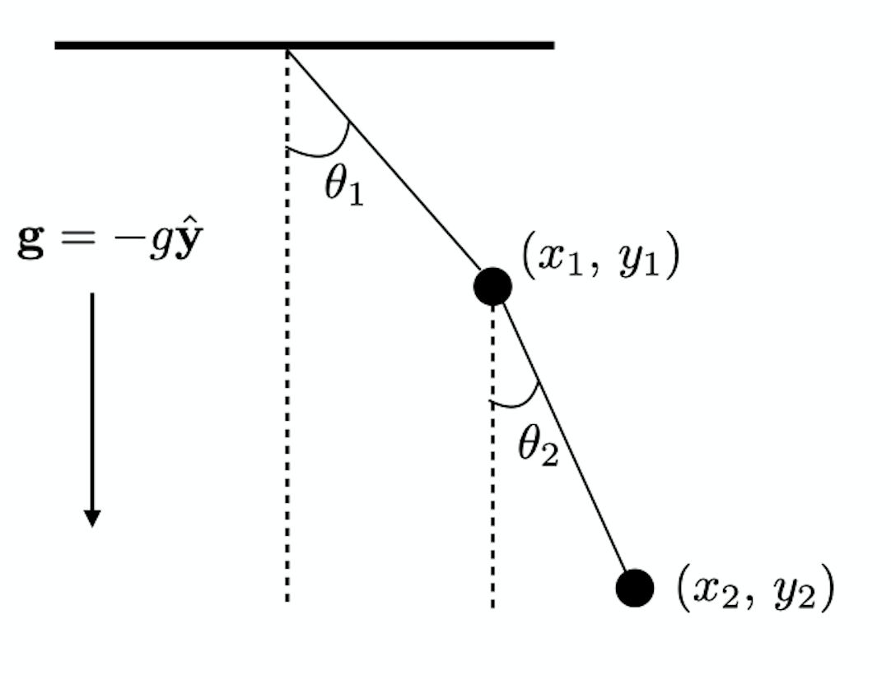

II. Extremals
===

## 2.1  Euler-Lagrange Equation

#### Geodesic

두 지점을 잇는 최단거리의 경로를 **geodesic** 이라 한다. 만약 비행기로 볼티모어와 얼랑겐을 여행한다고 할 때 그 거리는 (지구가 반경 $R$인 완전한 구라고 가정한다면) functional 이며 다음과 같다.
$$
J=R\int_{Baltimore}^{Erlangen} \sqrt{1+\varphi'^2\sin^2\theta}\, d\theta
$$
여기서 $\varphi' = \dfrac{d\varphi}{d\theta}$ 이다. 

#### Fermat's theorem

고정된 두 지점을 빛이 지나는 가능한 경로중 최소시간이 걸리는 경로가 실제 경로이다.

<b>Note : </b> Snell's law 는 페르마의 법칙으로부터 유도될 수 있다.

#### Hamilton's principle 과 자유낙하

Hamilton's principle 에 의하면 입자의 경로는 모든 가능한 경로중 다음과 같이 정의된 $J$ 값을 최소화 하는 경로(실제로는 extremum 값을 갖는 경로)를 택한다.
$$
J=\int_a^b (K-U)\, dt
$$
중력장이 $\mathbf{g}$ 로 주어진 균일한 중력장에서의 운동을 생각하자. 이 때 $U=mgy$ 이며 자유낙하를 한다고 하자. 그렇다면
$$
J=\int_a^b \left(\dfrac{1}{2}m\dot{y}^2-mgy\right)\, dt
$$
이다. 해가 $y=At^n$ 꼴임을 가정하자. $\dot{y}=nAt^{n-1}$ 이므로,
$$
J=\dfrac{1}{2(2n-1)}mn^2A^2t^{2n-1}-\dfrac{1}{n+1}mgAt^{n+1}
$$
이다. 만약 이 입자가 $y=0$ 부터 자유낙하한다고 가정하자. 그렇다면 $y=0,\, \dot{y}=0$ 이므로 $E=K+U=0$ 이며 에너지 보존법칙에 의해 $K=-U=-mgy \ge 0$ 이어야 한다. 그렇다면 $U=-K$ 이므로 $\mathcal{L}=K-U=2K\ge 0$ 이어야 하므로 $J \ge 0$ 이어야 한다.

앞서 계산한 $J$ 값이 $0$ 이 되는 조건은
$$
\dfrac{1}{2(2n-1)} n^2|A|t^{n-1}=\dfrac{gt}{n+1}
$$
이며 $n=2$, $|A|=\dfrac{1}{2}g$ 일 때 이다. 즉 $y=-\dfrac{1}{2}gt^2$ 이다. 

#### Fundamental lemma of the calculus of variations

$A(t)$ 는 $[a,\,b]$ 에서 $C^2$ 함수라 하자. 다음을 만족하는 임의의 $\eta : [a,\,b]\to \R$ 

1) $C^2$ class

2) nonzero

3) $\eta(a)=\eta(b) = 0$

에 대해
$$
\int_a^b A(t) \eta(t)\, dt=0
$$
이면 $A(t)=0$ for each $t\in [a,\,b]$ 이다. 

---

*(proof)* $A(c)\ne0$ for some $c\in (a,\,b)$ 라 하자. $A(c)>0$ 으로 잡아도 no loss of generality. $A$ 는 연속이므로 어떤 $c$ 를 포함하는 open interval $(t_1,\,t_2)\subset [a,\,b]$ 에서 positive 이다. 그렇다면 이 적분이 절대 $0$ 이 될 수 없는 $\eta$ 를 항상 생각할 수 있다면 $A(t)=0$ 일 수 밖에 없다. 예를 들어,
$$
\eta(t) = \left\{\begin{array}{ll} (t-t_1)^3(t_2-t)^3\,, \quad&t\in (t_1,\,t_2) \\
0 & t\le t_1 \text{ or } t\ge t_2\end{array} \right.
$$
이면 적분은 양수이다. 따라서 $A(t)=0$ 일 수 밖에 없다.

#### Euler-Lagrange equation

Functional $J$ 의 Lagrangian 이 $\mathcal{L}=\mathcal{L}(t,\, x^\mu,\, \dot{x}^{\mu})$ for $\mu=1,\,2,\ldots,\,N$ 이라 하자. 즉
$$
J=\int_a^b \mathcal{L}(t,\,x^\mu,\,\dot{x}^{\mu})\,dt \tag{2.2.1}
$$
이다. 이 때 $J$ 가 extremal 을 갖도록 하는 $\{x^{\mu}\}$ 의 해는 $N$ 개의 Euler-Largrange equation을 만족한다.
$$
\dfrac{\partial L}{\partial x^\mu}=\dfrac{d}{dt}\left(\dfrac{\partial L}{\partial \dot{x}^\mu}\right),\quad \mu=1,\ldots,\,N \tag{2.2.2}
$$

---

*(proof)* $x^{\mu}(t)$ 가 $J$ 를 extremal을 갖게 하는 경로의 $\mu$-th coordinate 성분이라 하자. 이 경로와 유사한 경로를 다음 식과 같이 도입한다.
$$
x^\mu(\varepsilon) = x^\mu+\varepsilon \eta^\mu\, \tag{2.2.3}
$$
여기서 $\varepsilon$ 은 연속으로 변할 수 있는 parameter 이며 $\eta^\mu$ 는 $t$ 에 대한 함수이고 $\eta^\mu (a) = \eta^\mu (b) = 0$ 이다. 그렇다면 $x^\mu (\varepsilon)
$ 도 일단은 경로의 조건을 만족하며 $x^\mu (\varepsilon)$ 에 대한 $J$ 는 다음과 같다.
$$
J(\varepsilon)=\int_a^b \mathcal{L}(t,\, x^\mu (\varepsilon),\, \dot{x}^\mu (\varepsilon))\, dt \tag{2.2.4}
$$
$\varepsilon$ 을 변화시킬 때 $J$ 의 extremal은 $\dfrac{dJ}{d\varepsilon}=0$ 일 때 임은 자명하다. Chain rule을 생각하면,
$$
\dfrac{dJ}{d\varepsilon}=\int_a^b \left[\dfrac{\partial\mathcal{L}}{\partial x^\mu(\varepsilon)} \cdot \dfrac{\partial x^\mu (\varepsilon)}{\partial \varepsilon} + \dfrac{\partial\mathcal{L}}{\partial \dot{x}^\mu(\varepsilon)} \cdot \dfrac{\partial \dot{x}^\mu (\varepsilon)}{\partial \varepsilon}\right] \, dt \tag{2.2.5}
$$
우리는 $\varepsilon=0$ 일 때 $J$ 가 extrimal을 취함을 알고 있다. 그렇다면 위 식은,
$$
\left[\dfrac{dJ}{d\varepsilon}\right]_0=\int_a^b \left[\dfrac{\partial\mathcal{L}}{\partial x^\mu} \cdot \eta^\mu + \dfrac{\partial\mathcal{L}}{\partial \dot{x}^\mu} \cdot \dot{\eta}^\mu\right] \, dt \tag{2.2.6}
$$
이다. 위 식의 integrand에서 $\dot{x}^\mu$ 관련 부분을 부분적분으로 다시 풀면
$$
\begin{align*}
\int_a^b \dfrac{\partial \mathcal{L}}{\partial \dot{x}^\mu } \dot{\eta}^\mu  \,dt &= \int_a^b\dfrac{d}{dt}\left[\dfrac{\partial \mathcal{L}}{\partial \dot{x}^\mu} \eta^\mu\right] dt-\int_a^b \dfrac{d}{dt}\left[\dfrac{\partial \mathcal{L}}{\partial \dot{x}^\mu}\right] \eta^\mu \\
&=\dfrac{\partial \mathcal{L}}{\partial \dot{x}^\mu} \eta^\mu(b)-\dfrac{\partial \mathcal{L}}{\partial \dot{x}^\mu} \eta^\mu(a)-\int_a^b \dfrac{d}{dt}\left[\dfrac{\partial \mathcal{L}}{\partial \dot{x}^\mu}\right] \eta^\mu \\
&=-\int_a^b \dfrac{d}{dt}\left[\dfrac{\partial \mathcal{L}}{\partial \dot{x}^\mu}\right] \eta^\mu 
\end{align*}
$$
, because $\eta^\mu (b)=\eta^\mu (a)=0$.

따라서,
$$
\left[\dfrac{dJ}{d\varepsilon}\right]_0=\int_a^b \left[\dfrac{\partial\mathcal{L}}{\partial x^\mu} \ -\dfrac{d}{dt}\left(\dfrac{\partial\mathcal{L}}{\partial \dot{x}^\mu} \right)\cdot \right] \eta^\mu\, dt \tag{2.2.7}
$$
이다. Fundamental lemma of the calculus of variations 에 의해,
$$
\dfrac{\partial\mathcal{L}}{\partial x^\mu} \ -\dfrac{d}{dt}\left(\dfrac{\partial\mathcal{L}}{\partial \dot{x}^\mu} \right) =0\,,\quad\mu =1,\,2,\,\cdots,N \tag{2.2.8}
$$
이어야 한다. $\qquad\square$

#### Convention : $\delta x^\mu$, $\delta J$ 

전통적으로 다음과 같은 notation을 사용해 왔다.
$$
\delta x^\mu \equiv x^\mu (\varepsilon)- x^\mu = \varepsilon \eta^\mu\,, \\
\delta J=0,\quad \delta \int\mathcal{L}\,dt=0\,.
$$

## 2.2 Corollaries to the Euler-Lagrange equation

#### Expanded form of Euler-Lagrange equation

식 (2.2.8)의 시간에 대한 전미분 텀을 고려하면 이렇게 다시 쓸 수 있다.
$$
\dfrac{\partial\mathcal{L}}{\partial x^\mu} + \dfrac{\partial^2 \mathcal{L}}{\partial t \partial \dot{x}^\mu} + \dfrac{\partial^2\mathcal{L}}{\partial x^\mu \partial\dot{x}^\nu} \dot{x^\nu}+\dfrac{\partial^2 \mathcal{L}}{\partial \dot{x}^\mu \partial \dot{x}^\nu}\ddot{x}^\nu=0\;. \tag{2.2.9}
$$

#### Canonically conjugate momentum

$x^\mu$ 에 대한 canonically conjugate momentum 혹은 canonical momentum $p_\mu$ 는 다음과 같이 정의된다.
$$
p_\mu = \dfrac{\partial \mathcal{L}}{\partial \dot{x}^\mu}\;. \tag{2.2.10}
$$
이를 이용하면 Euler-Lagrange equation을 다음과 같이 쓸 수 있다.
$$
\dfrac{\partial \mathcal{L}}{\partial x^\mu}=\dot{p}_\mu\;. \tag{2.2.11}
$$

#### Conservation of canonical momentum

$$
p_\mu =\text{const.} \iff \dfrac{\partial \mathcal{L}}{\partial x^\mu}=0\;.
$$

#### Hamiltonian $\mathcal{H}$ 

다음을 보자.
$$
\begin{align*}
\dfrac{d \mathcal{L}}{dt }&=\dfrac{\partial \mathcal{L}}{\partial t}+ \dfrac{\partial \mathcal{L}}{\partial x^\mu}\dot{x}^\mu + \dfrac{\partial \mathcal{L}}{\partial \dot{x}^\mu}\ddot{x}^\mu \\
&= \dfrac{\partial \mathcal{L}}{\partial t} + \dot{p}_\mu \dot{x}^\mu + p_\mu \ddot{x}^\mu\\
&=\dfrac{\partial \mathcal{L}}{\partial t}+ \dfrac{d}{dt}(p_\mu \dot{x}^\mu)

\end{align*}
$$
따라서,
$$
\dfrac{\partial \mathcal{L}}{\partial t}= \dfrac{d}{dt}\left[\mathcal{L}-p_\mu \dot{x}^\mu\right] \tag{2.2.12}
$$
이다. 

이제 **Hamiltonian** $\mathcal{H}$ 를 다음과 같이 정의하자.
$$
\mathcal{H} = \mathcal{H}(t,\, x^\mu,\, p_\mu)=p_\mu \dot{x}^\mu-  \mathcal{L}\;. \tag{2.2.13}
$$

그렇다면, 
$$
\dfrac{\partial \mathcal{L}}{\partial t}=-\dfrac{d\mathcal{H}}{dt}=-\dot{\mathcal{H}} \;.\tag{2.2.14}
$$
이며, $\mathcal{L}$ 이 explicitly dependent on $t$ 가 아니라면 $\mathcal{H}$ 는 상수임을 알 수 있다.

<b>Note : </b> Lagrangian $\mathcal{L}$ 은 시간 $t$와 generalized coordinate $x^\mu$, coordinate velocity $\dot{x}^\mu$ 의 함수인데 Hamiltonian $\mathcal{H}$는 $t$, $x^\mu$ 와 canonical momenta $p_\mu$ 의 함수이다.

#### Summary of Euler-Lagrange equation

Hamiltonian과 canonical momenta 에 대해
$$
\begin{align*}
\dfrac{\partial \mathcal{L}}{\partial{t}} & =-\dfrac{d\mathcal{H}}{dt}\;,\\
\dfrac{\partial \mathcal{L}}{dx^\mu} &=\dfrac{dp_\mu}{dt}\;. 

\end{align*} \tag{2.2.15}
$$
coordinate velocity에 대해
$$
\begin{align*}

\dfrac{\partial \mathcal L}{\partial t} &= -\dfrac{d}{dt}\left[\dot{x}^\mu \dfrac{\partial \mathcal{L}}{\partial \dot{x}^\mu} -\mathcal{L}\right] \;,\\
\dfrac{\partial \mathcal{L}}{\partial x^\mu} &=\dfrac{d}{dt} \left(\dfrac{\partial \mathcal{L}}{\partial \dot{x}^\mu}\right)\;.

\end{align*} \tag{2.2.16}
$$

#### Example : Central force motion

Central force는  $r=|\mathbf{r}|$ 에만 의존하는 힘이다. 즉 potential energy $U=U(r)$ 이다. Spherical coordinate $(r,\,\theta,\,\varphi)$ 에서 생각하자. $\mathbf{r}=r\hat{\mathbf{r}}$ 일 때, velocity $\mathbf{v}$ 는 다음과 같다.
$$
\mathbf{v} = \dot{r}\hat{\mathbf{r}}+ r\dot{\theta}\hat{\boldsymbol{\theta}}+r\dot{\varphi}\sin \theta \hat{\boldsymbol{\varphi}}\;.
$$
질량 $m$ 인 물체가 potential $U(r)$ 의 영향 하에 있다고 하자. 이 때 Lagrangian은
$$
\mathcal{L}=\dfrac{1}{2}m\mathbf{v}\cdot \mathbf{v} -U(r) = \dfrac{1}{2}m\left(\dot{r}^2+r^2\dot{\theta}^2+r^2\dot{\varphi}^2\sin^2\theta \right)-U(r)\;.
$$
따라서 canonical momenta는
$$
p_r =m\dot{r}\,,\quad p_\theta = \dfrac{\partial \mathcal{L}}{\partial x^\theta}=mr^2\dot{\theta}\,,\quad p_\varphi=\dfrac{\partial \mathcal{L}}{\partial x^\varphi}=mr^2\sin^2\theta \dot{\varphi}\;.
$$
이다. 이 때 angular momentum $\mathbf{L}=\mathbf{r} \times (m\mathbf{v})$ 를 계산하면,
$$
\mathbf{L}=mr^2\dot{\theta}\hat{\boldsymbol{\varphi}}-mr^2\dot{\varphi}\sin^2\theta \hat{\boldsymbol{\theta}} = p_\theta \hat{\boldsymbol{\varphi}}-p_\varphi \hat{\boldsymbol{\theta}}
$$
이다. canonical momenta가 보존되므로 각운동량 $\mathbf{L}$ 도 보존된다. $\mathbf{r}\cdot \mathbf{L}=0$ 이므로 $\mathbf{r}$ 은 항상 $\mathbf{L}$ 과 수직한 평면 위에 존재한다. $\mathbf{L}=L\hat{\mathbf{z}}$ 로 잡으면 운동은 항상 $xy$ 평면상에서만 이루어진다. 그렇다면 $\theta = \pi/2$ 이므로,
$$
\mathbf{L}=mr^2\dot\theta \hat{\mathbf{z}}
$$
이다. 

그렇다면 $p_r =  m\dot{r}$ 이므로 일반적으로 보존되지 않는다. 이제 Hamiltonian 쪽으로 보자. 
$$
\begin{align*}
\mathcal{H}&=p_\mu \dot{x}^\mu-\mathcal{L} = \dfrac{p_r^2}{2m}+\dfrac{L^2}{2mr^2}+U(r)

\end{align*}
$$
이며 이는 역학적 에너지 $E$ 와 같다. 따라서 $\mathcal{H}$ 는 보존된다.

## 2.3 On the Equivalence of Hamilton's  Principle and Newton's Second Law

#### From Hamilton's principle to Newton's second law

Hamilton's principle은 어느 특정 시간 $a,\,b$ 사이의 입자의 운동은 $K-U$ 의 시간에 대한 적분을 최소화 하는 경로를 따른다고 가정한다. 1차원에 한정시키고 $U=U(t,\,x)$ 라 가정한다면,
$$
\int_a^b \left(\dfrac{1}{2}m\dot{x}^2-U(t,\,x)\right)\,dt = \text{min.}
$$
이며, 이것을 최소화하는 경로는 Euler-Lagrange equation을 따르므로,
$$
-\dfrac{\partial U}{\partial x}=m\ddot{x}
$$
가된다. 이것은 분명하게 Newton's second law를 의미한다. 

#### From Newton's second law to Hamilton's principle

Newtons' second law를 rectangular coordinate에서 생각하면,
$$
-\dfrac{\partial U}{\partial x^\mu} = m\dfrac{d^2 x_\mu}{dt^2} \tag{2.2.17}
$$
이다. generalized coordinate $q^\mu$ 에 대해 Euler-Lagrange equation을 표현하면,
$$
-\dfrac{\partial(K-U)}{\partial q^\mu} = \dfrac{d}{dt}\dfrac{\partial (K-U)}{\partial \dot{q}^\mu} \tag{2.2.18}
$$
이다. 우리는 (2.2.17)로부터 (2.2.18)을 유도하여 최종적으로 Newton's second law와 Hamilton's principle이 수학적으로 동치임을 보일것인다.

$x^\mu$ 가 generalized coordinate $q^\nu$ 로 표현될 수 있어야 한다. (이것은 generalized coordinate의 조건이다) 즉
$$
x^\mu = x^\mu (q^\nu) \tag{2.2.19}
$$
이다. Chain rule로부터
$$
\dot{x}^\mu = \dfrac{\partial x^\mu}{\partial q^\mu}\dot{q}^\nu\tag{2.2.20}
$$
이다. 우리는 generalized coori. 사이에 다음 관계가 있음을 쉽게 보일 수 있다.
$$
\dfrac{\partial \dot{q}^\nu}{\partial \dot{q}^\eta}=\delta^\nu_\eta\;. \tag{2.2.21}
$$
따라서,
$$
\dfrac{\partial \dot{x}^\mu}{\partial \dot{q}^\eta}=\dfrac{\partial x^\mu}{\partial q^\eta} \tag{2.2.22}
$$
이다.

식 (2.2.17) 의 양변에 $\dfrac{\partial x^\mu}{\partial q^\nu}$  를 곱하고 $\mu$ 에 대해 sum 하면,
$$
\begin{align*}
-\dfrac{\partial U}{\partial q^\nu}&=m\ddot{x}_\nu \dfrac{\partial x^\mu}{\partial q^\nu}
 = \dfrac{d}{dt}\left[ m\dot{x}_\mu \dfrac{\partial x^\mu}{\partial q^\nu}\right]-m\dot{x}_\mu \dfrac{d}{dt}\dfrac{\partial x^\mu}{\partial q^\nu} \\
\end{align*}
$$
이다. $\dfrac{\partial x^\mu}{\partial q^\nu}$ 를 $\dfrac{\partial \dot{x}^\mu}{\partial \dot{q}^\nu}$ 로 바꾸고 (2.2.22), $K=\dfrac{1}{2}m\dot{x}_\mu \dot{x}^\mu$ 라 하면,
$$
\begin{align*}

-\dfrac{\partial U}{\partial q^\nu}&= \dfrac{d}{dt}\left[m\dot{x}_\mu \dfrac{\partial \dot{x}^\mu}{\partial \dot{q}^\nu}\right]-m\dot{x}_\mu \dfrac{\partial^2 x^\mu}{\partial q^\nu \partial q^\eta} \dot{q}^\eta \\
&= \dfrac{d}{dt}\dfrac{\partial K}{\partial \dot{q}^\nu}-m\dot{x}_\mu \dfrac{\partial}{\partial q^\nu}\left[\dfrac{\partial x^\mu}{\partial q^\eta} \dot{q}^\eta\right] \\
\end{align*}
$$
여기서 식 (2.2.20)을 위 식의 $[]$ 에 넣으면,
$$
-\dfrac{\partial U}{\partial q^\nu}=\dfrac{d}{dt}\dfrac{\partial K}{\partial \dot{q}^\nu}-\dfrac{\partial K}{\partial q^\nu}
$$
이다. Potential energy $U$ 는 $\dot{q}^\nu$-independent 하므로 위 식은 다음과 같이 고쳐 쓸 수 있다.
$$
\dfrac{\partial (K-U)}{\partial q^\nu}=\dfrac{d}{dt} \dfrac{\partial (K-U)}{\partial \dot{q}^\nu}\,.\tag{2.2.23}
$$
이는 아래와 같이 주어진 Lagrangian에 대한 Euler-Lagrange equation 이다.
$$
\mathcal{L}(t,\,q^\mu,\, \dot{q}^\mu)=K(q^\mu,\, \dot{q}^\mu)-U(t,\,q^\mu)\;.\tag{2.2.24}
$$

## 2.4 Where did Hamilton's Principle Come From?

#### The Principle of virtual work. 

- The D'Alembert's principle generalized to dynamics the principle of virtual work that applied to systems of particles in static equilibrium, earlier enunciated by Johann Bernoulli in 1717.
- Bernoulli introduced the concept of **virtual work** by imaging that the $n$th particle(among $N$ particles) undergoes some arbitrary displacement $d\mathbf{r}_n$, an imagined displacement that need not actually occur. <u>The virtual displacements are subject only to the collective constraints provided by rigid rods or supporting surface</u>. 

예를 들어 어떤 상상된 움직임이 전체 $N$ particles 에 대해 다음과 같은 제한을 둔다고 하자.
$$
\sum_{n=1}^N C_n d\mathbf{r}_n=0\;.\tag{2.2.25}
$$
여기서 $C_n$ 은 constraints 에 의해 정해진다. The principle of virtual work 은 역학적 평행상태의 the system of particles 가 다음의 관계를 만족함과 동치임을 말한다.
$$
\sum_{n=1}^N \mathbf{F}_n \cdot d\mathbf{r}_n = 0\;. \tag{2.2.26}
$$
여기서 $\mathbf{F}_n$ 는 $n$-th particle에 가해지는 external force 뿐만 아니라 constraints에 의한 internal force도 포함하는 총 힘이다. 만약 $\mathbf{F}_n$ 이 potential energy $U_n$으 로 부터 유도될 수 있다면, 즉,
$$
\mathbf{F}_n = \nabla U_n
$$
라면
$$
\sum_{n=1}^N \mathbf{F}_n \cdot d\mathbf{r}_n = 0 \iff \sum_{n=1}^N \nabla U_n\cdot  d\mathbf{r}_n = 0 \iff \sum_{n=1}^N dU_n =0\;.
$$
이다. 즉,
$$
\sum_{n=1}^N U_n = \text{min. or max.}
$$
이어야 한다. Potential energy가 maximum이면 이 system은 unstable equilibrium 이며 minimum 이어야 stable equilibrium 이다. 

#### D'Alembert's Principle

- D'Aembert 는 이 principle of virtual work을 dynamic system 까지 확장시켰다. 

식 (2.2.26)의 $\mathbf{F}_n$ 을 impressed force $\mathbf{F}_n^{(i)}$ 와 constraint force $\mathbf{F}^{(c)}_n$ 으로 분리한다. 여기서 impressed force 는 potential function $U$ 로부터 유도되는 힘을 말한다. Newton's 2nd law 로부터,
$$
\mathbf{F}_n^{(i)}+\mathbf{F}_n^{(c)}=m_n\mathbf{a}_n \tag{2.2.27}
$$
이다. 이 식에 virtual displacement $d\mathbf{r}_n$ 을 곱하고 다음과 같이 바꿀 수 있다.
$$
\left(\mathbf{F}_n^{(i)}-m_n\mathbf{a}_n\right)\cdot d\mathbf{r}_n =-\mathbf{F}_n^{(c)}\cdot d\mathbf{r}_n \;. \tag{2.2.28}
$$
Force of constraints에 의한 일은 $0$ 이므로 위 식의 우변은 $0$ 이다. 따라서,
$$
\sum_{n=1}^N \left(\mathbf{F}_n^{(i)}-m_n\mathbf{a}_n\right)\cdot d\mathbf{r}_n=0 \tag{2.2.29}
$$
이다. 이것을 D'Alembert's principle 이라 한다.

$\mathbf{F}_n^{(i)}$가 potential로 부터 유도된다고 가정했으므로 $\mathbf{F}_n^{(i)}=-\nabla U_n$ 이며, $\mathbf{a}_n = d\mathbf{v}_n/dt$ 이므로,
$$
m_n\mathbf{a}_n \cdot d\mathbf{r}_n = m_n\dfrac{d\mathbf{v}_n}{dt}\cdot \mathbf{v}_n dt=\dfrac{d}{dt}\left(\dfrac{1}{2} m_nv_n^2\right) dt = dK_n
$$
이다. 따라서 위 식 (2.2.29) 로부터 $\displaystyle \sum_{i=1}^N (dK+dU)=0$ 임을 알 수 있으며 이는 다음과 같다.
$$
\sum_{i=1}^n \left(K+U\right) = \text{min. or max.} \tag{2.2.30}
$$

- D'Alembert's Principle 로부터 Euler-Lagrange equation을 유도 할 수 있다. (Goldstein 참고)
- *In contrast to the Hamilton's principle, it is striking to notice that <u>the conservation laws of mechanics does not readily emerge from these earlier variational principles</u>. Perhaps, that explains why we do not routinely use them today. Unlike them, Hamilton's principle forms an important step directly toward Noether's theorem.*

## 2.5 Why Kinetic Energy Minus Potential Energy?

왜 action이 $\displaystyle \int (K-U)\,dt$ 인지에 대해 저자가 제시하는 두가지 이유..

#### 1) Equipartition

- Hamilton's principle is equivalent to requiring the time averages of the kinetic energy and the potential energy to be as nearly equal as possible... (Let's see ....)

$[a,\,b]$ 의 시간영역에서 움직이는 입자의 운동에너지 $K$ 와 potential energy $U$ 의 평균은 다음과 같다.
$$
\langle K\rangle=\dfrac{1}{b-a}\int_a^b K\,dt\;,\quad \langle U\rangle = \dfrac{1}{b-a}\int_a^b U\, dt\;.
$$
Kinetic energy와 potential energy의 평균을 최대한 적게 한다는 것은
$$
\langle K-U\rangle=\langle K\rangle -\langle  U\rangle = \text{min.}
$$
이므로 
$$
\int_a^b (K-U)\,dt = \text{min.}
$$
이 된다. 

- $\delta \displaystyle \int_a^b (K-U)\,dt =0$ 는 minimum or maximum 조건이지만 $v\to \infty$ 일 때 maximum 이 되므로 unphysical.

#### 2) Relativity and the Correspondence Principle

Hamilton's principle과는 달리 relativistic mechanics 에서는 event $A$ 에서 event $B$ 로 자유낙하하는 입자의 시공간에서의 world line은 proper time이 maximum이 되는 경로를 따른다. 즉
$$
\int_A^B \, d\tau = \text{max.}\tag{2.2.31}
$$
이다. 저자는 이것을 **Fermat's principle for relativistic particle** 이라 부른다. 여기서Infinitesimal nearby events사이의 proper time의 정의는 다음과 같다. 
$$
d\tau^2=g_{\mu\nu}dx^\mu dx^\nu\,. \tag{2.2.32}
$$

- 중력질량과 관성질량의 등가원리에 의하면, 우리는 항상 입자가 가속되지 않는 local free-fall frame을 찾을 수 있다.
- 위의 Fermat's principle은 이 local frame에서 성립한다.
- $d\tau$ 는 invariant 하므로 (2.2.32) 는 다른 frame 에서도 적용될 수 있다. Even global one that *feels* gravitation.

따라서 relativistic Fermat's principle은 다음과 같다.
$$
\Delta\tau = \int_A^B \sqrt{g_{\mu \nu} u^\mu u^\nu}d\tau\;, \text{ where } u^\mu\equiv dx^\mu/d\tau\;. \tag{2.2.33}
$$
In the weak-field, low-speed Newtonian limit에서 $u^0 = dt/d\tau \approx 1$ 이며 spatial component $u^\mu \approx 0$ 이다. $g_{00} \approx 1+2 \Phi$ where $\Phi$ denotes the gravitational potential 이므로 식 (2.2.33) 의 integrand는,
$$
\sqrt{g_{\mu\nu} u^\mu y^\nu } \approx m\Phi-\dfrac{1}{2}mv^2+\text{const.}
$$
이다. 따라서 $\int d\tau =\text{max.}$ 는 이 approx. 에서 $\int (K-U)dt=\text{min.}$ 이 된다.

## 2.6 Extremals with External Constraints

Lagrange multiplier 방법..

## Exercises

<b>2.1</b> $N$-dim. Space of variable curvature 에서의 거리를 측정하는 문제를 생각하자. Coordinate는 $x^\mu$ 와 같이 윗첨자를 사용한다. Infinitesimal nearby points 간의 거리는 $ds^2=g_{\mu \nu}dx^\mu dx^\nu$ 로 쓸 수 있다. $a$ 에서 $b$ 가지의 거리를 계산하는 functional 은 다음과 같지 주어진다.
$$
s=\int_a^b \sqrt{g_{\mu \nu} dx^\mu dx^\nu} =\int_{\sigma(a)}^{\sigma(b)} \sqrt{g_{\mu \nu}u^\mu u^\nu}d\sigma, \quad \text{where } u^\mu = dx^\mu/d\sigma\;.
$$
여기서 $\sigma$ 는 임의의 parameter 이다(coordinate 중의 하나가 될 수도 있다). Metric tensor $g_{\mu \nu}$ 의 components 들은 coordinate의 함수이다. 다음의 경우에 대한 geodesic을 찾아라.

a. Rectangular coordinates로 기술되는 3차원 유클리드 공간.

b. On a cylinder of radius $R$

c. 구 표면에서의 geodesig이 "great circle" 이 됨을 보여라.

---

a. 3차원 유클리드 공간을 rectangular coordinates 로 기술한다면, $g_{\mu \nu}= \delta_{\mu \nu}$ 이다. 임의의 $a$ 와 $b$ 를 잇는 임의의 곡선 $\lambda : t\to \R^3$ defined by $\lambda(t) = (x(t),\, y(t),\, z(t))$ where $\lambda(0)=a,\, \lambda(1)=b$ 을 생각 할 수 있다. 그렇다면,
$$
s=\int_0^1 \sqrt{\dot{x}^2+\dot{y}^2+\dot{z}^2}dt
$$
이다. $s$ 를 minimize 하도록 Euler-Lagrange equation을 생각하자. $\mathcal{L}=\sqrt{\dot{x}^2+\dot{y}^2+\dot{z}^2}$ 이며 $x,\,y,\,z$-independent 하며 우선 $x,\,\dot{x}$ 에 대해 생각해보면
$$
\dfrac{\partial\mathcal{L}}{\partial x}=0=\dfrac{d}{dt}\dfrac{\partial\mathcal{L}}{\partial\dot{x}}=\dfrac{d}{dt}\dfrac{\dot{x}}{\sqrt{\dot{x}^2+\dot{y}^2 + \dot{z}^2}}
$$
이다. 즉,
$$
\dfrac{\dot{x}^\mu}{\sqrt{\dot{x}_\nu\dot{x}^\nu}}=\text{const.}
$$
 이다. 이로부터 $\dot{x}^2+\dot{y}^2+\dot{z}^2= c$ where $c\ge 0$ 을 얻으며 따라서 $\dot{x}^\mu$ 는 상수이므로 $x^\mu = (b^\mu-a^\mu)t+a^\mu$ 꼴이다. 즉, 직선이다.

b. Cylindrical coordinate $(r,\,\theta,\, z)$ 를 사용한다. $g_{rr}=1,\, g_{\theta\theta}=r,\, g_{zz}=1$ 이며 다른 $g_{\mu\nu}=0$  이다. $dR=0$ 이므로,
$$
s=\int_a^b\sqrt{R^2d\theta^2+dz^2}=\int_a^b\sqrt{R^2+z'^2}d\theta\,,\quad \text{where }z'=dz/d\theta\
$$
이다. $s$ 를 minimize 하도록 Euler-Lagrange equation을 생각한다. $\mathcal{L}=\sqrt{R^2+z'^2}$ 라 놓으면,
$$
\dfrac{\partial \mathcal{L}}{\partial z}=0=\dfrac{d}{d\theta}\dfrac{\partial L}{\partial z'}=\dfrac{d}{d\theta}\left(\dfrac{z'}{\sqrt{R^2+z'^2}}\right)
$$
이며 이는 $z'/\sqrt{R^2+z'^2}=c=\text{const.}$ 란 뜻이므로 $z'=dz/d\theta=\text{const.}$ 이다. 

c. Spherical coordinate $(r,\,\theta,\,\varphi)$ 를 생각하자. 구의 반경을 $R$ 이라 하자. $dr=0$ 이므로,
$$
s=\int_a^b \sqrt{R^2d\theta^2+R^2\sin^2\theta d\varphi^2}=\int_a^b R\sqrt{1+\sin^2 \theta \dot{\varphi}^2}d\theta\;,\quad \text{where }\dot{\varphi}=d\varphi/d\theta
$$
 이다. $\mathcal{L}=\sqrt{1+\sin^2\theta \dot{\varphi}^2}$ 라 놓으면, $\dfrac{\partial \mathcal{L}}{\partial \varphi}=0$ 이므로,
$$
\dfrac{\partial \mathcal{L}}{\partial \dot{\varphi}}=\text{const.}=\dfrac{\sin^2\theta \dot{\varphi}}{\sqrt{1+\sin^2\theta \dot{\varphi}^2}} =c
$$
 라 하자.  그렇다면 $\dfrac{d\varphi}{d\theta}=\dfrac{c}{\sin \theta \sqrt{\sin^2\theta -c^2}}$ 이므로,
$$
\begin{align*}
\varphi &= \int_{\theta_a}^{\theta_b} \dfrac{c}{\sin\theta\sqrt{\sin^2\theta -c^2}}\, d\theta & \text{let }u=\cot \theta,\\
&= -\int_{u_a}^{u_b} \dfrac{c}{\sqrt{1-c^2(u^2+1)}} \,du\\
&=-\int_{u_a}^{u_b} \dfrac{du}{\sqrt{\dfrac{1-c^2}{c^2}-u^2}}  & k=\sqrt{1-c^2}/c\\
&= -\int_{u_a}^{u_b} \dfrac{du}{\sqrt{k^2-u^2}}= \cos^{-1}\left(ku_b\right)-\cos^{-1}(ku_a)
\end{align*}
$$
Let $\cos^{-1}(ku_a)=\varphi_0$. Then, 
$$
u_b= \dfrac{1}{k}\cos (\varphi - \varphi_0)=\cot \theta_b \tag{1}
$$

이제 great circle의 방정식을 구해보자. great circle의 normal vector $\hat{\boldsymbol{n}}=(\sin \theta_c \cos \varphi_c,\, \sin \theta_c \sin \varphi_c,\,\cos \theta_c)$ 을 생각하자. great circle 위의 점 $\boldsymbol{r}=(R \sin \theta \cos \varphi,\, R \sin \theta \sin \varphi,\,\cos \theta )$ 를 생각하면 $\hat{\boldsymbol{n}}\cdot \boldsymbol{r}=0$ 이어야 하므로,
$$
\begin{align*}
{}&R \sin\theta\cos \varphi \sin \theta_c \cos \varphi_c + R \sin \theta \sin \varphi \sin \theta_c \sin \varphi_c + R \cos \theta \cos \theta_c =0 \\
\implies& \sin \theta \sin \theta_c \cos (\varphi -\varphi _c)-\cos \theta \cos \theta_c =0 \\
\implies & \cos (\varphi -\varphi_c)=- \cot \theta_c \cot\theta \tag{2}

\end{align*}
$$

(1)과 (2) 식을 비교해보면 둘이 같음을 알 수 있다.

<b>3.4.</b> Newton's second law를 dampled oscillator에 적용하는데 있어 linear restoring and dample force를 가정하면 그 운동방정식은 다음과 같다.
$$
-kx-b \dfrac{dx}{dt}=m \dfrac{d^2 x}{dt^2}
$$
a. Equation of motion을 주는  Lagrangian을 찾아라. 

b. 어떤 양이 보존되는지 확인하라.

----

a. Goldstein Exerise 2.14 (2nd Ed.) 참고. Lagrangian $\mathcal{L}$ 을 다음과 같이 정의하자.
$$
\mathcal{L}=e^{b t}\left( \dfrac{m\dot{x}^2}{2}-\dfrac{kx^2}{2}\right)
$$
Euler-Lagrange equation을 구하면,
$$
\begin{align*}
\dfrac{\partial \mathcal{L}}{\partial x}&=-e^{b t}kx\,,\\
\dfrac{d}{dt}\left(\dfrac{\partial \mathcal{L}}{\partial \dot{x}}\right) &=\dfrac{d}{dt}\left(me^{bt} \dot{x}\right)=bme^{b t}\dot x+me^{b t} \ddot{x}

\end{align*}
$$
따라서,
$$
m\ddot{x}=-kx-\gamma\dot x
$$
가 성립한다.

b. -- 나중에--

<b>3.5.</b> 두 동일한 pendulums를 생각하자. 각각의 moment of inertia 는 한쪽 끝에서 $I$ 이며 두개가 이어져 연결되어 있다. 위의 pendulum의 추가 아래쪽 pendulum의 hook와 연결되어있다는 뜻. 이 pendulums가 평면에서 운동하며 uniform gravitational field $\boldsymbol{g}$ 에서 움직인다. Generalized coordinates를 사용하여 Lagrangian을 쓰고 이 시스템의 equation of motion을 유도하라.

---

운동에너지 $K$ 와 potential energy $U$ 를 계산하면,

$$
\begin{align*}
K&=\dfrac{1}{2}m(\dot{x}_1^2+\dot{y}_1^2)+\dfrac{1}{2}m((\dot{x}_1+\dot{x}_2)^2+(\dot{y}_1+\dot{y_2})^2)\\
&=I\dot{\theta_1}^2+\dfrac{1}{2}I\dot{\theta_2}^2+I\cos(\theta_1-\theta_2)\dot{\theta_1}\dot{\theta}_2 \\
U&=-mgl\cos \theta_1 - mgl (\cos \theta_1 + \cos\theta_2)

\end{align*}
$$
Euler-Lagrange Equation:
$$
\begin{align*}
\dfrac{\partial \mathcal{L}}{\partial \theta_1}&=-I\sin (\theta_1-\theta_2)\dot{\theta}_1 \dot{\theta}_2-2mgl \sin \theta_1 \\
\dfrac{d}{dt}\left(\dfrac{\partial \mathcal{L}}{\partial \theta_1}\right)&=\dfrac{d}{dt}\left(2I\dot{\theta}_1+I\cos(\theta_1-\theta_2)\dot{\theta}_2 \right) \\
&\implies 2I \ddot{\theta}_1-I\sin(\theta_1-\theta_2)\dot{\theta}_1 \dot{\theta}_2
+ I \sin (\theta_1-\theta_2) {\dot{\theta_2}}^2+I \sin (\theta_1 -\theta_2)\dot{\theta}_1 \dot{\theta}_2+2mgl \sin\theta_1 =0 \\
&\implies2I \ddot{\theta}_1
+ I \sin (\theta_1-\theta_2) {\dot{\theta_2}}^2+2mgl \sin\theta_1 =0 \tag{1}\\

\dfrac{\partial \mathcal{L}}{\partial \theta_2} &=I \sin (\theta_1-\theta_2)\dot{\theta}_1\dot{\theta}_2
-mgl \sin \theta_2 \\
\dfrac{d}{dt}\left(\dfrac{\partial \mathcal{L}}{\partial \dot{\theta}_2}\right) &=\dfrac{d}{dt}\left( I \dot{\theta}_2 +I \cos (\theta_1-\theta_2) \dot{\theta}_1 \right)=I\ddot{\theta}_2 -I \sin(\theta_1 - \theta_2){\dot{\theta}_1}^2+I \sin (\theta_1 - \theta_2) \dot{\theta}_1 \dot{\theta}_2 \\
&\implies I\ddot{\theta}_2
- I \sin (\theta_1 -\theta_2) {\dot{\theta}_1}^2+mgl \sin \theta_2 = 0 \tag{2}
\end{align*}
$$

<b>3.6, </b> a. Point mass $m$ 이 negligible mass와 spring constant $k$ 의 용수철 한 쪽 끝에 매달려 있다. 용수철의 다른 쪽 끝은 천정에 달려 있으며 전체 시스템이 uniform gravitational field $\mathbb{g}$ 에 존재한다. 이 pendulum이 한 평면 위에서 운동할 때 적당한 generalized coordinate에서의 Lagrangian을 쓰고 Euler-Lagrange equation을 유도하라.

b. 이 문제를 conical pendulum으로 일반화하라. 

---

a. plane motion의 경우 spherical coordinate $(r,\,\theta,\,\varphi)$ 에서 $r,\theta$ 가 independent variable이며 $\varphi = \text{const.}$ 이다. 따라서, 운동에너지 $K$ 와 potential 에너지 $U$ 는
$$
\begin{align*}
K&= \dfrac{1}{2}m(\dot{r}^2+r^2\dot{\theta}^2) \\
U&=-mgr\cos \theta \\
\mathcal{L} &=\dfrac{1}{2}m\left(\dot{r}^2+r^2\dot{\theta}^2\right) +mgr \cos \theta\;.
\end{align*}
$$
Euler-lagrange eq for $r$ :
$$
\begin{align*}
\dfrac{\partial \mathcal{L}}{\partial r} &= mr \dot{\theta}^2 + mg\cos\theta \,,\\
\dfrac{d}{dt} \left(\dfrac{\partial \mathcal{L}}{\partial \dot{r}}\right) &= m\ddot{r}\,, \\
&\implies \ddot{r}=r\dot{\theta}^2+g\cos\theta

\end{align*}
$$
Euler-Lagrange eq for $\theta$ :
$$
\begin{align*}
\dfrac{\partial \mathcal{L}}{\partial \theta} &=-mgr\sin \theta \,,\\
\dfrac{d}{dt}\left( \dfrac{\partial \mathcal{L}}{\partial \dot{\theta}}\right)&=mr^2\ddot{\theta} \\
&\implies r\ddot{\theta}=-g\sin\theta

\end{align*}
$$
b. conical pendulum 의 경우 spherical coordinate 에서 $r,\, \varphi$ 가 independent variables 이며, $\theta = \text{const.}$ 이다. 따라서, 운동에너지 $K$ 와 potential energy $U$ 그리고 Lagrangian은
$$
\begin{align*}
K&= \dfrac{1}{2}m(\dot{r}^2+r^2\sin^2\theta \dot{\varphi}^2)\,,\\
U&=-mrg\cos\theta\,,\\
\mathcal{L} &= \dfrac{1}{2}m(\dot{r}^2+r^2\sin\theta^2 \dot{\varphi}^2)+mrg\cos\theta\,
\end{align*}
$$
Euler Lagrange eq. for $r$ :
$$
\begin{align*}
\dfrac{\partial \mathcal{L}}{\partial r}&=mr \sin^2 \theta \dot{\varphi}^2+mg\cos\theta\,,\\
\dfrac{d}{dt}\left(\dfrac{\partial \mathcal{L}}{\partial \dot{r}}\right)&=m\ddot{r}\,,\\
&\implies m\ddot{r} = mr\sin^2\theta + mg\cos\theta\,.

\end{align*}
$$
Euler-Lagrange eq. for $\varphi$ :
$$
\begin{align*}
\dfrac{\partial \mathcal{L}}{\partial \varphi}&=0\,,\\
\dfrac{d}{dt}\left(\dfrac{\partial \mathcal{L}}{\partial \dot\varphi}\right)&=\dfrac{d}{dt}\left( mr^2\sin^2\theta \dot\varphi\right)\,\\
&\implies mr^2\sin^2 \theta  \dot\varphi=\text{const.}

\end{align*}
$$
<b>3.7. </b> 변분법을 이용하여 Dido's problem을 풀어라. 길이를 $w$ 로 놓고 평면성에서 $w$ 로 최대한 둘러 쌀 수 있는 모양을 찾아라. Lagrange multiplier $\lambda$ 의 역할은 무엇인가?

---

$w$ 로 둘러 싼 영역의 boundary를 $t$ 로 매개화 한 곡선을 $\alpha (t)=(x(t),\,y(t))$ 라 하자. 또한 $w$ 로 둘러 싼 영역을 $D$, 그 boundary를 $\partial D$ 라 하자. Green's theorem에 의하면  $D$ 의 면적 $A$는
$$
A=\dfrac{1}{2}\oint_{\partial D} \left( x \dot{y} - y \dot{x}\right) \, dt\tag{1}
$$
이다. . 그렇다면,
$$
w=\int \sqrt{\left(\dot{x}\right)^2+\left(\dot{y}\right)^2}\, dt \tag{2}
$$
이다 그렇다면 $\mathcal{L}(x,\,y,\,\dot{x},\,\dot{y}\,;t)= \dfrac{1}{2} (x\dot{y}-y \dot{x})+\lambda\sqrt{\dot{x}^2+\dot{y}^2}$ 이므로, $x,\,y$ 에 대핸 Euler-Lagrange equation으로 부터
$$
\begin{align*}
\dfrac{\partial \mathcal{L}}{\partial x}&= \dfrac{d}{dt}\left(\dfrac{\partial \mathcal{L}}{\partial \dot{x}}\right) \implies \dfrac{\dot{y}}{2}=\dfrac{d}{dt}\left(-\dfrac{1}{2}y +\lambda \dfrac{\dot{x}}{\sqrt{\dot{x}^2+\dot{y}^2}}\right) \tag{3}\\
\dfrac{\partial \mathcal{L}}{\partial y}&= \dfrac{d}{dt}\left(\dfrac{\partial \mathcal{L}}{\partial \dot{y}}\right) \implies -\dfrac{\dot{x}}{2} = \dfrac{d}{dt}\left(\dfrac{1}{2}x + \lambda \dfrac{\dot{y}}{\sqrt{\dot{x}^2+\dot{y}^2}}  \right) \tag{4}
\end{align*}
$$
(3), (4)를 각각 적분하면,
$$
y+\lambda \dfrac{\dot{x}}{\sqrt{\dot{x}^2+\dot{y}^2}}=a=\text{const.} \\
-x+\lambda \dfrac{\dot{y}}{\sqrt{\dot{x}^2+\dot{y}^2}}=b=\text{const.}
$$
이 식으로부터,
$$
(x-b)^2+(y-a)^2=\lambda^2
$$

<b>3.8. </b> Uniform linear density $\mu$ 이며 길이 $l$ 인 chain이 $xy$ 평면상에서 임의의 고정된 endpoints 사이에 매달려 있으며 uniform gravitation field $\mathbb{g}=-g\hat{\mathbb{y}}$ 가 작용하고 있을 때의 chain의 모양을 구하여라.

---

Lagrangian이 $\mathcal{L}=y^n \sqrt{1+\dot{y}^2}$ 꼴일 때 $H=\dot{y} \dfrac{\partial \mathcal{L}}{\partial \dot{y}}-\mathcal{L}$ 에 대해, $\dfrac{dH}{dx} = -\dfrac{\partial \mathcal{L}}{\partial x}=0$ 이므로 $H=C=\text{const.}$ 이다. 
$$
H=y^n\dfrac{\dot{y}^2}{\sqrt{1+\dot{y}^2}}-y^n \sqrt{1+\dot{y}^2}=\dfrac{y^n}{\sqrt{1+\dot{y}^2}}=C \tag{1}
$$

Potential energy minimum 을 이용하자. 
$$
dU=\mu g \sqrt{(dx)^2+(dy)^2}y\\
U=\int \mu g\sqrt{(dx)^2+(dy)^2} y=\int\mu g\sqrt{1+\dot{y}^2}y\,dx\\
l=\int\sqrt{(dx)^2+(dy)^2}=\int\sqrt{1+{\dot{y}^2}}\,dx
$$
이며 Lagrangian $\mathcal{L}=\mu g y\sqrt{1+\dot{y}^2}$ 이므로 (1) 을 이용 할 수 있다. 즉 $\dfrac{dy}{dx}=\dfrac{1}{C}\sqrt{y^2-C^2}$ 이며, 이것의 해는
$$
y(x) = C \cosh \left( \dfrac{x}{C}+a_0\right)
$$
이다.

<b>3.9. </b> Brachistrochrone problem을 풀어라. 에너지 보존법칙을 가정해야 할 수도 있다.

---

Point 1 을 $(0,\,0)$ 으로 두었을 때 에너지 $E=\dfrac{1}{2}mv^2-mgy=0$ 이므로 $v=\sqrt{2gy}$ 이다. point 1에서 point 2로 가는 시간을 $T$ 라 하면,
$$
T=\int_1^2 \dfrac{ds}{v}=\int_1^2 \dfrac{\sqrt{(dx)^2+(dy)^2}}{\sqrt{2gy}}=\int_1^2 \dfrac{\sqrt{1+\dot{y}^2}}{\sqrt{2gy}}dx
$$
이다. Integrand $\mathcal{L}=\sqrt{1+\dot{y}^2}/\sqrt{y}$ 에 대해 $H=\dot{y} \dfrac{\partial \mathcal{L}}{\partial \dot{y}}-\mathcal{L}=\dfrac{1}{C}=\text{const}$ 이므로,
$$
C=\sqrt{y}\sqrt{1+\dot{y}^2} \implies \dfrac{dy}{dx}=\sqrt{\dfrac{D-y}{y}}\,\quad \text{where }D=C^2
$$
이다. $dx = \sqrt{\dfrac{y}{D-y}}dy$ 이며 $y \ge 0$ 이므로 $y=D\sin^2 \theta$ 로 치환하면,
$$
x=\int_0^{\theta_f} \sqrt{\dfrac{D\sin^2 \theta}{D\cos^2 \theta}} 2D\sin\theta \cos\theta \, d\theta =2D\int_0^{\theta_f} \sin^2\theta \, d\theta=2D\left(\dfrac{1}{2}\theta_f-\dfrac{1}{4}\sin(2\theta_f)\right)=D(\theta_f- \dfrac{1}{2} \sin (2\theta_f))
$$
And $y=\dfrac{1}{2}D(1-\cos (2\theta_f))$. $2\theta_f=t,\, D/2=A$ 라 하면,
$$
\begin{align*}
x(t) &=  A(t-\sin{t})\\
y(t) &= A(1-\cos t)

\end{align*}
$$

<b>3.10.</b> Potential energy $U(x)$ 의 영향에 있는 질량 $m$ 인 입자의 운동에 대한 time-independent Schrödinger Eq. 는 다음과 같다.
$$
-\dfrac{\hbar^2}{2m}\dfrac{d^2 \psi}{dx^2} + U\psi =E\psi\;.
$$
여기서 $\psi = \psi (x)$ 는 에너지 eigenvalue $E$ 를 갖는 stationary state wave function 이다. 라그랑지안이 아래와 같이 주어졌을 때, 
$$
\mathcal{L}(x,\, \psi,\,\psi^\ast,\,\psi_X^\ast,\, \psi_X)=-\dfrac{\hbar^2}{2m} \psi_X^\ast \psi_X -\psi^\ast (U-E)\psi
$$
Euler-Lagrange eq. 는 time-independent Schrödinger Eq. 가 됨을 보이시오. 여기서 $\psi^\ast$ 는 complex conjugate of $\psi$ 이며 $\psi_X = \dfrac{d\psi}{dx}$ 이다.

---

$$
\begin{align*}
\dfrac{\partial \mathcal{L}}{\partial \psi^\ast }&= - (U-E)\psi\,,\\
\dfrac{d}{dx}\left(\dfrac{\partial \mathcal{L}}{\partial \psi_X^\ast}\right) &=\dfrac{d}{dx}\left(-\dfrac{\hbar^2}{2m} \psi_X \right)=-\dfrac{\hbar^2}{2m}\dfrac{d^2\psi}{dx^2}

\end{align*}
$$

<b>3.11. </b> a. 특수상대론과 일반상대론에서 $\displaystyle \int d\tau$ 가 maximum이 되어야 하는 이유를 밝히시요.

b. 식 (2.2.33) (text 에서는 3.5.5)가 $m\Phi - \dfrac{1}{2}mv^2+\text{const}$ 가 됨을 보이시요.

----

<b>3.12.</b> Newton's second 를 특수상대론으로 확장하면 다음과 같다.
$$
f^\mu = \dfrac{dp^\mu}{d\tau}\tag{a}
$$
 여기서 $\tau$ 는 invariant proper time 이며 $p^\mu = mdu^\mu/d\tau$, $u^\mu = dx^\mu/d\tau$ 이고 $f^\mu$ 는 4-vector force의 $\mu$-th component 이다. 질량 $m$ 의 free particle을 생각하자. 즉 $f^\mu =0$ 이다. 이 때 $(\text{a})$ 는
$$
0=du^\mu/d\tau
$$
이다.

a. 이 결과는 Lagrangian $\mathcal{L}$ 이 다음과 같이 주어졌을 때의 결과임을 보이시오. ($c=1$ 임을 유의하라.)
$$
\mathcal{L}=\mathcal{L}(u^\mu)=-m\gamma^{-1} \quad\text{where }\gamma \equiv(1-v^2)^{-1/2}\;.
$$
 b. canonical momenta는 $p^\mu =mv^\mu\gamma$ where $v^\mu =dx^\mu/dt$ 임을 보이시오.

c. Hamiltonian $\mathcal{H}=m\gamma$ 임을 보이고 $\mathcal{H}=E$ 임을 보이시오.

d. Lagrangian으로 주어진 functional이 다음과 같이 쓰일 수 있음을 보이시오.
$$
J=\int_A^B d\tau\;.
$$

---

a. $\mathcal{L}=-m\gamma^{-1}=-m(1-v^2)^{1/2}$ , $d\tau = \sqrt{1-v^2}dt$ 이므로, $u^\mu = \gamma v^\mu$ 이다. 
$$
\begin{align*}
\dfrac{\partial \mathcal{L}}{\partial x^\mu}&=0\,,\\
\dfrac{d}{dt}\left(\dfrac{\partial \mathcal{L}}{\partial v^\mu}\right)&=\dfrac{d}{dt}\left( \dfrac{mv^\mu}{\sqrt{1-v^2}} \right)= \dfrac{d}{dt} (mu^\mu)

\end{align*}
$$
 이므로 $\dfrac{d}{dt}u^\mu=0\implies \dfrac{d}{d\tau}u^\mu=0$. 

b. 
$$
p^\mu = \dfrac{\partial \mathcal{L}}{\partial v^\mu}=\gamma mv^\mu
$$
c.
$$
\mathcal{H}=p^\mu v^\mu-\mathcal{L}=\gamma mv^2+\dfrac{m}{\gamma} = \dfrac{m}{\gamma}\left(\gamma^2v^2+1\right) = \gamma m\;.
$$
d. $d\tau = dt/\gamma$ 이므로 
$$
m\int_A^Bd\tau = \int_A^B m\gamma^{-1}dt.
$$

<b>3.13. </b> 질량 $m$, 전하 $q$ 인 입자가 electric potential $V$, vector potential $\boldsymbol{A}$ 에서 움직일 때의 Lagrangian (with $c=1$) 은
$$
\mathcal{L}=-m\gamma^{-1} +q\boldsymbol{A}\cdot \boldsymbol{v}-qV\,,\quad\text{where }\gamma=\dfrac{1}{\sqrt{1-v^2}}
$$
 이다. 이 때 $v$ 는 어떤 관성좌표계에서의 입자의 speed 이다.

a. canonical momentum component $p_k$ 는 다음과 같음을 보여라.
$$
p_k = mv_k\gamma + qA_k\,,\quad \text{where }k=1,\,2,\,3
$$
b. Hamiltonian이 다음과 같음을 보여라.
$$
\mathcal{H}=\left(\dfrac{\left(\boldsymbol{p}-q\boldsymbol{A}\right)^2}{m}+m\right)\gamma^{-1} +qV
$$
그리고 $\mathcal{H}=m\gamma +qV$ 임을 보여라.

c. $\mathcal{H}=E$ 라면 $E^2-p^2 \ne m^2$ 임을 보여라. 특수상대론에서 $E^2-p^2=m^2$ 는 noninteracting particle 에서만 유효하다.

---

a. caninical momentum의 정의로부터,
$$
p_k = \dfrac{\partial \mathcal{L}}{\partial v_k}=\dfrac{\partial }{\partial v_k}\left( -{m} \sqrt{1-v^2}+q\boldsymbol{A} \cdot \boldsymbol{v}\right) = m\gamma v_k + qA_k
$$
b. a.의 결과로부터, $v_k = (p_k-qA_k)/m\gamma$ 이므로, Hamiltonian의 정의의 $v_k$ 를 모두 $p_k$ 에 대한식으로 바꾸면,
$$
\begin{align*}
\mathcal{H}&=\sum_k p_kv_k -\mathcal{L}=\sum_k\dfrac{p_k (p_k -qA_k)}{m\gamma}+m\gamma^{-1}-\sum_kqA_k \dfrac{p_k-qA_k}{m\gamma}+qV \\
&=\dfrac{1}{m\gamma} \sum_k \left(p_k^2-2qp_kA_k+q^2A_k^2\right)+m\gamma^{-1}+qV \\
&=\left(\dfrac{(\boldsymbol{p}-q\boldsymbol{A})^2}{m} +m\right)\gamma^{-1} +qV

\end{align*}
$$
이제 $\mathcal{H}=m\gamma+qV$ 임을 보이자. $p_k$ 를 쓰지 않고 $v_k$ 를 쓰면,
$$
\mathcal{H}=\sum_kp_kv_k-\mathcal{L}=\sum_km\gamma v_k^2+q\boldsymbol{A}\cdot \boldsymbol{v} -\mathcal{L}=m\gamma+qV
$$
c. 계산해보자.
$$
\begin{align*}
E^2-p^2&=\mathcal{H}^2-p^2=(m\gamma+qV)^2-(m\gamma \boldsymbol{v}+q\boldsymbol{A})^2 \\
&=m^2\gamma^2+2mq\gamma V +q^2V^2-m^2\gamma^2 v^2-2mq \gamma \boldsymbol{A}\cdot \boldsymbol{v}-q^2|\boldsymbol{A}|^2 \\
&= m^2+2mq\gamma (V-\boldsymbol{A}\cdot \boldsymbol{v})+q^2(V^2-|\boldsymbol{A}|^2) \\
&\ne m^2

\end{align*}
$$

<b>3.14. </b> a. Lagrangian이 2nd derivative of the dependent variable에 의존하며 다음 조건
$$
J=\int_a^b \mathcal{L}(t,\,x^\mu,\,\dot{x}^\mu,\, \ddot{x}^\mu)\,dt = \text{extremum,}
$$
 이 필요하다면 Euler-Lagrange equation 이 다음과 같음을 보이시오. What must you assume about $\dot{\eta}$ in eq.(2.2.3) (in Text, (3.1.7))
$$
\dfrac{\partial \mathcal{L}}{\partial x^\mu}-\dfrac{d}{dt}\left( \dfrac{\partial \mathcal{L}}{\partial \dot{x}^\mu} \right)+\dfrac{d^2}{dt^2} \left( \dfrac{\partial \mathcal{L}}{\partial \ddot{x}^\mu}\right) =0\;.
$$
b. 이 결과를 일반화하여 $n$ th derivative of $x$ with respect to $t$ 에 dependent 한 Lagrangian의 Euler-Lagrange eq. 를 구하시오.

---

a. text 에서 제시한 1st derivative에만 의존한 경우를 확장한다. $x^\mu (\varepsilon)=x^\mu + \varepsilon \eta^\mu$ 로 놓자. $\eta^\mu (a) = \eta^\mu (b)=0$ 이다.
$$
\begin{align*}
\dfrac{dJ}{d\varepsilon}&=\int_a^b \left[ \dfrac{\partial\mathcal{L}}{\partial x^\mu}\dfrac{\partial x^\mu}{\partial \varepsilon}  + \dfrac{\partial\mathcal{L}}{\partial \dot{x}^\mu}\dfrac{\partial \dot{x}^\mu}{\partial \varepsilon} +\dfrac{\partial\mathcal{L}}{\partial \ddot{x}^\mu}\dfrac{\partial \ddot{x}^\mu}{\partial \varepsilon} \right]\, dt \\
&=\int_a^b \left[\dfrac{\partial\mathcal{L}}{\partial x^\mu}\eta^\mu + \dfrac{\partial\mathcal{L}}{\partial \dot{x}^\mu} \dot{\eta}^\mu + \dfrac{\partial\mathcal{L}}{\partial \ddot{x}^\mu}  \ddot{\eta}^\mu \right] \, dt \\
&=\int_a^b \left[\dfrac{\partial\mathcal{L}}{\partial x^\mu}\eta^\mu -\dfrac{d}{dt} \left(\dfrac{\partial\mathcal{L}}{\partial \dot{x}^\mu} \right)\eta^\mu + \dfrac{\partial\mathcal{L}}{\partial \ddot{x}^\mu}  \ddot{\eta}^\mu \right] \, dt

\end{align*}
$$
임을 알고 있다. 
$$
\begin{align*}
\dfrac{\partial\mathcal{L}}{\partial \ddot{x}^\mu}  \ddot{\eta}^\mu &= \dfrac{d}{dt} \left(\dfrac{\partial\mathcal{L}}{\partial \ddot{x}^\mu}  \dot{\eta}^\mu \right)-\dfrac{d}{dt}\left(\dfrac{\partial\mathcal{L}}{\partial \ddot{x}^\mu}\right) \dot{\eta}^\mu \\
&=\dfrac{d}{dt}\left(\dfrac{\partial\mathcal{L}}{\partial \ddot{x}^\mu}  \dot{\eta}^\mu \right) -\dfrac{d}{dt} \left( \dfrac{d}{dt}\left[ \dfrac{\partial \mathcal{L}}{\partial \ddot{x}^\mu}\right] {\eta^\mu}\right) +\dfrac{d^2}{dt^2} \left( \dfrac{\partial \mathcal{L}}{\partial \ddot{x}^\mu}\right) \dot{\eta}^\mu

\end{align*}
$$

여기에 boundary condition $\eta^\mu (a)=\eta^\mu (b)=0$ 을 적용하여 적분하면 두번째 term은 사라지며 따라서,
$$
\dfrac{dJ}{d\varepsilon}= \int_a^b \left[\dfrac{\partial \mathcal{L}}{\partial x^\mu}-\dfrac{d}{dt}\left( \dfrac{\partial \mathcal{L}}{\partial \dot{x}^\mu} \right)+\dfrac{d^2}{dt^2} \left( \dfrac{\partial \mathcal{L}}{\partial \ddot{x}^\mu}\right)\right] \, dt+\left[\dfrac{\partial \mathcal{L}}{\partial \ddot{x}^\mu} \dot{\eta}^\mu\right]_a^b=0
$$
이어야 한다. $\dot{\eta}^\mu (a)=\dot{\eta}^\mu (b) =0$ 임을 가정하면 끝.

b. $N$ 을 Lagrangian에 포함된 최고의 derivatives of $x$ 라 하면, 경계조건 $\dfrac{d^n}{dt^n}{\eta^\mu} (a)=\dfrac{d^n}{dt^n}{\eta^\mu} (b)=0$ for $n=0,\ldots,\,N-1$ 조건에서
$$
\dfrac{\partial \mathcal{L}}{\partial x^\mu}+\sum_{k=1}^{N}(-1)^k\dfrac{d^k}{dt^k}\left( \dfrac{\partial \mathcal{L}}{\partial (x^\mu)^{(k)}}\right) =0\,,\quad \text{where }(x^\mu)^{(k)}=\dfrac{d^k}{dt^k}x^\mu \;. 
$$

<b>3.14. </b> Endpoints 가운데 시작점은 fixed 되어 있고, 끝점이 variable 일 때의 Euler-Lagrange eq.를 구하시오. 즉
$$
J(T)=\int_a^T \mathcal{L}(t,\,x^\mu,\, \dot{x}^\mu)\, dt
$$
이다.

---

(See Goldstein 2nd ed. pp. 365~)

Let $x^\mu (t,\,\varepsilon)=x^\mu_0 (t,\,0)+\varepsilon \eta^\mu (t)$. 여기서 경계조건은 $\eta^\mu (a)=0$ 이지만 $\eta^\mu (b) = 0$ 일 필요는 없다. $x^\mu_0$ 를 correct path 이다. $T=b+\Delta T$ 라 하자. 
$$
\begin{align*}
\Delta J(T) &= \int_a^b \mathcal{L (t,\,x^\mu,\,\dot{x}^\mu)}\, dt+\int_{b}^{b+\Delta T} \mathcal{L}(t,\,x^\mu,\,\dot{x}^\mu)\, dt\\
&=\int_a^b\mathcal{L}(t,\,x^\mu,\,\dot{x}^\mu)+ (\Delta T)\left[\mathcal{L}(b+\delta t,\,x^\mu+\delta x^\mu,\,\dot{x}^\mu+\delta \dot{x}^\mu) \right]

\end{align*}
$$
인 $0 \le \delta t \le \Delta T$ 가 존재한다. 여기서 $\delta x^\mu = x^\mu (b+\delta t,\,\varepsilon)-x^\mu (b,\,\varepsilon)$, $\delta \dot{x}^\mu = \dot{x}^\mu (b+\delta t,\,\varepsilon)-\dot{x}^\mu (b,\,\varepsilon)$ 이다. 
$$

$$
