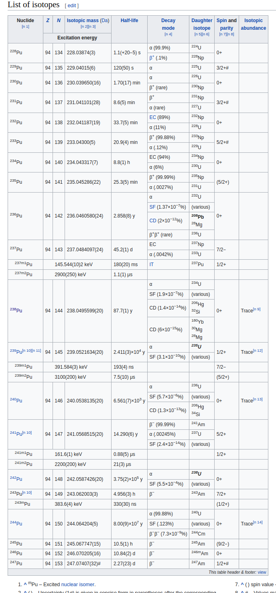
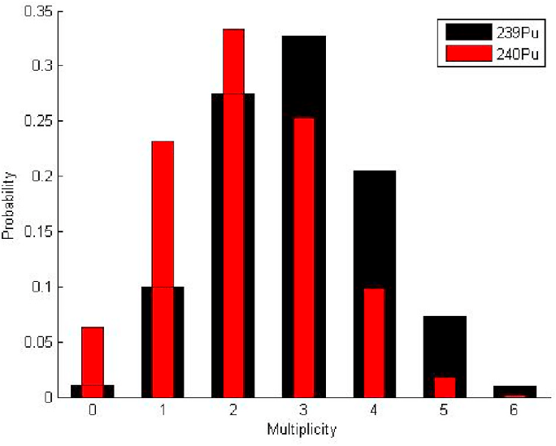

Application Guide to Neutron Multiplicity Counting (1998)
===

# 0. 용어

## A. Die-away time

Once one neutron has been detected, <u>the probability of detecting another neutron from the same fission</u> decreases approximately exponentially with time according to the following equation: 

$$
P(t) = \exp \left(–\dfrac{t}{t_d}\right)
$$

where $P(t)$​​​​ = Probability of detecting coincidence neutrons in time $t$​​​ ​,  where $t_d$​​ = die-away time of the moderated detector assembly. <u>The die-away time is the characteristic time a neutron will survive before it is absorbed in the 3He​ tubes or escapes the counter</u>. The neutron die-away time normally ranges from $10$​​ to $128\, \mu s$​​​​  depending upon the counter geometry. 

## B. 플루토늄 동위 원소 (한국어 위키백과 2021.08.03)

위키백과, 우리 모두의 백과사전.

**플루토늄의 동위 원소**(Isotopes of plutonium)는 228Pu부터 247Pu​까지 존재한다.

- https://ko.wikipedia.org/wiki/플루토늄_동위_원소#각주)

  

#### 플루토늄-236

원자로 내에서 [넵투늄](https://ko.wikipedia.org/wiki/넵투늄)-237이 중성자를 흡수할 때 극미량의 일부가 2개의 중성자를 방출하여 넵투늄-236이 되고 이 중 12.5%가 236Pu으로 붕괴된다. 넵투늄-236 자체도 극미량 생성되는데다 반감기도 15만 4천년으로 매우 길므로 이 동위체는 원자로에서 극미량 생성되기 때문에 그리 중요한 동위체는 아니다. 반감기가 2.858년으로 매우 강한 방사선을 내뿜는 우라늄-232로 붕괴되며 매 붕괴 사슬을 거치면서 강한 감마선을 내뿜는다.

#### 플루토늄-238

원자로에서 [우라늄](https://ko.wikipedia.org/wiki/우라늄)-235가 중성자를 먹고 우라늄-236이 된 후 이것이 중성자를 2개 흡수하여 생성된다. 플루토늄-238은 1kg당 567W의 에너지를 내뿜기 때문에 원자력 전지의 원료가 된다. 하지만 원자로내에서는 239Pu와 240Pu도 섞여 있기 때문에 반드시 분리해야 하며, 동위원소 분류법으로 분리되어야 되기 때문에 가격도 비싸므로 일반 원자로 재처리에서는 뽑아내지 않는다. 대신 실험용 원자로에서 플루토늄-238이 잘 생성될 수 있는 동위체인 우라늄-236이나 넵투늄-237을 우라늄-235와 섞어서 만든 연료를 태운후에 얻는다.

감마선이 거의 나오지 않으며 자발핵분열 비율도 5억분의 1의 비율로 매우 낮아 중성자선도 거의 나오지 않아 질좋고 가벼운 원자력 전지로 쓰일 수 있다.

반감기는 87.7년이므로 긴 시간동안 안정적으로 에너지원으로 이용되고 있다.

#### 플루토늄-239

이 부분의 본문은 [플루토늄-239](https://ko.wikipedia.org/wiki/플루토늄-239)입니다.

원자로에서 [우라늄-238](https://ko.wikipedia.org/wiki/우라늄-238)이 중성자를 먹고 B-붕괴를 하여 생성되는게 대다수이다.([넵투늄-237](https://ko.wikipedia.org/wiki/넵투늄-237)과 [플루토늄-238](https://ko.wikipedia.org/wiki/플루토늄-238)이 중성자를 먹고 생성되는 경우도 있지만 비율이 낮다.) 열중성자로에서의 핵분열 비율이 64~76%, 고속중성자(자원중성자)로에서의 핵분열 비율도 62~63%로 높기 때문에 핵연료와 핵무기로 이용된다. 실제 원자로(경수로)에서도 플루토늄-239의 핵분열로 인해 생산된 전력량은 원자로 전체에서 생산된 전력의 28%의 비율을 차지한다.

플루토늄-239의 임계질량은 13kg이며 중성자 반사체를 입히면 4kg까지 줄일 수 있다. 240Pu이 50% 섞이게 되면 임계질량은 2.4 kg 이하로 줄어들게 되며 238Pu이 섞이면 950g까지 줄어들게 된다. 다만 임계질량이 줄면서 핵무기의 효율과 위력이 약해지므로 핵무기 제조시 이들 동위체를 제거해야 한다.

반감기가 24110년이나 되고 1kg당 1.9W의 강력한 방사선을 내뿜기 때문에 재처리를 꼭 해야만 하는 동위체이나 핵무기 제조 우려 때문에 일부 국가를 제외하고는 여러 국가들이 제한받고 있다. 하지만 보관기간이 30만년이나 필요하고 이 기간동안 안전하게 보관하기란 사실상 불가능하므로 재처리를 하여 핵연료로 소진해야 한다.

자연계에서 우라늄-238의 자발핵분열로 인해 튀어나오는 중성자로 인해 소량 생산되는데 농축된 우라늄 광석에서는 20억분의 1의 비율로 존재하기도 한다.

#### 플루토늄-240

원자로의 핵폐기물에서 대량으로 생산되며 반감기는 6560년이나 되기 때문에 위험한 핵 폐기물로 분류된다. 1kg당 6.9W의 강한 방사선을 내뿜으며 보관기간도 10만년이나 된다. 핵무기 제조시 플루토늄-240의 비율은 7%이하로 줄여야 한다. 플루토늄-240이 섞여 있으면 임계질량이 낮아지지만 임계질량이 낮아지는만큼 핵무기가 폭발할시의 내부의 중성자 통제력이 약화되고 효율도 매우 낮아지기 때문에 비경제적으로 된다. 또한 플루토늄-240은 핵분열을 못하므로 중성자 경제력을 약화하므로 핵무기의 폭발력을 더욱 약화시킨다.

#### 플루토늄-241

열중성자로에서의 핵분열 비율이 73~75%, 고속중성자(자원중성자)로에서의 핵분열 비율도 73~75%로 중성자 선속에 관계없이 비슷하기 때문에 좋은 핵분열 연료이다. 실제 원자로에서도 0.9%의 비율이 이 동위체의 핵분열로 인해 에너지를 생산하고 있다. 반감기가 14.29년으로 약한 베타선을 내뿜기 때문에 보관하기 용이하지만 붕괴 생성물인 241Am은 강한 알파선에 감마선도 내뿜으므로 위험하다. 원자로에서 대량으로 생산되고 있으며 241Am은 차세대 원자력 전지로 주목을 받고 있지만 감마선을 일정량 내뿜기 때문에 전지 개발에 제한을 받을 것이다.

임계질량은 12kg이며 중성자 반사제를 이용하면 3.5kg까지 줄일 수 있으나 반감기가 짧아서 핵무기로 이용하지는 않는다.

241Am을 핵폐기물 저장고에 보관한다면 8천년 이상 보관해한다.

###3 플루토늄-242

핵폐기물의 하나로써 핵분열을 하지 못하며 다음 동위체인 아메리슘-243도 핵분열을 하지 못한다. 따라서 이 동위체는 핵폐기물로 분류되며 연구용으로도 쓰이며 퀴륨-244의 생산에 이용되기도 한다.

원자로에서 소량 생산되지만 위험하다. 1kg당 0.11W의 강한 방사선을 내뿜으며 반감기는 37만 3300년이나 되기 때문에 200만년 이상 보관해야 한다.(원자로에서 미량 생성되기 때문에 보관 기간을 반감기의 10배 이상으로 확대하지는 않았다.)

#### 플루토늄-243

원자로에서 극미량 생산되며 243Am으로 붕괴된다. 반감기는 4.956시간이다.

#### 플루토늄-244

원자로에서 플루토늄-243이 중성자를 하나 흡수하여 극미량 생산되며 자연계에서 극미량 존재한다. 태양계의 연대가 45억 6720만년이며 반감기가 8000만년이나 되기 때문에 자연계에 극미량 존재할 수 있다.

태양계의 역사동안 이 동위체는 반감기의 57배나 되는 긴 기간동안 붕괴했으며 처음 양의 15경분의 1까지 줄어들었다.

즉 자연계에 플루토늄-244는 매우 극미량이다. 이보다 반감기가 짧은 나이오븀-92(반감기 3472만년)은 자연계에 전혀 존재하지 않는다.

자발핵분열의 비율이 0.123%나 되기 때문에 강한 중성자선을 내뿜지만 반감기가 8000만년이나 되기 때문에 위험도는 낮은 편이며, 원자로에서도 미량 생성되기 때문에 위험한 동위체로 분류되지 않는다.

#### Pu isotope table

# I. Introduction

## A. Purpose of the Application Guide

- Passive neutron multiplicity counting 은 플루토늄에 대한 비파괴검사(Nondestructive assay, NDA) 법의 일종이며 neutron coincidence counting 의 확장으로 개발되었다. 

## B. Definition of Neutron Multiplicity Counting

#### Multiplicity 의 의미

- 자발핵분열 과정에서 다수의, 구별할 수 없는 중성자가 방출되는 것은 플루토늄의 중요한 NDA signature 이다. (The important NDA signature for plutonium is the process of spontaneous fission, leading to the <u>nearly simultaneous emission of multiple, indistinguishable neutrons as a byproduct of the fission process</u>. )

- Spontaneous fission 에서 방출되는 중성자의 갯수는 0 에서 6 혹은 그 이상까지 이다. 이 과정은 본질적으로 임의적이며 확률적이다. 이렇게 방출되는 중성자 갯수의 분포를 **neutron multiplicity distribution** 이라 한다. 아래 그림은 ${}^{239}\text{Pu}$​​ 와 ${}^{240}\text{Pu}$​​ 의 neutron multiplicity distribution 이다.

- **Total neutron counting** 은 모든 emitted neutrons의 합을 측정한다. **Neutron coincidence counting** 은 시간적으로 가까운, coincidence resolving time (or **gate width** of the electronics package) 내에 측정되는 중성자를 센다. However, multiplicity electronics packages are more complex, and sum up separately the number of $0,\,1,\,\,2,\,3,\,4,\,5,\,6,\,7,\text{etc}$​. multiple neutrons within the coincidence resolving time. 따라서, 방출되는 중성자의 multiplicity distribution 이 측정되며, gate width 내에서 계수된다. 이 이유로 multiplicity 는 일반적 coincidence counting을 higher-order multiples of neutrons 까지 확장한 것이라 볼 수 있다.
- 또 하나의 multiplicity 의 의미는 특정한 중성자 계수기 설계와 데이터 해석에서의 수학적 기법과 관련되어있다. 실제로 우리의 multiplicity data analysis는 측정된 multiplicity distribution 에 직접적으로 기반하지 않고 **the moment of distribution** 이라는 이 guide 의 PART V에 정의되는 양에 기반하고 있다. Conventional coincidence counting 에서는 singles 나 double coincidences 만을 고려하지만 우리는 triple coincidences 까지 고려한다. (Thus, when we use the word "multiplicity", we really mean that we will add a third measured parameter, triple coincidence, to the singles and doubles determined by conventional coincidence counting.)

## C. Basic Principles of Neutron Multiplicity Counting

- The coincident neutrons emitted in spontaneous fission provide a strong signature for $\text{Pu}$​. Ideally, this information should provide a unique signature for plutonium, and should also determine the actual grams of ${}^{240}\text{Pu}$​-effective in the sample, where this quantity is defined as the mass of ${}^{240}\text{Pu}$​ that would give the same double coincidence response as that obtained from all the even isotopes in the actual sample :
  $$
  {}^{240}\text{Pu}_{\text{eff}}=2.52{}^{238}\text{Pu} + {}^{240}\text{Pu}+1.68{}^{242}\text{Pu} \tag{1-1}
  $$

  - page 43의 Table 5.1 에 spontaneous fission yield n/s-g 가 나와 있다. 238Pu, 240Pu, 242Pu 의 그것을 240Pu 의 상대적인 비율로 표현하면 위의 식과 거의 같은 값이 나온다. (2.54, 1.69) 이 차이는 어디서 오는 건지는 아직은 불분명... 

- 고분해능 감마 분광법, 질량분광법 혹은 다른 시설 정보로부터 플루토늄의 동위원소 비율을 얻을 수 있으며 이것고 240Pueff​ 를 결합하여 다음 식을 통해 시료의 총 플루토늄 질량을 얻을 수 있다.
  $$
  {}^{\text{total}}\text{Pu}=\dfrac{{}^{240}\text{Pu}_{\text{eff}}}{2.52 f_{238}+f_{240}+1.68 f_{242}} \tag{1-2}
  $$
  여기서 $f_{238},\, f_{240},\, f_{242}$ 는 시료상의 플루토늄 동위원소의 비율이다.

- 실제로는 중성자선속에는 많은 미지의, 혹은 불완전한 정보들이 영항을 끼치게 된다. 그 리스트들은 다음과 같다.

  1. Spontaneous fission rate - the goal of the assay
  2. Induced fission, or sample self-multiplication, and its variation across the sample
  3. The $(\alpha,\,n)$ reaction rate in the sample
  4. Spatial variation in neutron detection efficiency
  5. Energy spectrum effects on detector efficiency
  6. Neutron capture in the sample, and
  7. The neutron die-away time in the detector

- Conventional coincidence counting 에서 우리가 얻는 정보는 "singles", "doubles" 인데 이에 비해 우리가 모르는 정보가 더 많다. Neutron multiplicity 측정의 기본 원리는 세번째 측정 parameter - "triples" 를 얻을 수 있으며, then it is possible to solve for three unknown sample properties :  

  1. Fission rate (proportional to ${}^{240}\text{Pu}_{eff}$ )
  2. sample self-multiplication
  3. $(\alpha,\, n)$ reaction rate

- Then, the plutonium mass can be determined without knowing the multiplication or the $(\alpha,\,n)$ reaction rate in advance.

- 중성자 검출기 효율에 관련된 4, 5 번 unknown parameters 는 multiplicity counter 를 잘 디자인 하고 calibration 하는 것으로 불확실성이 제거될 수 있다. 나머지 unknown parameters 는 상대적으로 덜 중요하며, 수학적 처리에서 매우 작거나 상수라고 가정한다.

- 요약하자면, multiplicity counting 은 보통 측정을 통해 세 파라미터 - "singles", "doubles", "triples"- 를 결정하며 이를 통해 240Pueff 와 , self-multiplication, 그리고 $(\alpha,\,n)$​​ reaction rate를 찾는다. 즉 세 미지수에 대한 세 방정식이 나온다. 이것은 다음과 같은 흥미로운 결론을 낸다.
  1. For samples that meet the assumptions in the derivations, the assay is bias free and accurate within counting statistical errors.
  2. If the sample does not meet the assumption, the assay will biased.
  3. There is no need for calibration with a series of physical standards, because there is no room in the model for unknown constants.

## D. Historical Reason for Multiplicity Counting

- 최초에는 total neutron rate 측정
- 이후 coincidence 측정법 개발 : spontaneous fission signature 에 촛점을 맞추었으나 random $(\alpha,\,n)$​ reaction in the sample matrix 에는 영향을 받지 않음. 이 기술이 impure materials 에 정확하게 사용되지 않을 경우 큰 오류가 발생할 수 있으므로 domestic accountability measurements 에 제한적으로 사용됨. ("singles" 와 "doubles" 만을 측정한다.) 따라서 $(\alpha,\, n)$​ 혹은 self multiplication을 안다고 가정하해야 plutonium mass를 그나마 예측 할 수 있다. 실제로는 많은 impure or heterogeneous samples 의 경우 이 둘중 하나라도 사전에 알 수 없다. 

## E. Areas of Application for Multiplicity Counting

- Passive multiplicity counting 이 안보분야의 다음 영역에서 응용될 수 있다.
  1. Improved materials accountability measurements,
  2. Verification measurements,
  3. Confirmatory measurements, and
  4. Excess weapons material inspections.

## F. Advantages and Disadvantages of Multiplicity Counting

#### Benefits or advantages 

1. The measurement accuracy for impure plutonium samples is much greater than for conventional coincidence counting.
2. Information on sample self-multiplication and $(\alpha,\,n)$ reaction rate is obtained without prior process knowledge.
3. Calibration for many material types does not require representative standards. Thus, the technique can be used for inventory verification without calibration standards, at somewhat reduced accuracy.
4. The measurement time, typically 15-30 min., is still relatively short compared to other techniques.
5. If a multiplicity counter is used for conventional coincidence counting, one can use very short counting times, and expect somewhat better accuracy because of the design of the counter

#### Disadvantages

1. The cost of a multiplicity counter is higher than the cost of a conventional coincidence counter.
2. The multiplicity counter will require somewhat more floor space than height than a conventional counter of the same cavity size.
3. The measurement time for good precision on triples, typically 15-30 min, or 1000 s, is longer than the 100- to 300-s counting time used for most conventional coincidence assays.
4. <u>For plutonium samples that do not meet the assumptions required by the analysis algorithms, some assay biases still remain.</u> These biases need to removed by the use of correction factors, special calibration procedures, or by the use of calorimetry to resolve outliers.

# II. Multiplicity Counter Design Principles

## A. Multiplicity Detector Design Goals

- 이 책의 저자들이 사용한 counter 는 4-atm ${}^3\text{He}$​ tubes in polyethylene with Amptek amplifiers.

- 전반적인 설계의 목표는 검출기에 사용되는 재료들의 types를 고려하며 검출기 의존적인 변수의 효과를 최소화 하는 것이다.  

  

- 검출기 설계 관점에서 바라본 Quantitative assay를 위한 중성자 계수에 영향을 미치는 7가지 요인 
  1. 자발핵분열(spontaneous fission) 중성자 스펙트럼
  
  2. 유도핵분열(induced fissions, or self-multiplications)
  
  3. $(\alpha,\, n)$ 반응률과 그 에너지 스펙트럼
  
  4. 검출기의 sample cavity 에서의 검출효율의 위치 의존성
  
  5. potential changes in the neutron energy spectrum leaving the container due to sample matrix materials, such as moderator
  
  6. 시료에서의 중성자 포획
  
  7. the neutron die-away time in the detector(?)
  
     
  
- 위의 사항들을 고려하여 multiplicity counter design의 목표들은 다음과 같이 기술될 수 있다.
  1. 중성자 검출 효율 향상 (triple coincidence count rate 는 검출 효율의 3승에 비례한다.). 일반적인 검출 효율 목표는 40%~ 60% 이다.  A desirable result, which can usually be obtained in practice, is 1% RSD[^fn1] in 15-30 min
  2. Amptek preamp/discriminators circuits의 갯수를 크게 늘려 counting electronics 에서의 deadtime losses 를 최소화한다. 보통 카운터에서는 6 개 정도의 Amptek amplifiers를 사용하지만 multiplicity counter 에서는 20개 이상 사용한다.
  3. Detector die-way time을 최소화한다. 이를 통해 background of accidental coincidences 를 최소화 하여 triples 에 대한 신호대 잡음비를 개선한다. 
  4. Minimize the effects of sample placement in the cavity, or variable plutonium distribution within the sample container, by making the radial and axial efficiency profile of the sample cavity as flat as possible.
  5. $(\alpha,\,n)$ 반응들, 혹은 sample moderating materials 에서 기인하는 시료에서 방출되는 중성자 에너지 스펙트럼의 변화에 의한 효과를 최소화하는것. Multiplicity analysis 방정식들은 모든 중성자들이 같은 검출 효율로 검출됨을 가정하지만, 검출 효율은 중성자 에너지에 의존하므로 multiplicity counters 들은 가능한 에너지에 의존하지 않도록 설계되어야 한다. <u>This is very important to eliminate detection efficiency as one of the potential unknown parameters in multiplicity assay.</u>
  6. Make the size of the assay chamber as large as needed for the containers to be assayed, but minimize the overall size of the counter, in terms of floor space required, or height required in case of installation under a glove box.
  7. Minimize the fabrication cost of the multiplicity counter. 

[^fn1]:  RSD 는 상대표준편차(Relative Standard Deviation) 이며 변동 계수(coefficient of variation, CV)라고도 한다. 표준편차 $\sigma$ 와 산술평균 $\bar{x}$ 에 대하여 ${\sigma}/{\bar{x}}$ 로 정의된다.

## B. Calculation Tools

- MCNP and Figure of Merit codes 
- MCNP : counter efficiency, die-away time
- Figure of Merit code : MCNP 에서 계산된 결과를 이용하여, determine the optimum design target values to achieve the desired measurement precision for a given sample type. (저자중 1인이 포함된 1990년 논문에 제시된)
- 그 외에 Stewart 의 1989년 보고서에서 제시한 계산법이 있음.

## C. How Calculations Are Used

## D. Examples of Figure of Merit Calculations

## E. Examples of Energy Sensitivity Calculations

# III. Survey of Existing Multiplicity Counters

## A. Basic Differences between Multiplicity and Conventional Coincidence Counters

- Neutron multiplicity counters 와 coincidence counters 는 설계와 제작에서 유사하다. 
  - 모두 열중성자 검출 시스템이며 
  - polyethylene-moderated 3He proportional counters 
  - Amptek preamp/discriminators and shift register-based electronics packages
- Multiplicity counters 

| Multiplicity counter name       | Application            | # of tube rings | # of 3He tubes | # of Amptek preamp | De-randomizer | Deadtime (ns) | n efficiency (%) | Die-Away time | Cavity Size                  |
| ----------------------------- | ---------------------- | :-------------: | :-----------------------: | :----------------: | :----------: | :-----------: | :----------------: | :-----------: | ------------------------------ |
| Five-Ring multiplicity counter  | Technology development | 5               | 130                       | 34                 | Yes          | 36            | 53               | 49            | 16.5 cm D $\times$ 25.4 cm H |
| Three-Ring Multiplicity counter | Technology development | 3               | 60                        | 12                 | Yes          | 83            | 45               | 63            | 20 cm D $\times$ 30 cm H     |
| Pyrochemical Multiplicity counter | In-plant metals, oxides | 4 | 126 | 36 | No | 90 | 57 | 47 | 24 cm D$\times$ 38 cm H |
| Pu Scrap Multiplicity Counter | Pu Inventory Verification | 3 1/2 | 80 | 19 | No | 121 | 55 | 47 | 20 cm D$\times$ 41 cm H |
| ARIES neutron counter | Pu metals and residues | 3 1/2 | 80 | 20 | Yes | 60 | 55 | 47 | 20 cm D$\times$ 41 cm H |
| FB-Line Multiplicity counter | Metal, Oxide inventory | 4 | 113 | 24 | Yes | 50 | 58 | 50 | 20 cm D$\times$ 41 cm H |
| 30-Gallon Multiplicity counter | Excess weapon oxide | 3 | 126 | 54 | Yes | 25 | 42 | 55 | 30-Gallon Drum |
| 30-Gallon Multiplicity counter | Inventory verification | 3 | 126 | 54 | Yes | 25 | 42 | 55 | 30-Gallon Drum |
| Sield cell waste drum counter | Waste R&D, training | 2 | 89 | 33 | No | 260 | 30 | 65 | 55-Gallon Drum |
| High-efficiency neutron counter | Waste assay | 2 | 113 | 16 | No | 171 | 32 | 50 | 55-Gallon drum |
| Pu residues Multiplicity counter | Pu salts and residues | 3 1/2 | 73 | 19 | No | 111 | 37 | 74 | 37 cm D$\times$ 30 cm H |

# V. Multiplicity Mathematics

## A. Overview

