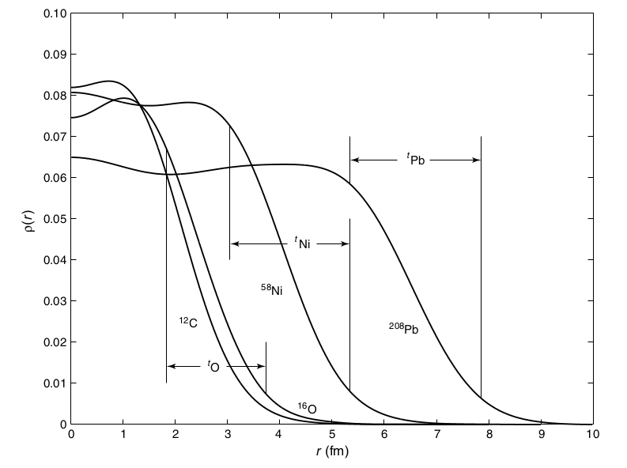

Chapter 3. Nuclear Properties
===

- Static properties of nuclei : electric charge, radius, mass, binding energy, angular momentum, parity, magnetic dipole moment, electric quadrupole moment, energies of excited states
- Dynamic properties of nuclei :

# 3.1 The Nuclear Radius

- 양자역학적 특성에 의해 반경이란 것을 제대로 정의할 수 없으므로 기능적 정의 (*operational definition*) 에 의해 두가지 정의가 많이 사용된다.
  - **Mean radius** : 확률밀도가 중앙값의 1/2 가 되는 반경
  - **Skin thickness** :  over which the density drops from near its maximum to near its minimum. 
  - ch 5 에서 다룰 것 : nuclear 가 구형이 아닐 경우에 사용한다는데...
- 우리가 얻고자 하는 어떠 것의 분포인가에 따라..
  - Coulomb interaction 을 사용하는 실험에서는 (High-energy electron scattering, Muonic X rays, optical and X-ray isotope shift 등) 기본적으로 전하분포를 얻지만, 러더퍼드 스캐터링, $\alpha$-decay, pionic X ray 등 강한 핵력을 사용하는 실험에서는 nucleons 의 분포를 얻는다. 이를 **distribution of nuclear matter** 라 한다.

##  The distribution of Nuclear Charge

- 핵의 직경은 10 fm 이하이므로 산란실험에서는 파장이 10 fm 이하인 파장을 사용해야 한다. 
  $$
  \lambda \le 10 \text{ fm} \iff p \gtrsim 100 \text{ MeV/c}
  $$

  - 전자의 경우 100 MeV ~ 1 GeV 가 주로 사용된다. (10 fm 파장 은 124 MeV, 1 fm 파장은 1.24 GeV )
  - plane wave approx. 등을 사용하여 계산한 form factor 는 다음과 같다. 여기서 $q=|\mathbf{q}|=|\mathbf{k}_i-\mathbf{k}_f|$ 이며 $\rho_e(\mathbf{r}')$ 은 핵의 전하 밀도로 spherically symmetric 함을 가정하여 $\rho_{e}(\mathbf{r})=\rho_e(r)$ 로 표현하였다.

  $$
  F(q) = \dfrac{4\pi}{q} \int \sin qr' \rho_e (r')r' dr'
  $$

  - 전자 산란 등으로 $F(q)$​ 를 얻은 뒤 inverse Fourier transform 하여 $\rho_e(r')$​ 을 얻는다. 

- 아래 그림은 몇몇 핵에 대한 전자 산란으로 얻은 nuclear charge distribution 을 나타낸다. (출처 : <i>The Atomic Nucleus </i>, A.-M. Mårtensson-Pendrill and M.G.H. Gustavsson, Volume 1, Part 6, Chapter 30, pp 477–484 in Handbook of Molecular Physics and Quantum Chemistry, Edited by Stephen Wilson)

- 중앙에서의 nuclear charge density는 모든 핵에서 거의 동일하다. Nucleons 는 핵의 중심에 모여있는 것이 아니라 어느 정도 범위까지는 거의 일정하게 분포한다. 또한 단위 부피당 nucleons 의 갯수는 거의 일정하다. ($A$ 를 atomic mass 라 하면,)

$$
\dfrac{A}{\frac{4}{3} \pi R^3} \sim \text{nearly constant}
$$

​	따라서 $R \propto A^{1/3}$​ 이므로 ​ 우리는 **proportionality constant** $R_0$ 를 
$$
R_0 = \dfrac{R}{A^{1/3}}
$$
​	로 정의한다. 위의 그림으로부터 $R_0 \simeq 1.2 \text{ fm}$  임을 알 수 있다. (어쨌든!!!)

- 위의 그림에서 $t_{O},\, t_{Ni}$​​ 등으로 표시된 것이 **skin thickness** 이다. 이 skin thickness는 atomic number 에 거의 의존하지 않는것 처럼 보이며 보통 모든 원자/동위원소에 대해 상수로 취급한다. 보통 $r=0$ 에서의 밀도의 90% 지점부터 10% 지점까지의 거리로 정의하며 2.3 fm 정도 된다.
- root mean square (rms) radius 는 $\left \langle r^2 \right\rangle^{1/2}$​ 로 정의되며 electron scattering 실험으로 부터 얻어진다. 반경  $R$​ 의 uniformly charged sphere 를 가정하면 $\langle r^2 \rangle = \frac{3}{5}R^2$​ 이다. 실험적으로 측정 한 결과 rms radius 와 $A^{1/3}$​ 은 전 영역에서 근사적으로 비례관계에 있으며 

$$
\left\langle r^2 \right \rangle^{1.2} \approx (1.23 \text{ fm})A^{1/3} 
$$

​	의 관계가 존재한다.(approximately!!)

### Isotope Shift 를 통한 nuclear radius 측정

- 핵이 point 가 아닌 부피를 가지고 있다면 전자가 핵 내에 존재할 확률이 $0$ 이 아니며 이는 당연히 point 로 간주할 때와 그 에너지가 다르다.  수소의 1s 전자의 경우 대략 전자의 속박에너지의 $10^{-4}$ 정도 차이가 난다. 적절한 근사에 의해 그 에너지 차이는 다음과 같이 계산된다. ($R$: 원자핵의 반경, $a_0$ : 원자 반경)
$$
\Delta E = \dfrac{5}{2}\dfrac{Z^4e^2}{4\pi\epsilon_0}\dfrac{R^2}{a_0^3}
$$

- 이정도 영역에서 영향일 끼칠수 있는 다른 요인은 상대론적인 효과와 주변의 다른 전자에 의한 효과가 있으며, 따라서 single measurement 로는 핵의 반경을 정확히 측정 할 수 없다. 만약 인접한 두 isotope 에 대한 $2p \to 1s$​ transition 의 에너지 변화의 차이를 얻는다고 가정하자.  (K X-ray 측정을 통해 얻는다.) $2p$ wavefunction 은 원점에서 존재할 확률이 $0$ 이므로 $2p$ state 에서의 차이는 무시할만하며 $1s$ 에서의 차이만 고려하면 된다. 

$$
\begin{aligned}
E_K(A)-E_K(A') &= \left[ E_{2p}(A)-E_{1s}(A)\right]-\left[E_{2p}(A')-E_{1s}(A')\right] \\
&=E_{1s}(A')-E_{1s}(A)
\end{aligned}
$$

- 여기서 $A,\,A'$ 은 각각 isotope 의 atomic weight 이며 $E_{1s}\equiv E-\Delta E$ 이므로,

$$
E_{K}(A)-E_K(A') = - \dfrac{2}{5} \dfrac{Z^4e^2}{4\pi \epsilon_0}\dfrac{R_0^2}{a_0^3} {\big(} A^{2/3}-A'^{2/3}{\big)}
$$

이다. 이 때의 $E_K(A)-E_K(A')$ 을 K X-RAY **isotope shift** 라 한다. 

- Text 의 fig 3.6 에 보면 Hg 의 다양한 동위원소에 대한 isotope shift 측정 결과가 나온다. $-\Delta E \propto (A^{2/3}-A'^{2/3})$ 이 아주 뚜렷하다.

- K X-ray 이외의 빛을 이용한 optical isotope shift 실험도 있다. 
- Isotope shift 는 transition energy 의 10-4~ 10-6 정도로 매우 작은데 이는 전자의 파동함수중 원자핵과 겹치는 부분이 매우 작으므로 어쩔 수 없는 부분이다. 뮤온은 전자 대신 사용한다면 뮤온 $1s$ 의 파동함수의 반경은 전자의 약 1/207 이므로 상대적인 shift 가 매우 커진다.  Pb 와 같은 무거운 원소의 경우 뮤온 1s 오비탈의 반경은 원자핵의 반경보다 작게 되며 isotope shift 는 transition energy 의 2배나 된다.

- 
