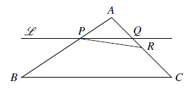
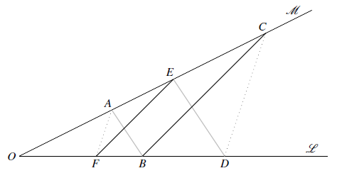
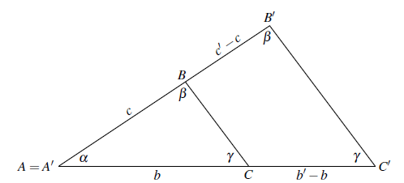
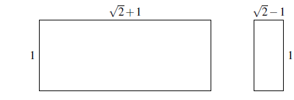

I. Straightedge and Compass
==

## 1.1. Euclid's construction axioms

#### Euclids' axiom for constructions

유클리드는 다음 작도(constructions)가 가능하다고 가정했으며 이를 *postulates* 라고 불렀다. Stillwell은 *axioms*라 한다

1. 임의의 두 점 사이에 선분(straight line segment)을 그릴 수 있다.
2. 선분은 무한히 확장될 수 있다.
3. 주어진 중심과 반경으로 원을 그릴 수 있다.

<b>Note : </b> Euclid와 그의 동시대인들은 무한을 피하기 위해 직선보다는 선분을 주로 사용했다.

#### 직각자와 컴퍼스

- 직각자에는 눈금이 없으며 단지 직선을 긋는 데 사용한다
- 컴퍼스는 원을 긋는데 사용 할 수 있다.
- 컴퍼스는 어떤 길이를 이동하는 데 사용 할 수 있다. 이것을 이용하여 두 선분의 길이를 더하거나 뺄 수 있다.

## 1.2 Euclid's construction of the equilateral triangle

#### 정삼각형 그리기

## 1.3 Some basic constructions

#### 선분의 이분할

4. 선분을 이분할 할 수 있다.

5. 주어진 직선 $\mathscr{L}$ 에 대해 $\mathscr{L}$ 위의 점 $P_1$ 을 지나며 $\mathscr{L}$ 에 수직한 직선을 그을 수 있다.

6. 주어진 직선 $\mathscr{L}$ 에 대해 $\mathscr{L}$ 위에 있지 않은 점 $P_2$ 를 지나며 $\mathscr{L}$ 에 수직한 직선을 그을 수 있다.

#### 각의 이분할

7. 임의의 각을 이분할 할 수 있다.

#### 평행선

8. 직선 $\mathscr{L}$ 과 직선 밖의 점 $P$ 가 있을 때 $P$ 를 지나며 $\mathscr{L}$ 과 평행한 직선을 그릴 수 있다.

   - 점 $P$ 에서 직선 $\mathscr{L}$ 에 수직선 $\mathscr{M}$ 을 그은 후(6) $P$ 를 지나고 $\mathscr{M}$ 에 수직한 직선 $\mathscr{L}'$ 을 그리면 $\mathscr{L}'$ 은 $\mathscr{L}$ 과 평행하다.

     

#### 평행선에 대한 Thales' theorem

9. 삼각형 $ABC$ 에서 $BC$ 에 평행하고 $A$ 로부터의 거리가 $BC$ 보다 짧은 직선 $\mathscr{L}$ 이 $AB$ 와 만나는 점을 $P$, $AC$ 와 만나는 점을 $Q$ 라 할 때, 
   $$
   |AP|:|AB|=|AQ|:|AC|
   $$
   이다. 혹은 다음과 같이 표현 할 수 도 있다.
   $$
   |AP|:|PB|=|AQ|:|QC|
   $$
   (증명은 section 2.6에)
   
   
   

<b>Exercise 1.3.6 </b> 

위의 그림에서 $|AP|/|PB|=|AQ|/|QC|$ 이 성립한다는 것이 $|AP|/|AB|=|AQ|/|AC|$ 와 동치임을 보여라.

---

Let $a=|AP|/|PB|=|AQ|:|QC|$ . Then, $|AP|=a|PB|,\, |AQ|=a|QC|$. 

$|AB|=|AP|+|PB|=(1+a)|PB|$ and $|AC|=(1+a)|QC|$. Then,
$$
\dfrac{|AP|}{|AB|}=\dfrac{a|PB|}{(1+a)|PB|}=\dfrac{a}{1+a}=\dfrac{|AQ|}{|AC|}
$$

#### 선분의 $n$ 분할

10. 임의의 양의 정수 $n$ 에 대해 선분 $AB$ 를 $n$ 분할 할 수 있다.

- $A$ 를 지나는 임의의 직선 $\mathscr{L}$ 을 긋는다. $A$ 서부터 컴퍼스를 이용햐여 같은 길이로 $A_1,\ldots,\,A_n$ 을 찍는다. 즉 선분$A_{i-1}A_i$ 의 길이가 모두 같도록. $A_n$ 과 $B$ 를 잇는 선분 $\mathscr{M}_n$ 을 그리고 $A_1,\ldots,\,A_{n-1}$ 을 지나며 선분 $\mathscr{M}_n$ 과 평행한 직선을 긋는다. $A_i$ 를 지나고 $\mathscr{M}_n$ 과 평행한 직선을 $\mathscr{M}_i$ 라 하고 이것이 선분 $AB$ 와 만나는 점을 $B_i$ 라 하자. 그렇다면 $B=B_n$ 이 된다.
- 그렇다면 $|AB_1|=|B_1B_2|=\cdots =|B_{n-1}B_n|$ 이 된다. 따라서 선분 $AB$ 를 $n$ 분할 하였다.

## 1.4 Multiplication and division

이 section에서는 임의의 선분의 길이 $a$ 를 unit length로 잡고 이 unit length에 대한 곱하기와 나누기가 가능함을 보인다. 즉 여기서 선분의 길이가 $a$ 라 함은 이 길이가  unit length 의 $a$ 배란 의미이다.

11. $a,\,b$ 의 길이를 갖는 선분이 있을 때 $ab$ 의 길이를 갖는 선분을 그릴 수 있다. 즉 곱셈을 할 수 있다.
12. $a,\,b$ 의 길이를 갖는 선분이 있을 때 $a/b$ 의 길이를 갖는 선분을 그릴 수 있다. 즉 나눗셈을 할 수 있다.

<b>Exercise 1.4.1</b> 

위의 그림에서 $PR$ 이 $BC$ 와 평행하지 않으면 $|AP|/|AB| \ne |AR|/|AC|$ 임을 보이시오.

---

우리는 $|AP|/|AB|=|AQ|/|AC|$ 임을 알고 있다. 만약 $R$ 이 $Q$ 보다 $A$ 쪽으로 치우쳐 있다면 $|AR|<|AQ|$,  $|AR|/|AC|<|AQ|/|AC|=|AP|/|AB|$ 이다. 만약 $R$ 이 $Q$ 보다 $C$ 쪽으로 치우쳐 있다면 $|AR|>|AQ|$ 이므로, $|AR|/|AC|>|AQ|/|AC|=|AP|/|AB|$ 이다. $\square$

<b>Exercise 1.4.2 </b> Exercise 1.4.1의 그림에서 다음을 증명하시오.

$PQ$ 와 $BC$ 는 평행하다. $\iff$ $|AP|/|AB|=|AQ|/|AC|$ .

---

$\implies$ 는 Thales theorem. $\impliedby$  는 Exercise 1.4.1

<b>Exercise 1.4.3</b>

위의 그림에서 $EF \parallel BC$ 이고 $AB\parallel ED$ 이다. 다음을 증명하라.
$$
\dfrac{|OA|}{|OF|}=\dfrac{|OC|}{|OD|}
$$

---

$$
\begin{align*}
|OA|/|OE|=|OB|/|OD|\,; \quad& \triangle OAB \text{ and } \triangle OED\\
|OE|/|OC|=|OF|/|OB|\,; \quad& \triangle OEF \text{ and } \triangle OBC

\end{align*}
$$

좌 우변을 각각 곱하면 $|OA|/|OC|=|OF|/|OD|$ 이므로 증명 끝. 또한 Exercise 1.4.2 에 의해  $AF \parallel CD$ 이다.

## 1.5 Similar Triangle

#### 닮은 삼각형

두 삼각형의 세 각이 같을 때 이를 닮은 삼각형이라 한다.

$\triangle ABC$ 와 $\triangle A'B'C'$ 은 닮은 삼각형이다. 평행선 공리에 의해  $BC$ 와 $B'C'$ 이 평행이므로 
$$
\dfrac{b}{c}=\dfrac{b'}{c'}
$$
이며 $B$ 와 $B'$ 을 일치시켜 표현하면,
$$
\dfrac{a}{a'}=\dfrac{b}{b'}=\dfrac{c}{c'}
$$
임을 알 수 있다.

#### Exercise 1.5.1 ~ 1.5.4

두 직사각형에서 $\dfrac{\text{긴 변의 길이}}{\text{짧은 변의 길이}}$ 가 같을 경우 이 두 직사각형을 닮았다고 한다.

<b>Exercise 1.5.1</b> 위 그림의 두 직사각형이 닮았으므로 $\dfrac{\sqrt{2}+1}{1}=\dfrac{1}{\sqrt{2}-1}$ 임을 보이시오.

---

trivial

<b>Exercise 1.5.2</b> 하나의 긴 변의 길이가 $a$ 이고 짧은변의 길이가 $b$ 인 직사각형이 위의 직사각형과 닮은꼴이라 하자. 그렇다면 긴 변의 길이가 $b$ 인 직사각형이 역시 닮은꼴이면 짧은변의 길이는 $a-2b$ 임을 보이시오.

---

$$
\sqrt{2}+1=\dfrac{a}{b} =\dfrac{b}{x}=\dfrac{1}{\sqrt{2}-1}
$$

From above, $ax=b^2,\,b=x/(\sqrt{2}-1),\, b=(\sqrt{2}-1)a$. Then, 
$$
x=(\sqrt{2}-1)^2a=(3-2\sqrt{2})a=a-2(\sqrt{2}-1)a=a-2b\;.
$$

<b>Exercise 1.5.3</b> $\sqrt{2}+1=m/n$ where $m,\,n \in \Z_{+}$ 라 가정하자. 또한 $m$ 이 가장 작은 수라 가정하자. Exercise 1.5.2로부터 $\sqrt{2}+1=n/(m-2n)$ 인데 이는 모순이다. 그 이유는?

---

$\sqrt{2}+1=m/n$ 이며 $m$ 이 가장 작은 수라는 조건에서 $\gcd (m,\,n)=1$ 임을 알 수 있다.
$$
\dfrac{m}{n}=\dfrac{n}{m-2n}\implies m^2-2mn=n^2\implies m^2=n(n+2m)
$$
이므로 $m^2$ 는 $n$ 의 배수이다. 그런데 $\gcd(m,\,n)=1 \implies \gcd(m^2,\,n)=1$ 이므로 이는 모순. 

<b>Exercise 1.5.4</b> 1.5.3으로부터 $\sqrt{2}+1$은 무리수라는 것을 증명했다. 이로부터 $\sqrt{2}$ 가 무리수라는 것을 어떻게 알 수 있는가?

---

유리수는 덧셈에 대해 닫혀 있다.

