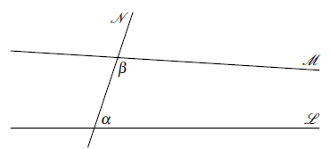
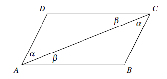
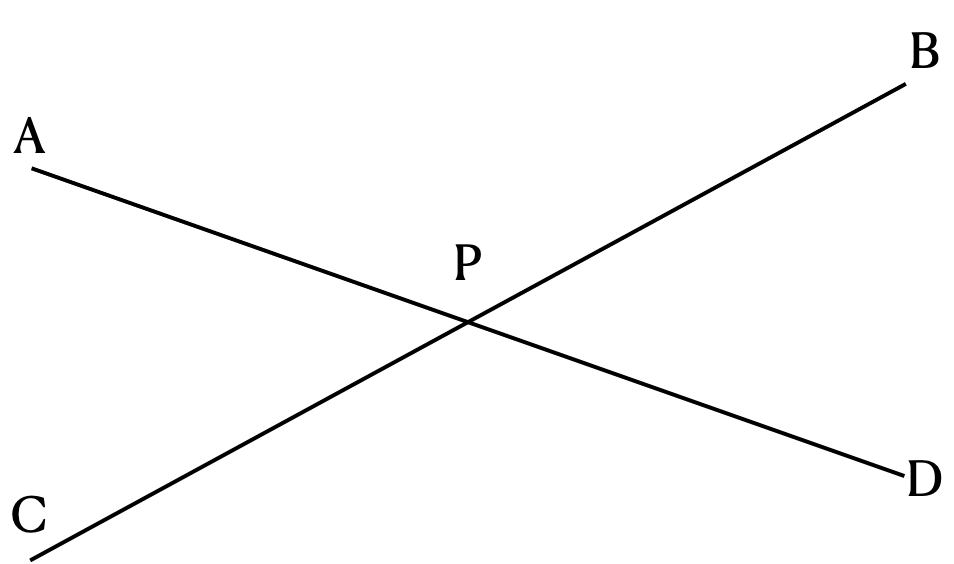
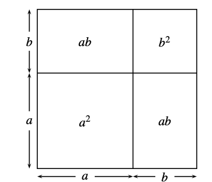

II. Euclid's Approach to Geometry
===

## 2.1 평행선 공리

#### 유클리드의 평행선 공리

한 직선이 다른 두 직선을 만날 때, 그 내각이 직각의 두배보다 작다면 이 두 직선은 그쪽에서 만난다.

#### 그림으로 설명

직선 $\mathscr{N}$ 이 직선 $\mathscr{L},\,\mathscr{M}$  과 만나며 그 내각은 $\alpha,\,\beta$ 이다. 두 직선이 만난다면 $\mathscr{N}$ 의 왼쪽 혹은 오른쪽에서 만나며 $\alpha+\beta$의 합이 직각의 두배, 즉 $180^\circ$ 나 $\pi$ 보다 작으면 오른쪽에서 만나고, 크면 왼쪽에서 만난다. 만약 $\pi$ 이면? $\mathscr{L}$ 과 $\mathscr{M}$ 은 평행하다.

#### 현대적인 평행선 공리 (Playfair's axiom)

임의의 직선 $\mathscr{L}$ 과 $\mathscr{L}$에 포함되지 않는 점 $P$ 에 대해 $P$를 통과하며 $\mathscr{L}$ 과 만나지 않는 직선이 유일하게 존재한다.

#### 삼각형의 내각의 합

삼각형의 내각의 합은 $\pi$ 이다.

---

*(proof)* 평행선 공리로 증명 가능.

*이 section의 exercises는 쉬워서 생략*

#### 평행선에서의 엇각

## 2. 합동 공리 (Congruence axioms)

#### Euclide의 합동 공리

만약 두 삼각형의 두 변이 같고 두 변 사이의 사잇각들이 같으면 두 삼각형은 같다(합동이다)

#### SAS 공리

만약 두 삼각형 $ABC$ 와 $A'B'C'$ 에 대해 
$$
|AB|=|A'B'|,\quad\ang ABC=\angle A'B'C',\quad |BC|=|B'C'|
$$
이면,
$$
|AC|=|A'C'|,\quad\ang BCA=\ang B'C'A',\quad \ang CAB=\ang C'A'B'
$$
이다. 

<b>Note : </b> SAS는 side-angle-side 의 약자이다. $SAS$로부터 두 삼각형이 합동인 조건 $ASA$, $SSS$ 를 유도할 수 있으므로 이들을 공리로 여기지 않는다.

#### 이등변 삼각형 정리 (Isosceles triangle theorem)

한 삼각형의 두 변의 길이가 같다면 이 변의 반대편 각의 크기도 서로 같다. 즉 $\triangle ABC$ 에서 $|AB|=|AC|$ 이면 $\beta=\gamma$ 이다.

---

*(proof)*  $\triangle ABC$ 와 $ABC$를 뒤집은 $\triangle ACB$ 를 생각하자. SAS 공리에 의해 두 삼각형은 합동이므로 $\beta=\gamma$ 이다. $\square$

#### 평행사변형의 정의

마주보는 두 변이 각각 평행한 사각형을 평행사변형이라 한다.

#### 평행사변형 변의 정리 (Parallelogram side theorem)

평행사변형의 마주보는 두 변의 길이는 같다.

---

*(proof)* 평행사변형 $ABCD$ 와 대각선 $AC$ 를 그린다. $\alpha = \angle DAC$, $\beta=\angle CAB$ 라 하자. 

$AB$ 와 $DC$ 가 평행선이므로 $\ang ACD=\ang CAB=\beta$이며, $AD$ 와 $CB$ 가 평행선이므로 $\ang DAC=\ang ACB=\alpha$ 이다. $AC$ 를 공유하므로 ASA 조건에 의해 $\triangle DAC$ 와 $\triangle ABC$ 는 합동이다. 따라서 평행사변형의 마주보는 두 변의 길이는 같다. $\square$

## 2.3 Area and equality

#### Euclid's 5 common notions

1. $A=B \text{ and } A=C \implies B=C$. 
2. $A=B \text{ and } C=D \implies A+C=B+D$.
3. $A=B \text{ and } C=D \implies A-C=B-D$.
4. Thigs which coincide with one another are equal to one another (서로 포개어 겹쳐지는 것은 서로 같다)
5. 전체는 부분보다 크다.

#### Euclid's proposition 15 : vertically opposite angle

위 그림에서 $\ang APC$ 와 $\ang PBD$ 를 서로 vertically opposite angle 을 서로 엇각이라고 하며 그 크기는 같다.

#### The square of the sum

유클리드 원리의 proposition 4 of Book II 는 다음과 같다.
$$
(a+b)^2=a^2+2ab+b^2
$$
유클리드는 기하학을 이용하여 증명하였다. 다음 그림을 보면 어떻게 증명하는지 알 수 있다.

고대 그르스인들은 equiality of region을 생각했지 equality of area를 생각하지 않았다. 예를 들어 두 변의 길이가 $a,\,b$ 인 직사각형과 $\sqrt{2}a$ 와 $b/\sqrt{2}$ 인 직사각형이 같다고 생각하지 않았다. 

