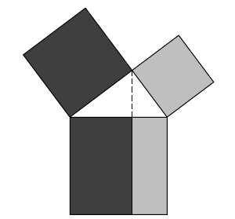
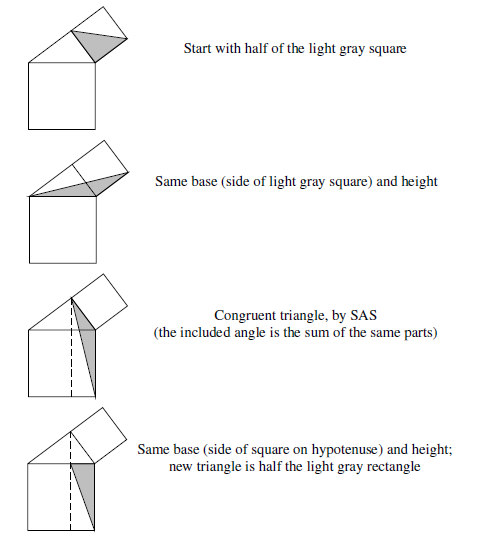
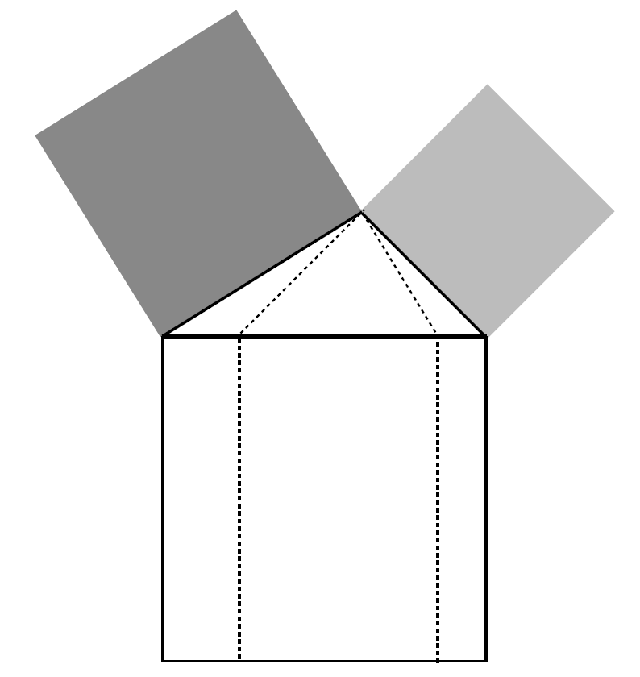
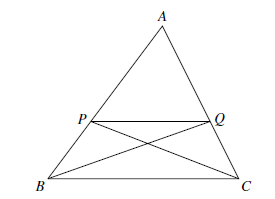
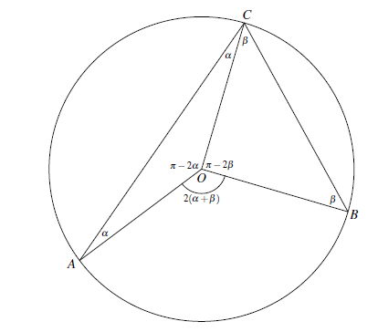
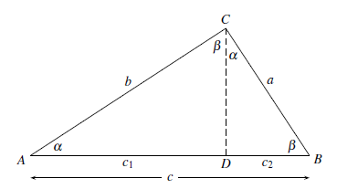
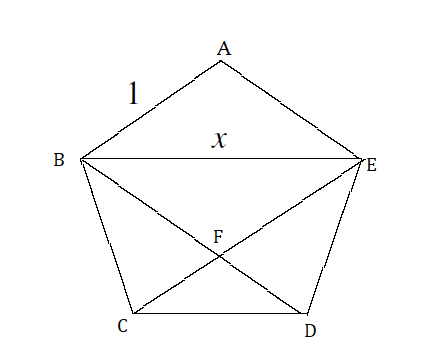

II. Euclid's Approach to Geometry
===

## 2.1 평행선 공리

#### 유클리드의 평행선 공리

한 직선이 다른 두 직선을 만날 때, 그 내각이 직각의 두배보다 작다면 이 두 직선은 그쪽에서 만난다.

#### 그림으로 설명

직선 $\mathscr{N}$ 이 직선 $\mathscr{L},\,\mathscr{M}$  과 만나며 그 내각은 $\alpha,\,\beta$ 이다. 두 직선이 만난다면 $\mathscr{N}$ 의 왼쪽 혹은 오른쪽에서 만나며 $\alpha+\beta$의 합이 직각의 두배, 즉 $180^\circ$ 나 $\pi$ 보다 작으면 오른쪽에서 만나고, 크면 왼쪽에서 만난다. 만약 $\pi$ 이면? $\mathscr{L}$ 과 $\mathscr{M}$ 은 평행하다.

#### 현대적인 평행선 공리 (Playfair's axiom)

임의의 직선 $\mathscr{L}$ 과 $\mathscr{L}$에 포함되지 않는 점 $P$ 에 대해 $P$를 통과하며 $\mathscr{L}$ 과 만나지 않는 직선이 유일하게 존재한다.

#### 삼각형의 내각의 합

삼각형의 내각의 합은 $\pi$ 이다.

---

*(proof)* 평행선 공리로 증명 가능.

*이 section의 exercises는 쉬워서 생략*

#### 평행선에서의 엇각

## 2. 합동 공리 (Congruence axioms)

#### Euclide의 합동 공리

만약 두 삼각형의 두 변이 같고 두 변 사이의 사잇각들이 같으면 두 삼각형은 같다(합동이다)

#### SAS 공리

만약 두 삼각형 $ABC$ 와 $A'B'C'$ 에 대해 
$$
|AB|=|A'B'|,\quad\ang ABC=\angle A'B'C',\quad |BC|=|B'C'|
$$
이면,
$$
|AC|=|A'C'|,\quad\ang BCA=\ang B'C'A',\quad \ang CAB=\ang C'A'B'
$$
이다. 

<b>Note : </b> SAS는 side-angle-side 의 약자이다. $SAS$로부터 두 삼각형이 합동인 조건 $ASA$, $SSS$ 를 유도할 수 있으므로 이들을 공리로 여기지 않는다.

#### 이등변 삼각형 정리 (Isosceles triangle theorem)

한 삼각형의 두 변의 길이가 같다면 이 변의 반대편 각의 크기도 서로 같다. 즉 $\triangle ABC$ 에서 $|AB|=|AC|$ 이면 $\beta=\gamma$ 이다.

---

*(proof)*  $\triangle ABC$ 와 $ABC$를 뒤집은 $\triangle ACB$ 를 생각하자. SAS 공리에 의해 두 삼각형은 합동이므로 $\beta=\gamma$ 이다. $\square$

#### 평행사변형의 정의

마주보는 두 변이 각각 평행한 사각형을 평행사변형이라 한다.

#### 평행사변형 변의 정리 (Parallelogram side theorem)

평행사변형의 마주보는 두 변의 길이는 같다.

---

*(proof)* 평행사변형 $ABCD$ 와 대각선 $AC$ 를 그린다. $\alpha = \angle DAC$, $\beta=\angle CAB$ 라 하자. 

$AB$ 와 $DC$ 가 평행선이므로 $\ang ACD=\ang CAB=\beta$이며, $AD$ 와 $CB$ 가 평행선이므로 $\ang DAC=\ang ACB=\alpha$ 이다. $AC$ 를 공유하므로 ASA 조건에 의해 $\triangle DAC$ 와 $\triangle ABC$ 는 합동이다. 따라서 평행사변형의 마주보는 두 변의 길이는 같다. $\square$

## 2.3 Area and equality

#### Euclid's 5 common notions

1. $A=B \text{ and } A=C \implies B=C$. 
2. $A=B \text{ and } C=D \implies A+C=B+D$.
3. $A=B \text{ and } C=D \implies A-C=B-D$.
4. Thigs which coincide with one another are equal to one another (서로 포개어 겹쳐지는 것은 서로 같다)
5. 전체는 부분보다 크다.

#### Euclid's proposition 15 : vertically opposite angle

위 그림에서 $\ang APC$ 와 $\ang PBD$ 를 서로 vertically opposite angle 을 서로 엇각이라고 하며 그 크기는 같다.

#### The square of the sum

유클리드 원리의 proposition 4 of Book II 는 다음과 같다.
$$
(a+b)^2=a^2+2ab+b^2
$$
유클리드는 기하학을 이용하여 증명하였다. 다음 그림을 보면 어떻게 증명하는지 알 수 있다.

고대 그르스인들은 equiality of region을 생각했지 equality of area를 생각하지 않았다. 예를 들어 두 변의 길이가 $a,\,b$ 인 직사각형과 $\sqrt{2}a$ 와 $b/\sqrt{2}$ 인 직사각형이 같다고 생각하지 않았다. 

## 2.4 평행사변형의 면적과 삼각형

#### 평행사변형의 면적 

$$
\text{평행사변형의 면적}=\text{밑변}\times \text{높이}
$$

#### 삼각형의 면적

$$
삼각형의 면적 = \dfrac{1}{2} \times 밑변 \times 높이.
$$

## 2.5 The Pythagorean theorem

#### Pythagorean theorem

모든 직각삼각형에서 두 짧은 변의 길이의 제곱의 합은 빗변의 길이의 제곱의 합과 같다.

---

*(proof)* 우선 위의 그림에서 두 짙은 부분과 두 옅은 부분의 넓이가 같다는 것을 보이면 피타고라스정리가 증명된다. 다음과 같이 보일 수 있다.

$\square$

<b>Exercise 2.5.2</b> 피타고라스 정리의 역을 증명하라. 즉 삼각형 세 변의 길이가 $a,\,b,\,c$ 이고 $c^2=a^2+b^2$ 이면 $\ang ACB$는 직각임을 보여라.

---

위의 그림에서 $\ang ACB$ 가 직각보다 크면 $c^2<a^2+b^2$ 임을 알 수 있다. 또한 같은 방법으로 $\ang ACB$가 직각보다 작으면 $c^2>a^2+b^2$  임을 알 수 있다. 

## 2.6 Thales theorem의 증명.

#### The Thales theorem

삼각형의 한 변과 평행하며 나머지 두 변과 만나는 직선은 이 두 변을 비례적으로 자른다. 즉, 

에서 $PQ$ 가 $BC$ 와 평행하면 $|AP|/|AB|=|AQ|/|AC|$ 이다.

---

*(proof)* 선분 $PC$와 $QB$를 긋는다. $\triangle PBC$의 면적은 $\triangle QBC$의 면적과 같다. 이 두 삼각형에 $\triangle APQ$를 각각 붙이는 것으로 $\triangle AQB$ 와 $\triangle APC$ 의 면적이 같음을 알 수 있다.

$\triangle AQB$ 로부터,
$$
\dfrac{|AP|}{|PB|}=\dfrac{\text{area of } \triangle AQP}{\text{area of }\triangle PQB} \tag{1}
$$
임을 알 수 있고, $\triangle APC$ 로부터,
$$
\dfrac{|AQ|}{|QC|}=\dfrac{\text{area of }\triangle AQP}{\text{area of }\triangle QPC} \tag{2}
$$
임을 알 수 있다.  $\text{area of  }\triangle PQB=\text{area of }\triangle PQC$ 이므로,
$$
\dfrac{|AP|}{|PB|}=\dfrac{|AQ|}{|QC|}
$$
이다. $\square$

## 2.7 원의 각

#### Invariance of angles in a circle

원주 상의 점 $A,\,B$ 와 원의 중심 $O$를 생각하자. 원주상의 임의의 점 $C$에 대해 $\angle ACB$는 항상 같으며 $\angle ACB=\dfrac{1}{2}\angle AOB$ 이다. 

이등변 삼각형의 성질을 이용하면 쉽게 보일 수 있다. 또한 $\angle ACB=\dfrac{1}{2} \angle AOB$ 임도 알 수 있다.

#### Angle of semicircle theorem

$A,\,B$가 원 위의 점이며 $AB$ 가 원의 지름이라면 원 위의 임의의 점 $C$ 에 대해 $\angle ACB=\pi/2$ 이다. 

---

proof is trivial from invariance of angle in a circle.

#### Exercises

<b>2.7.1</b> semicircle theorem으로부터 주어진 빗번 $AB$를 갖는 직각삼각형을 그릴 수 있음을 보이시오.

---

빗변 $AB$의 이분할 점 $O$ 를 찾을 수 있으며 $OA$를 반지름으로 하는 원을 그릴 수 있다. 이 원 상에 임의의 점 $C$ 에 대해 삼각형 $ABC$는 $\angle ACB$를 직각으로 하는 직각삼각형이다.

<b>2.7.2</b> Figure 2.13을 보고 주어진 직사각형과 같은 면적을 갖는 정사각형을 그리는 방법을 찾으시오.

---

직사각형 중 짧은 변의 길이를 확장하여 정사각형을 그린다. 짧은 변의 길이를 확장한 정사각형의 한 변을 지름으로 하는 원을 그린다. 긴 변중 원과 접하지 않는 변을 늘여서 원과 만나는 점 $C$를 찾는다. 반원의 각의 정리에 의해 앞서 그린 한 점과 점 $C$를 잇는 각 $\angle ACB$ 는 직각이며 $AC$ 혹은 $AB$ 쪽으로 정사각형을 그리면 그중 하나가 (무엇인지는 쉽게 찾을 수 있다) 원래의 직사각형과 같은 면적의 정사각형이다.

<b>2.7.3</b> 주어진 두개의 정사각형으로부터 두 정사각형의 면적의 합과 같은 면적을 갖는 정사각형을 그릴 수 있음을 설명하라.

---

한 점 $P$ 를 잡고 직선 $\mathscr{L}$ 과 역시 $P$를 통과하며 $\mathcal{L}$ 에 수직인 직선 $\mathscr{M}$ 을 그린다. 한 정사각형의 한 변의 길이 $a$ 와 같은 길이가 되도록 점 $P$로부터 직선 $\mathscr{L}$ 상에 점 $A$를 찍는다. 다른 정사각형의 한 변의 길이 $b$ 와 $PB$ 가 같은 길이가 되도록 직선 $\mathcal{M}$ 상에 점 $B$를 찍는다. $AB$ 를 한 변으로 갖는 정사각형을 그리면 그 면적은 $a^2+b^2$  이다.

<b>2.7.4</b>  위의  exercises로 부터 어떤 다각형에 대해서도 그 다각형과 면적이 같은 정사각형을 그릴 수 있음을 보이시오.

---

임의의 $n$ 각형은 $n-2$ 개의 삼각형의 합으로 나타 낼 수 있다. 만약 임의의 삼각형과 같은 면적을 갖는 정사각형을  그릴 수 있다면 exercise 2.7.3으로부터 이 정사각형의 면적의 합과 같은 면적을 갖는 정사각형을 그릴 수 있으므로 문제가 증명된다. 즉 임의의 삼각형과 같은 면적을 갖는 정사각형을 그릴 수 있음을 보이자.

임의의 삼각형 $ABC$ 에 대해 $C$를 통과하고 $AB$에 평행한 직선 $\mathscr{L}$ 을 그릴 수 있다. $A$ 로부터 $\mathscr{L}$ 에 수선을 그었을 때 만나는 점을 $C'$ 이라 하면 $\triangle ABC$ 의 면적은 직각삼각형 $\triangle ABC'$ 의 면적과 같다. $A$를 지나고 $BC'$ 에 수직인 직선과 $B$를 지나고 $AC'$ 에 수직인 직선이 만나는 점을 $D'$ 이라 하면 사각형 $ABC'D'$는 직사각형이며 $\triangle ABC$의 면적의 2배이다. Exercise 2.7.2에 의해 $ABC'D'$ 의 면적과 같은 면적을 갖는 정사각형 $EFGH$ 를 그릴 수 있다.

정사각형 $EFGH$ 의 한 변을 지름으로 삼는 원을 그리고 지름으로 삼은 한 변의 중심을 지나며 지름과 수직하는 직선이 원과 만나는 점 $K$를 생각하자. 원의 지름으로 삼은 변이 $EF$ 라면 $\triangle EKF$는 직각이등면삼각형이며 $|EK|=|KF|$ 이다. $EK$를 한 변으로 삼은 정사각형을 그릴 수 있으며 이 정사각형의 면적은 정사각형 $EFGH$ 의 1/2 이다. 이로부터 임의의 삼각형과 같은 면적을 갖는 정사각형을 그릴 수 있음을 보였다. 

임의의 정사각형의 면적의 합과 같은 면적을 갖는 정사각형을 그릴 수 있으므로 임의의 다각형과 같은 면적을 갖는 정사각형을 그릴 수 있다. 

<b>2.7.5</b> 어떤 사각형 $ABCD$ 에서 $A,\,B,\,C,\,D$ 가 각각 원에 있을 때 사각형의 마주보는 각의 합이 $\pi$ 가 됨을 보이시오.

---

원의 중심 $O$를 생각하자. $\ang ABC=\dfrac{1}{2} \ang AOC$ , $\ang CDA=\dfrac{1}{2} \ang COA$, $\ang AOC+\ang COA=2\pi$ 이므로 마주보는 각의 합은 $\pi$ 이다.

## 2.8 The Pythagorean theorem revisited.

#### 직각삼각형의 닮음을 이용한 Pythagorean theorem 증명

---

$\ang ACB=\pi/2$ 라 하자. $C$ 에서 선분 $AB$에 수선을 내려 그 만나는 점을 $D$라 하면 $\triangle ABC, \triangle ADC,\, \triangle BCD$ 는 서로 닮음을 알 수 있다. 위의 그림과 같이 각 $\alpha,\,\beta$ 와 길이 $c_1,\,c_2$ 를 정하자. 이 때 $\alpha+\beta =\pi/2$, $c_1+c_2=c$ 이다.

닮음에 의해 $\dfrac{b}{c} =\dfrac{c_1}{b}$ 이므로 $b^2=c_1 \cdot c$ 이고 $\dfrac{a}{c_2}=\dfrac{c}{a}$ 이므로 $a^2=c\cdot c_2$ 이다. 따라서,
$$
a^2+b^2=c\cdot c_1 +c\cdot c_2=c(c_1+c_2)=c^2\;.\square
$$

#### 직각자와 컴파스로 square root를 구하기

---

길이 $l$ 의 square root를 구할 수 있다. 길이 $l$ 과 길이 $1$ 을 연결하는 선분 $AB$ 를 만든다. 두 선분이 만나는 점을 $D$ 라하고  $l$ 의 다른 끝점을 $A$, $1$ 쪽의 다른 끝점을 $B$ 라 하자. $AB$를 지름으로 하는 원을 그리고 $D$ 에서 $AB$ 에 수직하게 직선을 그어 원과  만나는 점을 $C$ 라 하면 위의 그림에서 $c_1=l$, $c_2=1$ 이 된다. $|CD|=h$ 라 하면 닮음에 의해,
$$
\dfrac{h}{l}=\dfrac{1}{h}
$$
이고 $h=\sqrt{l}$ 이다.

#### Exercise

위의 그림은 한 변의 길이가 $1$ 인 정오각형이다. 가장 위의 점부터 반시계방향으로 $A,\,B,\,C,\,D,\,E$ 라 하자.

<b>2.8.1</b> 정오각형의 대칭을 이용하여 다음 식을 의미하는 닮은삼각형을 찾으시오.
$$
\dfrac{x}{1}=\dfrac{1}{x-x}
$$

---

우선 정오각형의 내각은 $(5-2)\times\pi/5=3\pi/5$ 이다. $\triangle ABE$ 에서 $\angle ABE=\angle AEB$ 이며 $\angle ABE=\dfrac{1}{2}(\pi-\dfrac{3\pi}{5})=\dfrac{\pi}{5}$ 이다 $\angle CBD=\dfrac{\pi}{5}$ 이므로 $\ang EBD=\dfrac{\pi}{5}$ 이다. 따라서 ASA에 의해 $\triangle ABE$ 와 $\triangle BFE$ 는 합동이며 $|BF|=|FE|=1$ 이다.  $|BD|=x$ 이므로 $|CF|=|FD|=x-1$ 이다. 

위의 그림의 에서 정오각형 내부에 $BD$와 $EC$ 가 만나는 점을 $F$ 라 하자. $\triangle BFE$ 와 $\triangle CFD$ 는 닮음이므로
$$
\dfrac{|BE|}{|BF|}=\dfrac{|CD|}{|CF|}\implies \dfrac{x}{1}=\dfrac{1}{x-1}
$$
이다.

<b>2.8.2</b> 위의 이차방정식을 풀어서 한 변의 길이가 1인 정오각형의 대각선의 길이 $x=(1+\sqrt{5})/2$ 임을 보이시오.

---

 trivial

<b>2.8.3</b> 정오각형을 그릴 수 있음을 보이시오.

---

우리는 직각자와 컴퍼스로부터 sqaure root를 그릴 수 있으며 주어진 두 길이를 합칠 수 있다. 길이 $1$ 인 선분을 다섯개 연결하여 길이 $5$인 선분을 만들고 이것의 square root 인 $\sqrt{5}$ 의 길이를 갖는 선분을 그릴 수 있다. 이것과 길이 $1$ 인 선분을 합친 후 2분할 하면 길이 $(1+\sqrt{5})/2$ 인 선분을 그릴 수 있다. 

한 변의 길이가 1이고 다른 두 변의 길이가 $(1+\sqrt{5})/2$ 인 이등변 삼각형을 그린다. 그리고 이 삼각형에서 길이 $(1+\sqrt{5})/2$ 인 변을 밑변으로 하고 다른 두 변의 길이가 모두 1인 이등변삼각형을 각각 그리면 정오각형이다.

