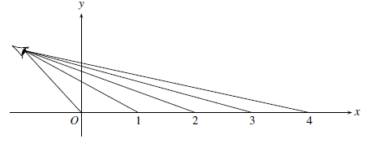
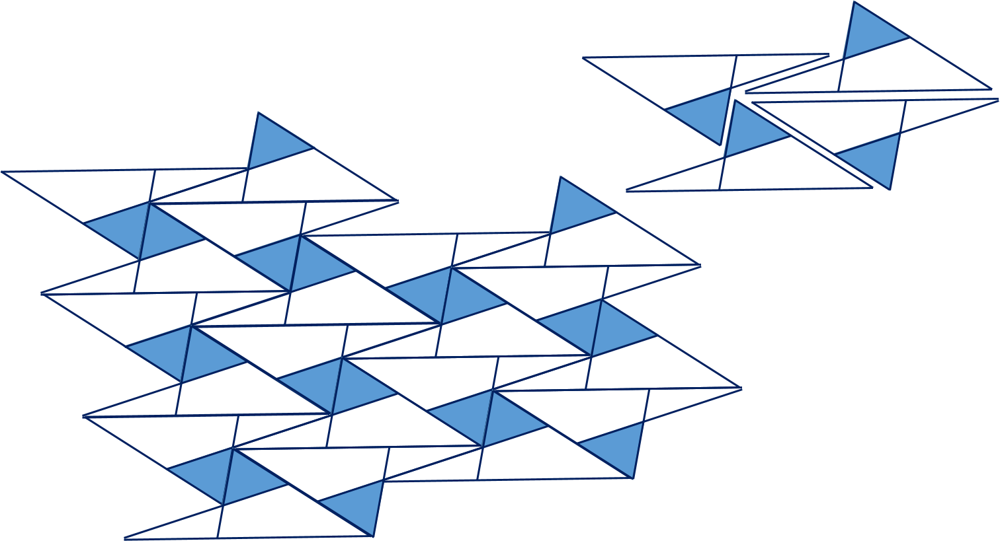
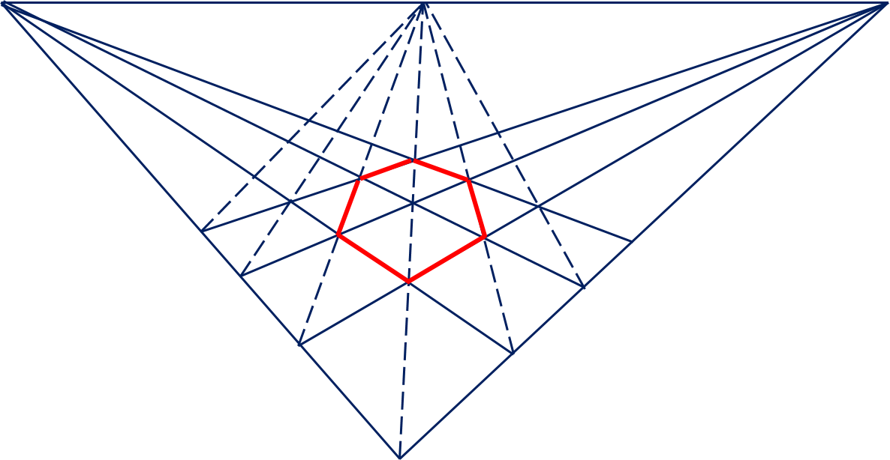

V. Perspective
===

## 5.1 Perspective Drawing

#### Exercise

Floor 의 타일의 행이 $ㅌ$$x$ 에서 $x=0,\,1,\,2,\,3,\ldots$ 에서 만나며 예술가는 floor를 $y$ 축을 따라 수직으로 서 있는 투명한 스크린을 통해 본다고 하자. 이 때 예술가의 눈은 $(-1,\,1)$ 에 위치해 있다. 이 때 $x=0,\,1,\,2,\ldots$ 에 대한 perspective of view 는 위의 그림에서와 같이 $y$ 축에 위치할 것이다.

<b>5.1.1.</b>  $(-1,\,1)$ 에서 $(n,\,0)$ 을 잇는 직선이 $y$ 축과 만나는 점은 $y=\dfrac{n}{n+1}$ 임을 보여라. 따라서, $x=0,\,1,\,2,\ldots$ 에 대한 perspective image는 point $y=0,\,\dfrac{1}{2},\,\dfrac{2}{3},\ldots$ 일 것이다.

---

직선의 방정식은 
$$
y=\dfrac{-1}{n+1}(x+1)+1
$$
이므로 $x=0$ 으로 놓으면, $y=\dfrac{n}{n+1}$ 이다.

만약 $0,\,1,\,2,\,3,\ldots$ 가 각각 다음 위치로 옮겨진다면 그 image $y=0,\,\dfrac{1}{2},\,\dfrac{2}{3},\,\dfrac{3}{4},\ldots$ 도 다음 point로 옮겨진다.

<b>5.1.2.</b> 함수 $f(y)=\dfrac{1}{2-y}$ 가 이 옮겨짐을 기술함을 보이시오.

---

$x_n=0,\,1,\,2,\,3,\ldots$, $y_n=\dfrac{n}{n+1}$ 이라 할 때 $f(y_n)=y_{n+1}$ 이라 하자.
$$
y_{n+1}=\dfrac{n+1}{n+2}=\dfrac{1}{\left(\dfrac{n+2}{n+1}\right)}=\dfrac{1}{2-\dfrac{n}{n+1}}=\dfrac{1}{2-y_n}
$$

<b>5.1.3.</b> $y$ 축상의 점 가운데 $f(y)=\dfrac{1}{2-y}$ 에 의해 옮겨지지 않는 점은 무엇이며 이 점의 기하학적인 중요성은 무엇인가?

---

$\displaystyle \lim_{n\to \infty}y_n=1$ 이며 $f(1)=1$ 이므로 옮겨지지 않는다. 이 점은 바로 눈이 위치한 높이이다.

## 5.2. Drawing with Straightedge Alone

#### Exercises

<b>5.2.1</b>

<b>5.2.2</b>

## 5.3 Projective Plane Axioms and Their Models

