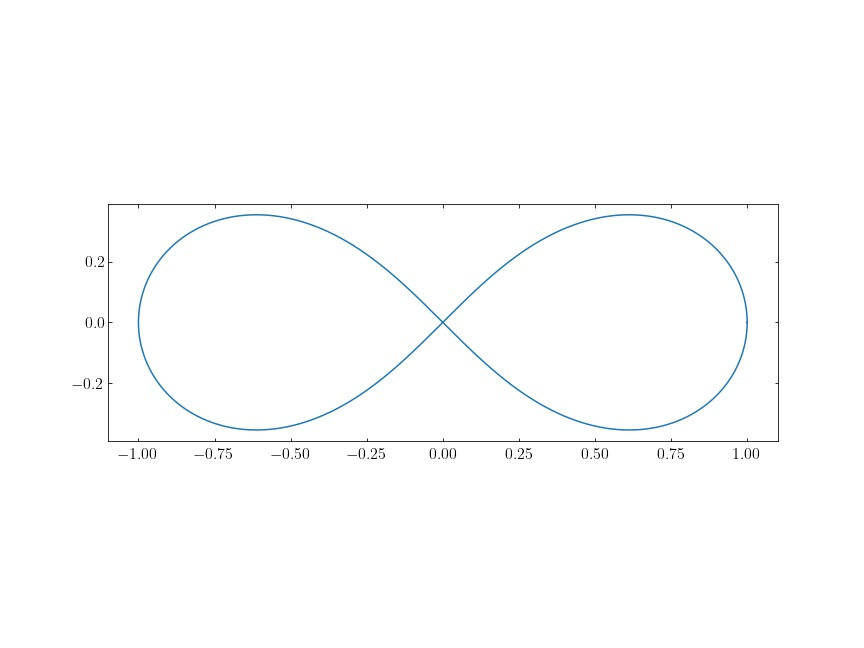

IV. 좌표공간과 좌표계 #1
===

## 연습문제 제 4장 1절

<b>1. </b> 절대값이 $0$ 인 점은 원점 뿐임을 보여라.

---

$n$-차원 좌표계 $(x_1,\ldots,\,x_n)$ 에서의 절대값은 원점에서의 거리이므로,
$$
0=\sqrt{\sum_{k=1}^n {x_k}^2} \implies x_1=\cdots =x_n = 0
$$

<b>2. </b> 상수 $t$ 와 좌표공간의 점 $A$ 에 대하여 $|tA|=|t||A|$ 임을 보여라.

---

Let $A=(a_1,\ldots,\, a_n)$ then,
$$
|tA|=\sqrt{\sum_{k=1}^n (ta_i)^2}=|t|\sqrt{\sum_{k=1}^n (a_i)^2}=|t||A|\;.
$$

<b>3. </b> 3차원 좌표공간에서 선분 $S$ 를 $yz$-평면, $zx$-평면, $xy$-평면에 정사영한 것의 길이가 각각 5, 6, 7 이라면 선분 $S$ 의 길이는 얼마인가?

---

선분 $S$ 의 양 끝점을 $(x_1,\,y_1,\,z_1),\, (x_2,\,y_2,\,z_2)$ 라 하자. $yz$ 평면에 대한 정사영은 $x_1=x_2=0$ 으로 놓은 것이다. 이것을 다른 두 정사영과 같이 생각하면,
$$
\begin{align}
&(y_1-y_2)^2+(z_1-z_2)^2 = 25 \\
&(x_1-x_2)^2 + (z_1-z_2)^2 = 36 \\
&(x_1-x_2)^2+ (y_1-y_2)^2 = 49 \\
\implies & \sqrt{(x_1-x_2)^2 +(y_1-y_2)^2+(z_1-z_2)^2}= \sqrt{55}
\end{align}
$$

<b>4.</b> 삼차원 좌표공간에서 길이가 $l$ 인 선분을 $yz$-평면, $zx$-평면, $xy$-평면에 정사영한 것의 길이를 각각 $l_{yz},\, l_{zx},\, l_{xy}$ 라고 두면 
$$
{l_{yz}}^2+{l_{zx}}^2 + {l_{xy}}^2 = 2l^2
$$
 임을 보이라. 이 때
$$
\left|{l_{yz}}^2-{l_{zx}}^2\right| \le {l_{xy}}^2 \le {l_{yz}}^2+{l_{zx}}^2
$$
임을 보이라.

---

(1) ${l_{yz}}^2+{l_{zx}}^2 + {l_{xy}}^2 = 2l^2$ 임은 trivial 하다.

(2) 3번 문제에서와 같이 선분의 양 끝점의 좌표를 $(x_1,\,y_1,\,z_1),\, (x_2,\,y_2,\,z_2)$ 라 하면,
$$
\begin{align}
\left| {l_{yz}}^2-{l_{zx}}^2 \right|&=\left|(y_1-y_2)^2-(x_1-x_2)^2\right| \le |(y_1-y_2)^2+(x_1-x_2)^2 |={l_{xy}^2}\,,\\
{l_{xy}}^2 &=|(y_1-y_2)^2+(x_1-x_2)^2| \le |(y_1-y_2)^2+(x_1-x_2)^2+2(z_1-z_2)^2|={l_{yz}}^2+{l_{zx}}^2\,.

\end{align}
$$

<b>7 . </b> 집합 $\{1,\,2,\ldots,\, n\}$ 에서 정의된 함수 전체의 집합은 $\mathbb{R}^n$ 과 일대일 대응이 됨을 보이라.

---

(1) $A=\{1,\,2,\ldots,\,n\}$ 일 때 $F$ 를 $A\to \mathbb{R}$ 함수의 집합이라 하자.  $T: F \to \mathbb{R}^n$ 을 생각한다. $f\in F$ 일 때,
$$
T(f) = (f(1),\,f(2),\ldots,\,f(n))
$$
으로 정의하면 모든 $f\in F$ 에 대해 $T(f)\in \mathbb{R}^n$ 이며, $(f_1,\ldots,\,f_n)\in \mathbb{R}^n$ 일 때 $f(k)=f_k$ 이므로 이 함수 $T$ 는 잘 정의됨을 알 수 있다. 

(2) $f,\, g \in F,\, f\ne g$ 이면 어떤 $k$ 에서 $f(k)\ne g(k)$ 이므로 $T(f) \ne T(g)$ 이다. 따라서 $T$ 는 단사이이다.

(3) 임의의 $(a_1,\ldots,\,a_n )\in \mathbb{R}^n$ 에 대해 $g(k)=a_k$ 로 정의하면 $g\in F$ 이다. 따라서 $T$ 는 전사이다. 

<b>8. </b> 차수가 3 이하인 다항식 전체의 집합
$$
\{ a_0+a_1x +a_2x^2 +a_3x^3 \mid a_0,\,a_1,\,a_2,\,a_3 \in \mathbb{R}\}
$$
과 4차원 좌표공간 $\mathbb{R}^4$ 사이의 일대일 대응관계를 서술하라. 이 때 두 다항식의 합은 공간의 점들의 합에 대응되는가?

---

차수가 삼차인 다항식 전체의 집합을 $A$ 라 하면 임의의 $f\in A$ 는 상수항과 1차항, 2차항 3차항 네개의 실수의 집합으로 표현 할 수 있다. $f = a_0+a_1x+a_2x^2 +a_3x^3$ 일 때 $T: A \to \mathbb{R}^4$ 를 
$$
T(f) = (a_0,\,a_1,\,a_2,\,a_3)
$$
로 정의하면 $T$ 는 $A \to \mathbb{R}^4$ 함수이다. 이 때 $T$ 가 전단사임은 쉽게 보일 수 있다.

$f(x) =a_0+a_1x+a_2x^2+a_3x^3,\, g(x) = b_0+b_1x+b_2x^2+b_3x^3$ 일 때, $f(x)+g(x) = (a_0+b_0)+(a_1+b_1)x+(a_2+b_2)x^2+(a_3+b_3)x^3$ 이므로, 
$$
T(f+g)=(a_0+b_0,\, a_1+b_1,\, a_2+b_2,\,a_3+b_3)\,,\\
T(f)+T(g) = (a_0+b_0,\, a_1+b_1,\,a_2+b_2,\, a_3+b_3)\,,
$$
이므로 $T(f+g)=T(f)+T(g)$ 이다.

<b>11. </b> $n$-공간의 점 $A=(a_1,\ldots,\,a_n)$ 에 대하여 $\overline{a}:=\dfrac{1}{n}(a_1+\cdots + a_n)$ 이라 하자. 이 때 점 $A$ 와 $\overline{A}=(\overline{a},\ldots,\,\overline{a})$ 사이의 거리는
$$
\sqrt{\sum_{i=1}^n {a_i}^2-n\overline{a}^2}
$$
임을 보이라.

---

$$
\begin{align}
|A-\bar{A}|^2=&\sum_{i=1}^n (a_i-\bar a)^2 = \sum_{i=1}^n {a_i}^2-2\sum_{i=1}^n \bar a a_i + \sum_{i=1}^n \bar a^2 \\
&= \sum_{i=1}^n {a_i}^2 -2\bar a (n \bar a)+n\bar{a}^2\\
&= \sum_{i=1}^n {a_i}^2 -n\bar{a}^2
\end{align}
$$

## 연습문제 : 제 4장 2절

<b>1.  </b> 좌표평면에서 극좌표가 $(r_1,\, \theta_1),\, (r_2,\,\theta_2)$ 로 주어진 두 점 사이의 거리를 구하라.

---

$$
\begin{align}
[\text{distance}]^2 &= (r_1 \cos\theta_1 - r_2 \cos\theta_2)^2 + (r_1 \sin \theta_1-r_2 \sin \theta_2)^2\\
&={r_1}^2+{r_2}^2 -2r_1r_2 (\cos \theta_1 \cos \theta_2+ \sin \theta_1 \sin \theta_2)\\
&={r_1}^2+{r_2}^2 -2r_1 r_2 \cos (\theta_1-\theta_2)

\end{align}
$$

이므로 두 점 사이의 거리 $L$ 은,
$$
L=\sqrt{{r_1}^2+{r_2}^2-2r_1r_2 \cos (\theta_1-\theta_2)}
$$

<b>2. </b> 극좌표계로 주어진 다음 곡선의 방정식을 직교좌표계의 벙정식으로 바꾸고, 곡선의 개형을 그리라. 단 $a>0$ 이다.

---

(1) $r=a\sin \theta$
$$
(x,\, y)=(a\sin \theta \cos \theta,\, a \sin^2 \theta)
$$
(2) $r=\cos \theta$
$$
(x,\,y)=(\cos^2 \theta,\, \sin\theta \cos \theta)
$$

(3) $r=\sin 3\left(\theta + \dfrac{\pi}{2}\right)$
$$
(x,\,y)=\left(\sin 3\left(\theta + \dfrac{\pi}{2}\right) \cos \theta,\, \sin 3\left(\theta + \dfrac{\pi}{2}\right)\sin \theta\right)
$$

<b>3. </b> 양수 $a$ 에 대하여 극좌표계에서 식
$$
r^2 = a^2 \cos 2\theta
$$
로 표현되는 곡선의 모양이 다음과 같음을 살펴보라.

---

$r^2\ge 0$ 이므로 $\cos 2\theta \ge 0$ 인 영역에서만 의미있다. 즉 $0\le \theta \le \dfrac{\pi}{4}$, $\dfrac{3\pi}{4} \le \theta \le \dfrac{5\pi}{4}$, $\dfrac{7\pi}{4} \le \theta < 2 \pi$ 에서만 고려하면 된다.   

$r=|a| \sqrt{\cos 2\theta}$ 이므로,
$$
(x,\,y)= |a| \sqrt{\cos 2\theta} (\cos \theta,\, \sin \theta)
$$
이다. 

<b>4. </b> 극좌표로 다음과 같치 주어진 곡선의 개형을 그려라.

(1) $r=|\cos 2\theta|$

(2) $r=\cos 3\theta$

(3) $r=|\cos 3\theta|$

(4) $r=1+2\cos \theta$

(5) $r=1+\sin \theta$

(6) $r=1+\frac{1}{2}\sin \theta$

(7) $r^2 = \sin \theta$

(8) $r^2=\cos 2\theta$

(9) $r=\dfrac{2}{2+\sin \theta}$

(10) $ r= \dfrac{2}{2-\cos \theta}$

----

<b>5. </b> (**Hesse 표준형**) 주어진 실수 $\theta_0$ 와 양수 $r_0$ 에 대하여 극좌표계에서 식
$$
r\cos (\theta -\theta_0)=r_0
$$
로 표현되는 직선과 직교좌표계에서
$$
x \cos \theta_0 + y \sin \theta_0 = r_0
$$
로 표현되는 직선은 걑음을 보이라.

---

$$
r_0=x \cos \theta_0 + y\sin \theta_0 = r\cos \theta \cos \theta_0 + r \sin \theta \sin \theta_0 = r \cos(\theta-\theta_0)
$$

<b>6. </b> 직교좌표계에서 중심이 $R(\cos \theta_0,\, \sin \theta_0)$ 이고 반지름의 길이가 $r_0$ 인 원의 방정식은 극좌표계로는
$$
r^2-2rR \cos (\theta-\theta_0)+R^2-r_0^2=0
$$
임을 보이라.

---

$$
\begin{align}
(x-R\cos \theta_0)+(y-R\sin \theta_0)^2-{r_0}^2 = 0 &\implies (r\cos \theta-R\cos \theta_0)^2 + (r \sin \theta -R \sin \theta_0)^2-{r_0}^2=0 \\
&\implies r^2+R^2 -2rR (\cos \theta \cos \theta_0 + \sin \theta \sin \theta_0)-{r_0}^2=0\\
&\implies r^2 -2rR \cos (\theta-\theta_0)+R^2-{r_0}^2=0\;.

\end{align}
$$

## 연습문제 제 4 장 3 절

<b>1. </b> 다음 구면좌표계로 표현된 점들을 원기둥좌표계와 구면좌표계로 표시하여라.

---

(1) $(1,\, \sqrt{3},\, 0)$

Cylindrical coordinate : $\left(2, \,\dfrac{\pi}{6}, \, 0\right)$

Spherical coordinate : $\left(2, \, \dfrac{\pi}{6},\, 0\right)$

(2) $(-1,\, -1,\, -1)$

Cylindrical coordinate : $\left(\sqrt{2}, \,\dfrac{5\pi}{4}, \, -1\right)$

Spherical coordinate : $\left(\sqrt{3}, \,\dfrac{5\pi}{4}, \, \arctan\left(-\dfrac{1}{\sqrt{2}}\right)\right)$

<b>2. </b> 다음 직교좌표계로 표현된 식들을 원기둥좌표계와 구면좌표계로 표시하여라.

---

(1) $x^2+y^2=z^2$

Cylindrical coordinate : $r^2=z^2$ 

Spherical coordinate : $\rho^2\sin^2 \theta = \rho^2\cos^2 \theta$

(2) $1 \le x^2+y^2+z^2 \le 4$

Cylindrical coordinate : $ 1 \le r^2+z^2 \le 4$

Spherical coordinate : $1 \le \rho^2 \le 4$

<b>3. </b> 직교좌표계에서 원뿔 $x^2+y^2 \le z^2$ 와 공 $x^2+y^2+z^2 \le z$ 의 공통부분으로 이루어진 영역을

(1) 원기둥좌표계로 나타내어라.

(2) 구면좌표계로 나타내어라.

---

(1) 원기둥좌표계에서, $r^2\le z^2$, $r^z+z^2\le z$ 

(2) 구면좌표계에서, $\rho^2 \sin^2 \theta \le \rho^2 \cos^2 \theta$, $\rho^2 \le \rho \cos \theta$

## 탐구문제

<b>1. </b> (**순서쌍**) 집합 $U$ 의 원 $x,\,y$ 에 대하여 순서쌍 $(x,\,y)$ 는 집합 $\{\{x\},\, \{x,\,y\}\}$ 로 정의한다. 이 때 $(x,\,y)=(x',\,y')$ 일 필요충분조건은 $x=x',\, y=y'$ 임을 보이라.

---

(1) $x=x',\,y=y'$ 일 때 $\{\{x\},\, \{x,\,y\}\}=\{\{x'\},\, \{x',\,y'\}\}$ 임은 자명하다.

(2) $ \{\{x\},\, \{x,\,y\}\}=\{\{x'\},\, \{x',\,y'\}\}$ 이라 하자. $\{x\}=\{x',\, y'\}$ 일 수 없으므로 $\{x\}=\{x'\}$ 이며 따라서 $x=x'$ 이다. $\{x,\,y\}=\{x',\,y'\}$ 이며 $x=x'$ 이므로 $y=y'$ 이어야 한다.

<b>2. </b> (**나비**) 다음은 극좌표계의 방정식
$$
r=\left(e^{\sin \theta}-2 \cos 4\theta\right) \sin^4(a\theta), \quad a=40
$$
으로 주어진 나비이다. 

이 때 $a$ 의 값을 다른 것으로 바꾸면 곡선의 모양이 어떻게 바뀌는 지에 대하여 설명하라.

---

$\sin^4 (a\theta)$ 는 주기가 $2\pi/a$ 이므로 $a$ 가 커질수록 원점에서 뻗어나오는 가지의 갯수가 많아진다.

<b>3. </b> 구간 $[0,\,1]$ 에서 연속인 함수 전체의 집합을 $\mathcal{C}^0 [0,\,1]$ 이라고 두자. 이때 두 함수 $f,\,g\in \mathcal{C}^0[0,\,1]$ 에 대하여
$$
\begin{align}
\operatorname{dist}_1(f,\,g)&:=\int_0^1 |f(x)-g(x)|\,dx,\,\\
\operatorname{dist}_2(f,\,g)&:=\left(\int_0^a |f(x)-g(x)|^2dx\, \right)^{1/2}

\end{align}
$$
으로 정의하면 이들은 모두 거리함수임을 보이라.

---

1) $\displaystyle \operatorname{dist}_1(f,\,g):=\int_0^1 |f(x)-g(x)|\,dx$ 이 거리함수의 4가지 성질을 만족함을 보인다. (1) $d(x,\,y)\le 0$ 과 (2) $d(x,\,y)=0 \iff x=y$ ,(3) $d(x,\,y)=d(y,\,x)$ 를 만족함은 자명하다. $f,\,g,\,h\in \mathcal{C}^0[0,\,1]$ 일 때,
$$
\begin{align}
\operatorname{dist}_1(f,\,g) + \operatorname{dist}_1(g,\,h) &=\int_0^1 |f(x)-g(x)|\, dx+\int_0^1 |g(x)-h(x)|\, dx\\
&= \int_0^1 \left(|f(x)-g(x)|+|g(x)-h(x)|\right)\, dx\\
&\le \int_0^1 |f(x)-h(x)|\, dx\\
&=\operatorname{dist}_1(f,\,h)

\end{align}
$$

2) $\displaystyle \operatorname{dist}_2(f,\,g):=\left(\int_0^a |f(x)-g(x)|^2dx\, \right)^{1/2}$역시 거리함수의 4가지 성질을 만족함을 보이자. (1), (2), (3) 을 만족함은 자명하다. $\operatorname{dist}_2(f,\,g)\ge 0$ 이므로 $\left(\operatorname{dist}_2 (f,\,g)+ \operatorname{dist}_2 (g,\,h)\right)^2 \ge (\operatorname{dist}_2(f,\,h))^2$  임을 보이면 (4)를 보이는것과 동치가 된다. 

우선 $f\in \mathcal{C}^{0}[0,\,1]$ 에 대해 (표기의 편의를 위해)$\displaystyle \|f\|:=\left(\int_0^1 |f(x)|^2\,dx\right)^{1/2}$ 로 정의한다. $\operatorname{dist}_2(f,\,g)=\|f-g\|$ 가 된다. $\|f\|\ge 0$ 임은 자명하다. $\lambda = \left(\displaystyle \int_0^1 f(x)g(x)\,dx\right)/\left(\displaystyle \int_0^1 |g(x)|^2 \, dx\right)$ 라 하고,  이를 이용하면,
$$
\begin{align}
0 &\le \|f(x)-\lambda g(x)\|^2 = \|f\|^2 + \lambda^2 \|g\|^2-2\lambda \int_0^1 f(x)g(x)\, dx \\
&= \|f\|^2-\dfrac{1}{\|g\|^2}\left(\int_0^1 f(x)g(x)\, dx\right)^2

\end{align}
$$
 이므로  $\|f\|\|g\| \ge \displaystyle \left|\int_0^1f(x)g(x)\,dx \right|$ 을 얻는다. 또한 $\displaystyle \left|\int_0^1f(x)g(x)\,dx \right| \ge \displaystyle \int_0^1f(x)g(x)\,dx $ 이므로,
$$
\|f\|\|g\|=\left(\int_0^1 |f(x)|^2\,dx\right)^2  \left(\int_0^1 |g(x)|^2\,dx\right)^2 \ge \int_0^1 f(x)g(x)\, dx \tag{1}
$$
을 얻었다. 

이제 $\|f\|+\|g\| \ge \|f+g\|$ 가 성립함을 보이자. 식 (1) 을 이용하여
$$
(\|f\|+\|g\|)^2=\|f\|^2+2\|f\|\|g\|+\|g\|^2 \ge \|f\|^2+\|g\|^2 +2\int_0^1 f(x)g(x)\,dx = \int_0^1 (f(x)^2+g(x)^2+2f(x)g(x))dx =\|f+g\|^2
$$
을 얻었다. 즉,
$$
\|f\|+\|g\| \ge \|f+g\| \tag{2}
$$
이다. $f\to f-g,\, g \to g-h$ 를 대입하면,
$$
\|f-g\|+\|g-h\| \ge \|f-h\|
$$
이므로,
$$
\operatorname{dist}_2(f,\,g)+\operatorname{dist}_2(g,\,h)\ge \operatorname{dist}(f,\,h)
$$
을 얻었다.

