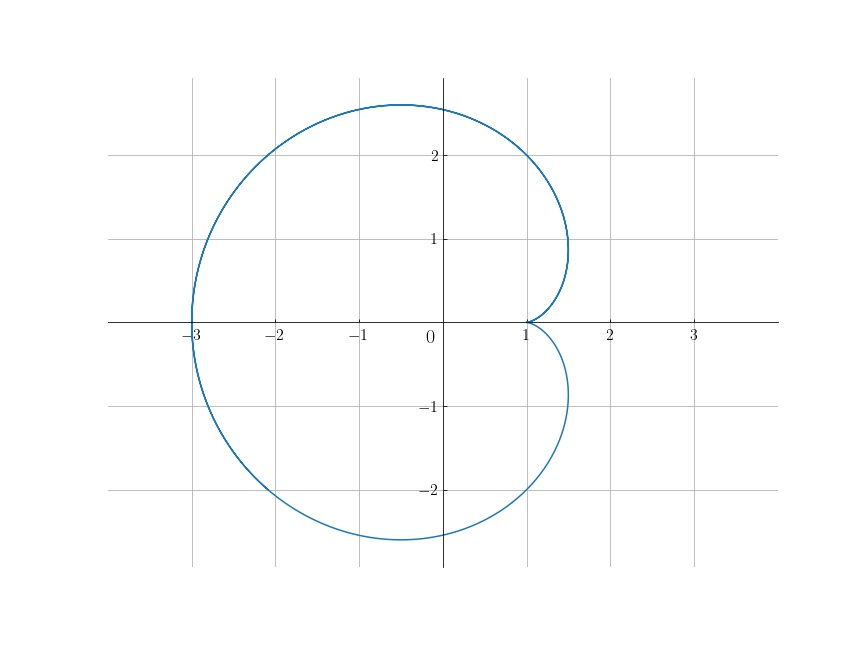

IX. 곡선 #1
===

## 연습문제 : 제 9 장 1 절

<b>1. </b> 곡선 $(2t^2,\, 1-t,\,3+t^2)$ 과 평면 $3x-14y+z=10$ 의 교점을 구하라.

---

$$
3(2t^2)-14(1-t)+3+t^2=10 \implies 7t^2+14t-21=0 \implies t^2+2t-3=0 \implies t=1,\, -3
$$

이므로, $(2,\, 0,\, 4),\, (18, 4, 12)$ 이다.

<b>2. </b> 생략.

<b>3. </b> 다음 두 곡선
$$
(e^t,\, e^{2t},\, 1-e^{-t}),\qquad (1-t,\, \cos t,\, \sin t)
$$
는 점 $(1,\,1,\,0)$ 에서 만남을 보이고, 그 점에서의 교각을 구하라.

---

$\mathbf{f}(t)=(e^t,\, e^{2t},\, 1-e^{-t})$, $\mathbf{g}(t) = (1-t,\, \cos t,\, \sin t)$ 라 하자. $\mathbf{f}(0)=(1,\, 1,\, 0),\, \mathbf{g}(0)=(1,\, 1,\, 0)$ 이므로 만난다. $t=0$ 일 때의 점선의 방향벡터는,
$$
\mathbf{f}'(0)=(1,\, 2,\, 1),\qquad \mathbf{g}'(0)=(-1,\, 0,\, 1)
$$
이므로 두 점선의 교각 $\theta$ 는,\
$$
\cos \theta = \dfrac{\mathbf{f}'(0)\cdot \mathbf{g}'(0)}{|\mathbf{f}'(0)||\mathbf{g}'(0)|}=0\implies \theta = \dfrac{\pi}{2}
$$

<b>4. </b> 원점을 지나지 않는 미분가능한 곡선 $X(t)\in \mathbb{R}^3$ 에 대하여,
$$
\dfrac{d}{dt}|X(t)|=\dfrac{X(t) \cdot X'(t)}{|X(t)|}
$$
임을 보이라. 이로부터 $t=t_0$ 일 때 $|X(t)|$ 의 값이 최소가 되면 원점과 $X(t_0)$ 를 이은 직선이 곡선 $X(t)$ 와 수직으로 만남을 설명하라.

---

$X(t)=(x(t),\, y(t),\, z(t))$ 라 하면,
$$
\dfrac{d}{dt}|X(t)|=\dfrac{d}{dt}\sqrt{x(t)^2+y^2(t)+z^2(t)}=\dfrac{x(t)x'(t)+y(t)y'(t)+z(t)z'(t)}{\sqrt{x^2(t)+y^2(t)+z^2(t)}} = \dfrac{X(t)\cdot X'(t)}{|X(t)|}
$$
이다. 

$t=t_0$ 일 때 $|X(t)|$ 의 값이 최소가 되면 $\dfrac{d}{dt}|X(t)|=0$ at $t=t_0$ 이며 $|X(t)|\ne 0$ for all $t\in \mathbb{R}$ 이므로 $X(t_0)\cdot X'(t_0)=0$ 이어야 한다. 

<b>5. </b> 극좌표계에서 $r=r(\theta)$ 로 주어진 평면곡선은 직교좌표계로는
$$
X(\theta)=(x(\theta),\,y(\theta))=r(\theta)(\cos \theta,\,\sin \theta)
$$
로 표현된다. 이때
$$
X'(\theta)=r'(\theta)(\cos \theta,\, \sin \theta)+r(\theta)(-\sin\theta,\, \cos\theta),\quad |X'|=\sqrt{{r'}^2-r^2}
$$
임을 보이라. 이로부터 원점과 점 $X(\theta_0)$ 를 잇는 직선이 점 $X(\theta_0)$ 에서의 곡선 $X(\theta)$ 의 접선과 이루는 사잇각의 코사인값이
$$
\dfrac{r'(\theta_0)}{\sqrt{{r'}(\theta_0)^2+r(\theta_0)^2}}
$$
임을 보이라. 

또 극좌표계에서 $r=e^\theta$ 로 주어진 **로그와선(logarithmic spiral)** 은 원점과 곡선의 한 점을 잇는 직선을 그 점에서 $45^\circ$ 회전시키면, 곡선의 접선이 됨을 보이라.

---

$X'(\theta)$ 를 계산하면,
$$
X'(\theta)=\left(\dfrac{dx(\theta)}{d\theta},\, \dfrac{dy(\theta)}{d\theta}\right)=(r'(\theta)\cos \theta -r(\theta)\sin \theta ,\, r'(\theta) \sin \theta+r(\theta)\cos \theta)=r'(\theta)(\cos \theta,\,\sin\theta)+r(\theta)(-\sin \theta,\,\cos \theta)
$$
이며,
$$
|X'(\theta)|=\sqrt{(r'(\theta)\cos\theta-r(\theta)\sin \theta)^2+(r'(\theta)\sin \theta+r(\theta)\cos\theta)^2}=\sqrt{{r'(\theta)}^2+{r(\theta)}^2}
$$
이다. 

원점과 점 $X(\theta_0)$ 를 잇는 직선이 점 $X(\theta_0)$ 에서의 곡선 $X(\theta)$ 의 접선과 이루는 사잇각을 $\phi$ 라 하면,
$$
\begin{align}
\cos \phi &= \dfrac{X(\theta_0)\cdot X'(\theta_0)}{|X(\theta_0)||X'(\theta_0)|}\\
&=\dfrac{r(\theta_0) \cos \theta_0 (r'(\theta_0)\cos \theta_0 -r(\theta _0)\sin \theta_0)+r(\theta_0)\sin \theta_0 (r'(\theta_0)\sin \theta_0 +r(\theta_0)\cos \theta_0)}{r(\theta_0)\sqrt{{r'(\theta_0)}^2+{r(\theta_0)}^2}}\\
&= \dfrac{r'(\theta_0)\cos^2\theta_0-r(\theta_0)\cos \theta_0 \sin \theta_0 +r'(\theta_0)\sin ^2\theta_0 +r(\theta_0)\cos \theta_0 \sin \theta_0}{\sqrt{{r'(\theta_0)}^2+{r(\theta_0)}^2}}\\
&=\dfrac{r'(\theta_0)}{\sqrt{{r'(\theta_0)}^2+{r(\theta_0)}^2}}

\end{align}
$$
이다. 

$r=e^\theta$ 일 경우 $\cos \phi = \dfrac{1}{\sqrt{2}}$ 이므로 그 사잇각이 $\dfrac{\pi}{4}=45^{\circ}$ 이므로, 원점과 곡선의 한 점을 잇는 직선을 그 점에서 $45^\circ$ 회전시키면, 곡선의 접선이 된다.

<b>6. </b> 탁자 위에서 원판이 일정한 각속도 $3 \operatorname{rad/sec}$ 로 돌고 있다. (이때 회전의 중심이 원판의 중심이다.) 원판의 중심에서 파리 한마리가 원판의 둘레의 한 점을 향하여 (원판에 대하여) $2 \operatorname{cm/sec}$ 로 움직인다고 하자. 원점에서 출발 후 $4$ 초가 되었을 때 탁자에 대한 파리의 속력을 구하라.

---

원판의 중심을 원점으로 잡고 $t=0$ 에서 파리가 $+x$ 방향으로 움직이기 시작했다고 하자. 회전이 반시계방향이라고 하고, 파리의 위치를 $X(t)=(x(t),\,y(t))$ 라 하면,
$$
X(t)= (2t) (\cos 3t, \, \sin 3t)=(2t\cos 3t,\, 2t\sin 3t)
$$
이므로 
$$
X'(t) = (2\cos 3t-6t\sin 3t,\, 2\sin 3t+6t\cos 3t)
$$
 이다. 따라서 $X'(4)=(2\cos 12-24 \sin 12 ,\, 2 \sin 12 + 24 \cos 12)$ 이므로,
$$
|X'(t)|=\sqrt{4+576}=2\sqrt{145} \text{ cm/sec}
$$
이다. 

<b>7. </b> 평면 위에서 점 $P$ 의 운동이 $(\cos 2t,\, \sin 2t)$ 로 주어지고, 또 점 $Q$ 의 운동이 $2(\cos t,\,\sin t)$ 로 주어졌다고 하자. 점 $P$ 에서 점 $Q$ 를 바라보았을 때 $Q$ 의 운동을 $X(t)$ 로 둘 때, 이를 구하고 도시하라.

---

$$
X(t)=P(t)-Q(t)=(\cos 2t-2\cos t,\, \sin 2t-2\sin t)
$$

<b>8. </b> (**Bézier 의 이차곡선**) 공간 상의 주어진 서로 다른 세 점 $P_0,\,P_\ast,\, P_1$ 에 대하여 곡선
$$
\begin{align}
P(t) & :=(1-t){\big (}(1-t)P_0 + tP_\ast {\big )}+t{\big (} (1-t)P_{\ast}+tP_1 {\big )} \\
&= (1-t)^2 P_0 + 2t(1-t)P_\ast + t^2P_1 & \qquad (0\le t \le 1)
\end{align}
$$
 은 점 $P_0,\,P_1$ 을 지나고, 점 $P_0$ 에서의 접선과 점 $P_1$ 에서의 접선이 점 $P_\ast$ 에서 만남을 보이라. 또 이 곡선은 $P_{\ast}$ 와 $\dfrac{1}{2}(P_0+P_1)$ 의 평균점을 지남을 보이라.

---

$P(0)=P_0,\, P(1)=P_1$ 이다. 
$$
\begin{align}
P'(t)=-2(1-t)P_0 + 2(1-t)P_{\ast}-2tP_{\ast}+2tP_1=-2(1-t)P_0 +(2-4t)P_{\ast}+2tP_1

\end{align}
$$
이므로 $P'(0)=-2P_0+2P_{\ast},\, P'(1)=2P_1-2P_{\ast}$ 이다. 

$P_1$ 에서의 접선을 $l_1(t)$, $P_2$ 에서의 접선을 $l_2(s)$ 라 하면,
$$
\begin{align}
l_1(t)&=(-2P_0+2P_\ast)t+P_0 \\
l_2(s) &= (2P_1-2P_\ast)s+P_1
\end{align}
$$
이며 $l_1(1/2)=l_2(-1/2)=P_{\ast}$ 이다. 즉 두 접선은 $P_{\ast}$ 를 지난다. 또한, 
$$
	P \left(\dfrac{1}{2}\right)= \dfrac{1}{4}P_0 + \dfrac{1}{2} P_{\ast}+ \dfrac{1}{4}P_1 = \dfrac{1}{2} \left(P_{\ast} + \dfrac{P_0+P_1}{2}\right)
$$
이므로, 이 곡선은 $P_{\ast}$ 와 $\dfrac{1}{2}(P_0+P_1)$ 의 평균점을 지난다.

<b>9. </b> 함수
$$
f(t) = \left\{\begin{array}{ll} te^{1/t^2} \qquad &(t\ne 0)\\ 0 & (t=0) \end{array} \right.
$$
에 대하여 곡선
$$
X(t)={\big (}f(t),\, |f(t)| {\big )}
$$
의 상을 그리라.  또 이 곡선은 무한급함수임을 보이라. 이 곡선은 정규곡선인가?

---

곡선의 상, 무한급함수임은 쉽게 보일 수 있다. $X'(t)=0$ 이므로 정규곡선이 아니다. 

<b>10. </b>  (**세잎 매듭**) 좌표공간에서 $yz$ 평면의 원
$$
(y-R)^2+z^2=r^2
$$
을 $z$ 축 주위로 회전시켜 엳은 **원환면**(torus) 은 방정식
$$
\left(\sqrt{x^2+y^2} -R  \right)^2+z^2=r^2
$$
로 주어진다 (이 때 $0<r<R$ 을 가정한다). 이제 구간 $0\le \theta ,\, \varphi \le 2 \pi$ 에서
$$
S(\theta,\,\varphi):=R(\cos \theta,\, \sin \theta,\, 0) + r \cos \varphi (\cos \theta,\, \sin \theta,\, 0)+r \sin \varphi (0,\,0,\,1)
$$
은 "원환면의 매개화" 임을 설명하라. 

또 
$$
\theta = 2t,\qquad \varphi = 3t
$$
로 주어지는 곡선
$$
X(t) :=S(2t,\,3t)
$$
는 주기가 $2\pi$ 임을 보이라. 이 곡선을 **세잎매듭**(trefoil knot) 이라고 부른다.

---

원환면을 이루는 점의 집합을 $V$ 라 하자. 
$$
S(\theta,\, \varphi) = (R\cos \theta + r\cos \varphi \cos \theta,\, R \sin \theta+ r \cos \varphi \sin \theta,\, r \sin \varphi)
$$
이다. $S(\theta,\, \varphi) = (x(\theta,\, \varphi),\, y(\theta,\, \varphi),\, z(\theta,\, \varphi))$ 이며 
$$
\sqrt{x(\theta,\,\varphi)^2+y(\theta,\,\varphi)^2}-R^2+z(\theta,\, \varphi)^2= R^2-z^2+z^2+r^2=r^2
$$
이므로 따라서 $S(\theta,\,\varphi)$ 는 $V$ 의 부분집합이다. 이제 $(x,\,y,\,z)$ 가 원환면상의 한 점이라 하자. $r<R$ 이므로 원점은 원환면상에 포함되지 않는다.

$0\le \theta,\,\varphi \le 2\pi$ 에 대해 $\varphi = \arctan \left(\dfrac{z}{\sqrt{x^2+y^2-R^2}}\right)$, $\theta = \arctan \left(\dfrac{y}{x}\right)$ 라 정의하면, 임의의 원환면상의 한 점은 $S(\theta,\,\varphi)$ 상의 한 점이다. 따라서 $V=S(\theta ,\,\varphi)$ 이므로 원환면의 재매개화이다.
$$
X(t)=(R \cos 2t + r \cos 3t \cos 2t,\, R \sin 2t+r \cos 3t \sin 2t,\, r \sin 3t)
$$
이다. $z(t)$ 의 주기가 $\dfrac{2\pi}{3}$ 이므로 $X(t)$ 의 주기는 $\dfrac{2\pi}{3}$ 의 배수이다. 
$$
\begin{align}
X(0) &=(R+r,\, 0,\, 0)\\
X\left(\dfrac{2\pi}{3}\right)&=
\left( -\dfrac{R}{2}-\dfrac{r}{2},\, -\dfrac{\sqrt{3}}{2}R-\dfrac{\sqrt{3}}{2}r,\,0  \right)\\
X\left(\dfrac{4\pi}{3}\right) &=\left( -\dfrac{R}{2}-\dfrac{r}{2},\, \dfrac{\sqrt{3}}{2}R+\dfrac{\sqrt{3}}{2}r,\,0  \right)\\
X(2\pi) &=(R+r,\, 0,\, 0)=X(0)
\end{align}
$$
이며,
$$
X(t+2\pi)=X(t)
$$
임은 쉽게 보일 수 있다. 따라서 이 곡선의 주기는 $2\pi$ 이다.

## 제 2 절

<b>2.0.1 기본연습문제.</b>

1. 곡선의 가속도벡터가 속도벡터에 항상 수직이면, 속력이 일정한 곡선임을 보이라. 역으로 속력 $|X'(t)|$ 가 일정한 곡선에서는 가속도 벡터 $X''(t)$ 가 속도벡터에 수직임을 보이라.

---

$$
X'(t) \cdot X''(t)=0 \iff \dfrac{d}{dt}(X'(t) \cdot X'(t))=0 \iff \dfrac{d}{dt}|X'(t)|^2=0 \iff |X'(t)|=\text{const.}
$$

2. 원 위를 움직이는 점의 가속도 벡터가 항상 원의 중심을 향하면, 이 운동은 등각속도 운동임을 보이라.

---

$$
X''(t) \times X(t)=0 \implies \dfrac{d}{dt}\left(X'(t) \times X(t)\right)=0 \implies X'(t) \times X(t)=\text{const}
$$

## 연습문제 : 제 9 장 2 절

<b>1. </b> 생략

<b>2. </b> 정규곡선 $X(t)$ 에서 속력 $v(t)$ 와 가속력 $a(t)$ 를 각각
$$
v(t) = |X'(t)|,\qquad a(t)=|X''(t)|
$$
로 두자. 이때
$$
a(t)= \pm v'(t),\qquad \forall t 
$$
일 필요충분조건은 $X(t)$ 가 직선운동을 하는 것임을 보이라. (교재에는 $a(t)=v'(t)$ 라과 나왔지만 $\pm$ 이 붙는게 맞다.)

---

(1) $X(t)$ 가 직선운동을 한다는 것은 어떤 상수 벡터 $U$ 와 스칼라 함수 $f(t)$ 에 대하여 $X(t)-X(0)=Uf(t)$ 란 의미이다. 따라서,
$$
X'(t)=Uf'(t),\qquad X''(t)=Uf''(t)
$$
이다. $X(t)$ 가 정규곡선이므로 $X'(t)\ne 0$ 이며, 따라서 $f'(t)>0 \;\forall t$ 이거나 $f'(t)<0\;\forall t$ 이다. $f'(t)>0$ 
$$
v'(t)= |U||f''(t)|,\qquad a(t)=|U||f''(t)|
$$
이고 $f'(t)<0$ 이면, 
$$
v'(t)=|U||-f''(t)|=|U||f''(t)|,\qquad a(t)=|U||f''(t)|
$$
이므로 $v'(t)=\pm a(t)$ 이다. 

(2) $a(t)= \pm v'(t)$ 임을 가정하자. 

$v(t)^2 = X'(t) \cdot X'(t)$ 이므로,
$$
\dfrac{d}{dt}\left(v(t)^2\right)=2v(t)v'(t) = 2X''(t)\cdot X'(t) \implies v'(t)=\dfrac{X'(t) \cdot X''(t)}{|X'(t)|}
$$
이다. $v'(t) = \pm a(t)= \pm |X''(t)|$ 이므로 $X'(t) \cdot X''(t) = \pm|X'(t)||X''(t)|$ 이다. 즉 $X'(t)$ 와 $X''(t)$ 는 평행하거나 $X'(t)=0$ or $X''(t)=0$ 임을 의미한다. $X''(t)=0$ 이면 $X'(t)=V$ 인 상수벡터이므로 $X(t)=Vt+X_0$ 이므로 직선이다. $X'(t)=0$ 는 $X(t)$ 가 정규곡선이라는 조건을 위배하므로 생각하지 않는다. 

이제 $X'(t)$ 와 $X''(t)$ 가 평행함을 가정하자. $X(t)$ 는 정규곡선이므로 $X'(t)\ne 0$ for all $t\in \mathbb{R}$ 이다. 그렇다면 $X'(t)=g(t)X''(t)$ 를 만족하는 스칼라 함수 $g(t)$ 가 존재한다. $\displaystyle X(t)=\sum_{i=1}^n x_i(t) \mathbf{e}_i$ 라 하면 $x_i'(t)=g(t) x_i ''(t)$ 이다. 정규곡선이므로 $g(t)\ne 0$ 이다. 

임의의 $i\in \{1,\ldots,\,n\}$ 에 대해 $\dfrac{1}{g(t)}= \dfrac{x_i''(t)}{x_i'(t)}$ 이므로,
$$
\int_{t_0}^t \dfrac{1}{g(t')}\, dt' = \int_{t_0}^t \dfrac{x_i''(t')}{x_i'(t')}dt'=\ln |x_i'(t)|-\ln |x_i'(t_0)|
$$
이다. 어떤 $i,\,t_0$ 에 대해 $x'_i (t_0)=0$ 이라 하자. $g(t)\ne 0$ 이므로 $x''_i(t_0)=0$ 이다. $x'_i(t)\ne 0$ 이라 하면
$$
\lim_{s \to t_0} \int_s^t \dfrac{1}{g(t')}dt' = \lim_{s\to t_0} {\big(} \ln |x_i'(t)|-\ln |x_{i}'(s)| {\big)}
$$
이므로 $x_i'(t)$ 가 발산하지 않기 위해서는 $x_i'(t)=0$ 이어야 한다. 즉 어떤 $t_0$ 에서 $x'_i(t_0)=0$ 이면 $x_i'(t)=0$ for all $t\in \mathbb{R}$ 이며, 따라서 $x''_i(t)=0$ for all $t\in \mathbb{R}$ 이다. 이제 우리는 nonzero $x_i(t)$ 에 대해서만 살펴보면 된다. $t_0=0$ 으로 놓아도 상관 없다. 
$$
G(t)=\int_0^t \dfrac{1}{g(t')} dt'
$$
이라 하자. 그렇다면 $x'_i (t)=x_i'(0) \exp (G(t))$ 이므로 $X'(t)=X'(0) \exp G(t)$ 이다.  또한,
$$
X(t)= X'(0)\int_0^t \exp (G(t'))dt' +X(0)
$$
이므로 $X(t)$ 는 직선운동을 한다. 

<b>3. </b> $X(t)=r(t) (\cos \theta(t),\, \sin \theta(t))$ 일 때,
$$
\begin{align}
X' &= r' (\cos \theta,\, \sin \theta)+r\theta' (-\sin \theta,\, \cos \theta)\\
X'' &= (r''-r\theta'^2)(\cos \theta,\, \sin \theta)+ \dfrac{1}{r} (r^2\theta')' (-\sin \theta,\,\cos \theta)

\end{align}
$$
임을 보이라.

---

$$
\begin{align}
X' &=\left( \dfrac{d}{dt}(r\cos \theta),\, \dfrac{d}{dt}(r \sin \theta)\right)=(r' \cos \theta -r\theta'\sin \theta ,\, r' \sin \theta+r\theta'\cos \theta)=r'(\cos \theta ,\, \sin \theta) + r\theta'(-\sin \theta,\, \cos\theta)\\
X'' &=r''(\cos \theta,\, \sin \theta)+ r'\theta'(-\sin\theta,\, \cos \theta)+(r'\theta'+r\theta'')(-\sin \theta,\, \cos\theta)+ r\theta' \theta'(-\cos\theta,\, -\sin \theta) \\
&=(r''-r\theta'^2)(\cos \theta,\, \sin \theta) + (2r'\theta'+r\theta'')(-\sin \theta,\, \cos \theta)\\
&=(r''-r\theta'^2)(\cos \theta,\, \sin\theta)+ \dfrac{1}{r}(r^2\theta')' (-\sin \theta,\,\cos \theta)

\end{align}
$$

<b>4. </b> 삼차원 좌표공간 속의 곡선 $X(t)$ 에 대하여,
$$
f(t):=X(t)\cdot X'(t) \times X''(t)
$$
이면 
$$
f'(t)=X(t)\cdot X'(t)\times X'''(t)
$$
임을 보이라.

---

$$
\begin{align}
f'(t) = \underbrace{X'(t) \cdot X'(t)\times X''(t)}_0 + \underbrace{X(t) \cdot X''(t)\times X''(t)}_0 + X(t) \cdot X'(t) \times X'''(t) = X(t) \cdot X'(t) \times X'''(t)

\end{align}
$$

<b>5. </b> 곡선 $X(t)=(\sin t,\, \cos t,\, t)$ 의 $t=\dfrac{\pi}{2}$ 인 점에서 접촉평면의 식을 구하라.

---

$X(\pi/2)=(1,\, 0,\, \pi/2),\, X'(\pi/2)=(0,\, -1,\,1),\, X''(\pi/2)=(-1,\,0,\,0)$ 이므로,
$$
0=\det \begin{pmatrix}  x-1 & y & z-\dfrac{\pi}{2} \\ 0 & -1 & 1 \\ -1 & 0 & 0\end{pmatrix}= -y-\left( z-\dfrac{\pi}{2}\right)
$$
인 $y+z-\dfrac{\pi}{2}=0$ 이 구하는 평면의 방정식이다.

## 연습문제 : 제 9 장 3절 

<b>1. </b> 다음 곡선을 재매개화 하라

(1) $4x^2+9y^2=1$ : $X(t)=\left(\dfrac{\cos \theta}{2},\, \dfrac{\sin \theta}{3} \right)$ 

(2) $4x^2-9y^2=1$ : $X(t) = \left(\dfrac{\cosh t}{2},\, \dfrac{\sinh t}{3} \right)$ 

(3) $y^2=x^3-x^2 \; (x>0)$ : $X(t)=(t^2+1,\, t^3+t) \quad t\in \mathbb{R}$ 

(4) $y^2=x^3-x\quad (x>0)$ : $X(t) = (t^2,\, \pm t \sqrt{t^4-1})$ 

<b>2. </b> 좌표평면에서 식
$$
y^2=x^3+ax+b
$$
의 꼴로 주어진 곡선을 타원곡선이라고 부른다. 여기에서 $a=0,\,b=0$ 일 때, 이 곡선을 매개화하라.

---

$$
(t^2,\, t^3),\qquad t\in \mathbb{R}
$$

<b>3. </b> (**피타고라스의 짝** 과 원의 매개화) 자연수 $p,\,q,\,r$ 이
$$
p^2+q^2=r^2
$$
이면 집합 $\{p,\,q,\,r\}$ 을 피타고라스의 짝 이라고 부른다, 이 때, $p,\,q,\,r$ 이 서로소이면, 이 짝을 *서로소인 짝* 이라고 부른다. 피타고라스의 짝은 서로소인 것이 흥미있다. 서로소가 아닌짝은 서로소인 짝으로 부터 얻어진다.

(1) 임의의 자연수 $k$ 에 대하여
$$
\{4k,\, 4k^2-1,\, 4k^2+1\}
$$
은 서로소인 피타고라스의 짝임을 보이라.

(2) $3$ 이상의 홀수 $k$ 에 대하여
$$
\left\{k,\, \dfrac{k^2-1}{2},\, \dfrac{k^2+1}{2} \right\}
$$
는 서로소인 피타고라스 짝임을 보이라.

(3) 피타고라스짝을 구하는 것은 단위원
$$
x^2+y^2=1
$$
상의 유리점을 구하는 문제와 같음을 설명하라. 또 기울기가 $t\in \mathbb{R}$ 이고, 점 $(-1,\,0)$ 을 지나는 직선 
$$
y=t(x+1)
$$
이 단위원과 만나는 점은
$$
P(t):= \left(\dfrac{1-t^2}{1+t^2},\, \dfrac{2t}{1+t^2}\right)
$$
임을 보이고, $P(t)$ 가 유리점일 필요충분조건은 $t$ 가 유리수인 것임을 밝히라. 이로부터 모든 서로소인 피타고라스의 짝은 홀짝이 다른 자연수 $m>n$ 에 대하여
$$
\{m^2-n^2,\, 2mn,\, m^2+n^2\}
$$
로 주어짐을 보이라.

---

(1) 우선 
$$
(4k)^2+(4k^2-1)^2=16k^4+8k^2+1=(4k^2+1)^2
$$
이므로 $\{4k,\, 4k^2-1,\, 4k^2+1\}$ 은 피타고라스의 짝이다. 우리는 두 자연수 $a>b$ 에 대하여 $a-b$ 는 $\gcd (a,\,b)$ 의 배수임을 알고 있다. $(4k^2+1)-(4k^2-1)=2$ 이며 $\gcd (4k^2+1,\,2)=1$ 이므로 $4k^2-1$ 과 $4k^2+1$ 은 서로소이다. 따라서 $\{4k,\, 4k^2-1,\, 4k^2+1\}$ 은 서로소인 피타고라스의 짝이다.

(2) $k$ 가 $3$ 이상의 홀수이므로 $n\ge 1$ 에 대하여 $k=2n+1$ 로 쓸 수 있다.
$$
\begin{align}
\dfrac{k^2-1}{2}&=\dfrac{4n^2+4n}{2}=2n(n+1)\\
\dfrac{k^2+1}{2}&=\dfrac{4n^2+4n+2}{2}=2n^2+2n+1

\end{align}
$$
이며,
$$
k^2+\left(\dfrac{k^2-1}{2}\right)^2=k^2+\dfrac{k^4-2k^2+1}{4}=\left(\dfrac{k^2+1}{2}\right)^2
$$
이므로 $\left\{k,\, \dfrac{k^2-1}{2},\, \dfrac{k^2+1}{2} \right\}$ 은 피타고라스의 짝이다. 또한 $ \dfrac{k^2+1}{2}-\dfrac{k^2-1}{2}=1$ 이므로 이 세 수는 서로소인 피타고라스의 짝이다.

(3) $V$ 를 단위원 상의 유리점의 집합이라 하고 $U$ 를 피타고라스의 짝의 집합이라 하자. $\phi: U \to V$ 를 $\phi (a,\,b,\,c)=\left(\dfrac{a}{c},\,\dfrac{b}{c}\right)$ 라 하면 $\phi$ 는 잘 정의된 함수이다. $\left(\dfrac{p}{r},\, \dfrac{q}{s}\right)\in V$ 이면
$$
\dfrac{p^2}{r^2}+\dfrac{q^2}{s^2}=1 \implies (ps)^2+(qr)^2=(rs)^2
$$
이므로 피타고라스의 짝이 하나 만들어진다. 즉 $\phi$ 는 전사이다. 

$\left(\dfrac{a}{c},\,\dfrac{b}{c}\right),\,\left(\dfrac{a'}{c'},\,\dfrac{b'}{c'}\right) \in V$ 이고, $\left(\dfrac{a}{c},\,\dfrac{b}{c}\right)=\left(\dfrac{a'} {c'},\,\dfrac{b'}{c'}\right)$ 이면 $a=ta',\,b=tb',\, c=tc',\, d=td'$ for some $t\in \mathbb{Q}$ 이다. 즉 $\left(\dfrac{a}{c},\,\dfrac{b}{c}\right)$ 로부터 서로소인 피타고라스의 짝과 이와 관계되는 서로소가 아닌 피타고라스의 짝이 만들어진다.

기울기가 $t$ 인 $y=t(x+1)$ 이 단위원과 다시 만나는 점은
$$
1=x^2+y^2=x^2+t^2(x+1)^2\implies {\big(}(t^2+1)x-(1-t^2){\big )}(x+1)=0
$$
이므로 
$$
P(t):=\left(\dfrac{1-t^2}{1+t^2},\, \dfrac{2t}{1+t^2}\right)
$$
이다. $t$ 가 유리수이면 $P(t)$ 는 유리점이다. $t$ 가 무리수라 가정하자.  $(1-t^2)/(1+t^2)=p/q$ 인 유리수라면,  $t^2=(q-p)(q+p)$ 인 유리수 이어야 한다. 그런데데 $t$ 가 무리수이고 $t^2$ 가 유리수이면 $2t/(1+t^2)$ 는 무리수이므로 $t$ 는 유리수이어야 한다. 즉 $t$ 가 유리수인것은 $P(t)$ 가 유리점인 것의 필요충분조건이다. 

$t\in \mathbb{Q}$ 일 때 $P(t)$ 의 집합을 $P$ 라 하자. $(-1,\,0)$ 을 지나는 기울기 $t$ 인 직선과 단위원의 교점이 $P(t)$ 의 모임이며 $P(t)$ 가 유리점 $\iff$ $t$ 가 유리수 임을 보였으므로 $P(t\in \mathbb{Q})$ 의 집합은 모든 단위원상의 유리점의 집합이다. $t=\dfrac{n}{m}$ 이며 $\gcd (m,\,n)=1$ 이라 하자. 둘 다 짝수이면 $\gcd (m,\,n)=1$ 이라는 조건에 위배되며 둘 다 짝수이면 $P(t)$ 상의 두 점이 짝수/짝수 가 되므로 기약분수가 되지 않는다. 일단 $m,\,n$ 중 하나는 홀수 하나는 짝수라 하자.  

$m>n$ 일 경우 피타고라스의 짝 $\{m^2-n^2,\, 2mn,\, m^2+n^2\}$ 이며 $m<n$ 인 경우 $\{n^2-m^2,\, 2mn,\, m^2+n^2\}$ 를 얻는다. $m>n$ 이라 놓고,  $t>1$ 이면 $t=m/n$, $t<1$ 이면 $t=n/m$ 이라 하면 $\{m^2-n^2,\, 2mn,\, m^2+n^2\}$ 의 피타고라스 짝을 얻는다. 이것이 서로소임을 보자. 

이 세 수의 최대공약수를 $p$ 라 하자. 우선 $m^2-n^2$ 와 $m^2+n^2$ 는 홀수이고 $2mn$ 은 짝수이다. 따라서 $p$ 는 홀수이다. $(m^2+n^2)-(m^2-n^2)=2n^2$ 이므로 $p$ 는 (짝수가 아니므로) $n^2$ 의 약수이다. $(m^2+n^2)+(m^2-n^2)=2m^2$ 이므로 $p$ 는 $m^2$ 의 약수이다. 

따라서 $p$ 는 $n^2,\,m^2,\,mn$ 의 공약수이다. 어떤 $1$ 이 아닌 $m$ 의 약수 $r$ 에 대해 $r \mid p$ 라 하면, $p\mid n^2$ 이므로 $r\mid n^2$ 이고 $r\mid n$ 이므로 $m,\,n$ 이 서로소임에 모순이다. 따라서 $\gcd (p,\,m)=1$, 같은 방법으로 $\gcd (p,\,n)=1$ 이다.  그런데 $p\mid mn$ 이므로 $p=1$ 이다. 즉 $\{m^2-n^2,\, 2mn,\, m^2+n^2\}$ 는 서로소이다. 

<b>4. </b> 곡선 $X:[a,\,b]\to \mathbb{R}^n$ 의 에너지는
$$
E(X):=\dfrac{1}{2}\int_a^b |X'(t)|^2\,dt
$$
로 정의한다. 다음 곡선의 에너지를 구하라.
$$
X(t):=(t,\,t^2)\qquad (0 \le t \le 1)
$$

---

$$
E(X)=\dfrac{1}{2}\int_0^1 (1+4t^2)\,dt=\dfrac{1}{2}\left[t+\dfrac{4}{3}t^3\right]_0^1=\dfrac{7}{6}
$$

<b>5. </b> 곡선의 에너지는 매개화를 달리하였을 때 변화하는지를 살펴보라.

----

문제 4 에서 $t=2s$ 로 재매개화 하면, $\tilde X(s):=(2s,\, 4s^2),\quad (0\le s \le 1/2)$ 이다. 
$$
E(\tilde{X})=\dfrac{1}{2} \int_0^{1/2} (4+16s^2) \, ds =\dfrac{1}{2} \left( 4s+\dfrac{16}{3} s^3 \right)^{1/2}_0 = \dfrac{4}{3} 
$$
이므로 4 의 결과와 다르다. 

<b>6. </b> 삼차원 공간 속의 곡선 $X(t)$ 에 대하여 $t=t_0$ 에서
$$
X' \times X'' \cdot X''' >0
$$
이면, 곡선 $X$ 는 $t=t_0$ 에서 양으로 (혹은 오른쪽으로) 휘었다고 하고
$$
X'\times X'' \cdot X''' <0
$$
이면 음으로 (또는 왼쪽으로) 휘었다고 한다. 이러한 개념은 곡선의 매개화와 무관함을 보이라. 또 행렬식 값이 양인 정사각행렬 $M$ 과 벡터 $\mathbf{v}$ 에 대하여 곡선
$$
Y(t)=M(X(t))+\mathbf{v}
$$
가 오른쪽으로 휘어 있을 필요충분조건은 $X$ 가 오른쪽으로 휘어 있는 것임을 보이라.

---

(1) $X(t)$ 가 $t=g(s)$ 로 재매개화되어어 $Y(s)$ 가 되었다고 하자. 이 때 $g(s)$ 는 일급가역함수이다.
$$
\begin{align}
Y' \times Y'' \cdot Y''' &= {\big [}(g'(s)X'(g(s))){\big]} \times \big{[} g''(s)X'(g(s))+(g'(s))^2X''(g(s)) {\big]} \\
&\quad \cdot {\big[}g'''(s)X'(g(s))+g''(s)g'(s)X''(g(s))+2g''(s)g'(s)X''(g(s))] +(g'(s))^3X'''(s){\big ]} \\
&=(g'(s))^3 {\big (}X'(g(s))\times X''(g(s)) {\big )} \\
&\qquad \cdot {\big[}g'''(s)X'(g(s))+g''(s)g'(s)X''(g(s))+2g''(s)g'(s)X''(g(s))] +(g'(s))^3X'''(s){\big ]} \\
&=(g'(s))^6 X'(g(s))\times X''(g(s))\cdot X'''(g(s)\\
&=(g'(s)^6 {\big (} X' \times X'' \cdot X'''{\big)}

\end{align}
$$
이다. $g(s)$ 는 일급가역함수이므로 모든 $s$ 에서 $0$ 이 아니며 $(g'(s))^6>0$ 이다. 따라서 양/음으로 휘는것은 재매개화에 의해 변하지 않는다.

(2) $Y^{(k)}(t)=MX^{(k)}(t)$ for $k=1,\,2,\,3$ 이다. $Y'\times Y'' \cdot Y''' =  (MX' \times MX''\cdot MX''')$ 이다. 따라서,
$$
\det (Y',\, Y'' ,\, Y''')= \det(M)\det(X',\, X'' \cdot X''')
$$
이며 $\det(M) >0$ 이므로, $Y$ 가 오른쪽으로 휘어 있을 필요충분조건은 $X$ 가 오른쪽으로 휜 것이다. 

<b>7. </b> 양수 $a,\,b$ 에 대하여 나선
$$
R(t):=(a\cos t,\, a \sin t,\, bt)
$$
는 오른쪽으로 휘어 있지만 나선
$$
L(t):=(a\cos t,\, -a \sin t,\ bt)
$$
는 왼쪽으로 휘어 있음을 보이라.

---

$$
\begin{align}
R'\times R'' \cdot R''' &= \begin{pmatrix} -a \sin t& a \cos t & b \\ -a \cos t & -a \sin t & 0 \\ a \sin t & -a \cos t & 0\end{pmatrix}=a^2b\cos ^2 t+a^2b \sin^2 t=a^2b> 0\\

L'\times L'' \cdot L''' &= \begin{pmatrix} -a \sin t& -a \cos t & b \\ -a \cos t & a \sin t & 0 \\ a \sin t & a \cos t & 0\end{pmatrix} =-a^2b \cos t -a^2b \sin ^2t = -a^2b < 0

\end{align}
$$

