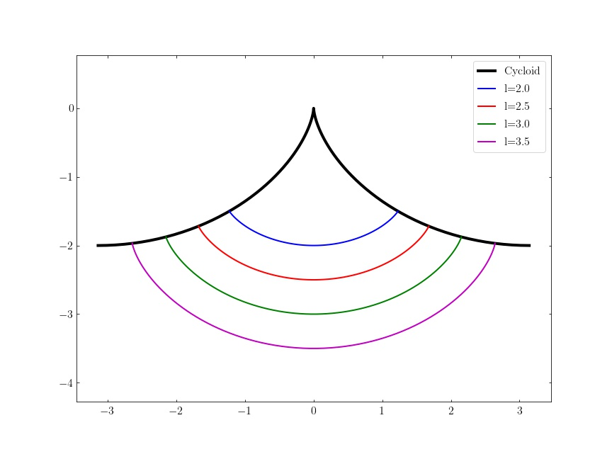
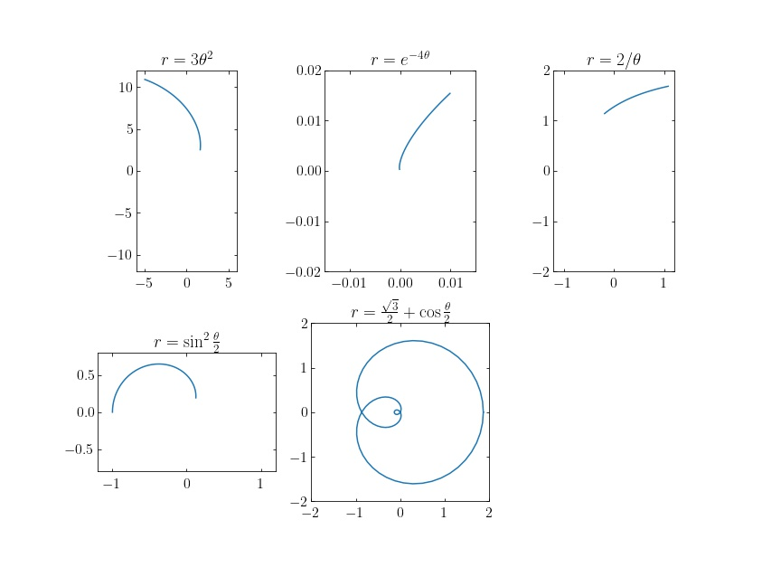
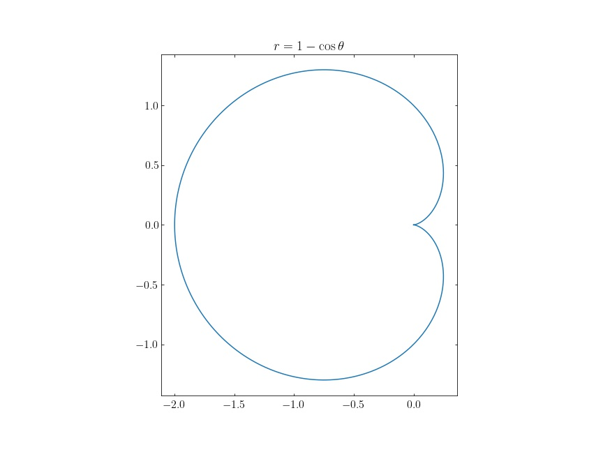
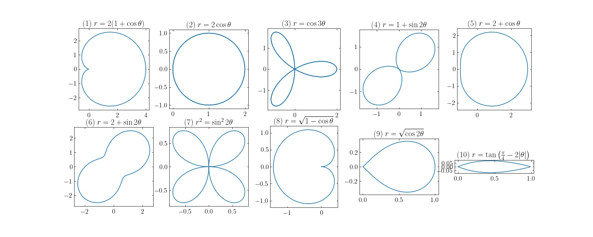
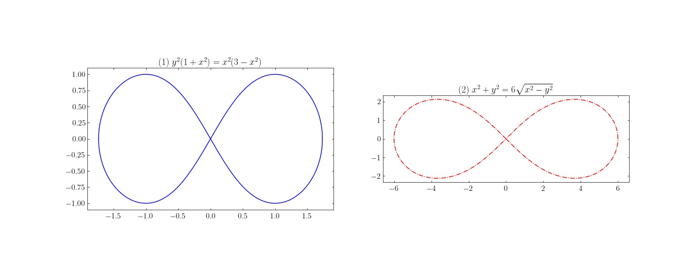
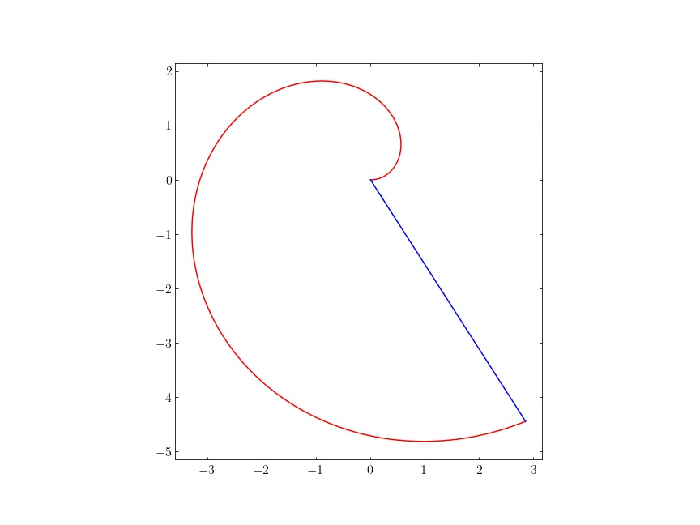
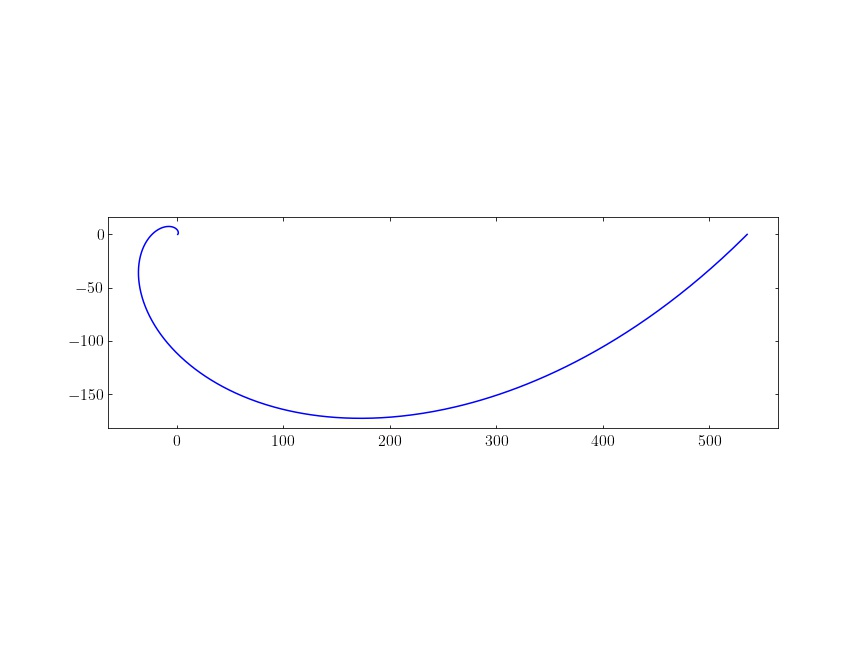
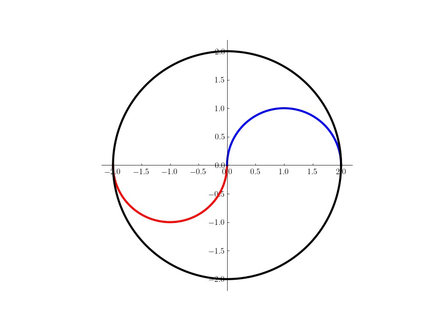

IX. 곡선 #2
===


## 연습문제 : 제 9 장 4 절


<b>1. </b> 양수 $a$ 에 대하여, 곡선
$$
X(t)=(t \cos t,\, t\sin t,\, t) \qquad 0\le t\le \sqrt{2}\sinh a
$$
의 길이를 구하라.

---

$$
l=\int_0^{\sqrt2 \sinh a} \sqrt{(\cos t - t\sin t)^2+(\sin t+t\cos t)^2 +1}\, dt=\int_0^{\sqrt{2}\sinh a} \sqrt{t^2+2} \, dt
$$

여기서 $t=\sqrt{2}\sinh s$ 로 치환하면,
$$
l=\int_0^a 2\cosh^2s\, ds = \dfrac{1}{2}\int_0^a (e^{2s}+2+e^{-2s})ds=\dfrac{1}{2}\left[\dfrac{1}{2}e^{2s}+2s-\dfrac{1}{2}e^{-2s}\right]_0^a=a+\dfrac{1}{2}\sinh 2a
$$


<b>2.</b> 좌표평면에서 식 $\sqrt{x}+\sqrt{y}=1$ 로 주어진 곡선의 길이를 구하라. 

---

$0\le x,\, y \le 1$ 임을 안다. $X(t)=(t^2,\, (1-t)^2)$ 로 재매개화 하면, 
$$
l=\int_0^1 \sqrt{4t^2+4(1-t)^2}\,dt=\int_0^1 \sqrt{8t^2-8t+4}\,dt=\int_0^1 \sqrt{8\left( t-\dfrac{1}{2}\right)^2+2} \, dt =\sqrt{2}\int_0^1 \sqrt{4\left(t-\dfrac{1}{2}\right)^2+1}
$$
이다.  $2(t-1/2)=\sinh s$ 로 치환하자. $a=\sinh^{-1}(-1),\, b=\sinh^{-1}(1)$ 라 하면,
$$
l=\dfrac{\sqrt{2}}{4}\int_a^b \sqrt{\sinh ^2+1} \cosh s\, ds=\dfrac{\sqrt{2}}{4}\int_a^b \cosh^2 s \, ds = \dfrac{\sqrt{2}}{16} {\big [}\sinh  2s+2s {\big ]}_{a}^b=\dfrac{\sqrt{2}}{16} (\sinh (2b)-\sinh(2a)+2(b-a))
$$
이다. 임의의 $x\in \mathbb{R}$ 에 대해
$$
\sinh (2x)=\dfrac{e^{2x}-e^{-2x}}{2}=2\dfrac{e^x-e^{-x}}{2}\dfrac{e^{x}+e^{-x}}{2}=2\sinh x\cosh x = 2\sinh x \sqrt{\sinh x^2+1}
$$
이므로 
$$
\sinh (2b)=2 \cdot 1 \cdot \sqrt{2}=2\sqrt{2},\qquad \sinh 2a = -2\sqrt{2}
$$
이며,  $a=\sinh^{-1}(-1),\, b=\sinh^{-1}(1)$ , 로 부터 $a=\ln(\sqrt{2}-1),\, b=\ln(\sqrt{2}+1)$ 를 얻는다. 따라서,
$$
l=\dfrac{\sqrt{2}}{16}(4\sqrt{2}+4\ln(\sqrt{2}+1))=\dfrac{1}{2}+\dfrac{\sqrt{2}}{4}\ln (\sqrt{2}+1)
$$
이다. 


<b>3. </b> (**아스트로이드**) 곡선
$$
(x^2)^{1/3}+(y^2)^{1/3}=1
$$
의 길이를 구하라. 

---

$-1 \le x,\,y \le 1$ 이며 대칭을 고려하면 $0\le x,\, y \le 1$ 에서의 곡선을 구한 후 $4$ 배 해주면 된다. $x=\sin ^{3}\theta,\, y = \cos^{3}\theta$ 로 매개화하면, $0\le \theta \le \pi/2$ 구간에서 생각해 주면 되므로,
$$
\begin{align}
l &= 4\int_0^{\pi/2} \sqrt{9 \cos^2 \theta \sin ^4 \theta + 9 \sin ^2 \theta \cos ^4 \theta}\, d\theta \\
&=4\int_0^{\pi/2} 3 \sin \theta \cos \theta\,d\theta = 6\int_0^{\pi/2} \sin 2\theta \, d\theta=6

\end{align}
$$


<b>4. </b> 종이가 감긴 직원기둥을 평면으로 절단한 뒤에 종이를 펴면, 잘린 종이의 부분은 사인곡선(sinusoid) 인가? 이 때 자르는 평면이 원기둥의 회전축과 수직이 아니라고 가정한다.

---

절단한 평면이 원점을 지나는 평면이라 해도 문제없다. 이 평면의 방향단위벡터를 $\mathbf{n}=(n_1,\,n_2,\,n_3)$ 라 하면 평면의 방정식은,
$$
\mathbf{n}\cdot X=(n_1,\,n_2,\,n_3)\cdot (x,\,y,\,z)=0
$$
이다. 직원기둥을 원통좌표계로 표시하면
$$
(x,\,y,\,z)=(a \cos \phi,\, a \sin \phi,\, z)\qquad a>0,\
$$
이다. 문제의 성격상 $n_3\ne 0$ 이어야 한다. 이제 직원기둥과 평면의 교점은 $(n_1,\,n_2,\,n_3)\cdot (x,\,y,\,z)=0$ 이어야 하므로,
$$
an_1\cos \phi + an_2\sin \phi+n_3z=0 \implies z=a \left( \dfrac{n_1}{n_3}\cos \phi+\dfrac{n_2}{n_3} \sin \phi \right)=b\sin(\phi+\phi_0) \qquad\text{where }\phi_0=\arctan\left(\dfrac{n_1}{n_2}\right),\, b=a\sqrt{\dfrac{n_1^2+n_2^2}{n_3^2}}
$$
이므로 사인곡선이다.


<b>5. </b> (**토리첼리** 의 정리). 로그 와선 $r=e^{\theta}$ 의 한 점 $T=(e^{2n\pi},\,0)$ 에서 그은 접선이 $y$ 축과 만나는 점을 $S$ 라고 하자. 이 때, 로그와선의 구간 $-\infty  < \theta \le 2n\pi$ 사이의 길이는 점 $T$ 와 $S$ 의 길이와 같음을 보이라. (특히 로그와선을 따라 원점에 접근하면, 그 움직인 거리는 유한함을 알 수 있다.)

---

$$
\begin{align}
X(\theta)&=(e^\theta \cos \theta,\, e^\theta\sin \theta) \\
X'(\theta)&=(e^\theta \cos \theta -e^\theta \sin \theta,\, e^\theta \sin \theta+ e^\theta\cos \theta)
\end{align}
$$

이므로 $X(T)=(e^{2n\pi},\,0),\, X'(T)=(e^{2n\pi},\, e^{2n\pi})$ 이므로 접선의 방정식은
$$
y=x-e^{2n\pi}
$$
이며 $S=(0,\, -e^{2n\pi})$ 이고 $|\overline{TS}|=\sqrt{2}e^{2n\pi}$ 이다. 이제 로그와선의 구간 $-\infty < \theta \le 2n\pi$ 사이의 길이 $l$ 은
$$
l=\int_{-\infty}^{2n\pi} \sqrt{(e^\theta \cos \theta -e^\theta \sin \theta)^2+(e^\theta \sin \theta+ e^\theta\cos \theta)^2} d\theta=\sqrt{2}\int_{-\infty}^{2n\pi} e^\theta\, d\theta = \sqrt{2}e^{2n\pi}=\left|\overline{TS}\right|
$$
이다.


<b>6. </b>(**호이겐스의 시계**) 왼쪽 벽과 오른쪽 벽이 사이클로이드로 되어 있는 시계에 추가 달려 있을 때 추가 움직이는 궤적도 역시 사이클로이드임을 보이라.

---

추의 고정점을 원점으로 잡았을 때 사이클로이드 벽면의 방정식은 $(t-\sin t,\, -1+\cos t)$ 이다. 추의 길이를 $l$ 이라 하자.

추를 매단 줄은 $[0,\,t]$ 구간은 사이클로이드 면을 따라, 그 이후는 남은 줄의 길이만큼은 $t$ 에서의 접선의 방정식을 따라 간다. $t$ 까지의 길이 $l_1(t)$ 는
$$
l_1(t) = \int_0^t 2 \sin \left(\dfrac{t'}{2}\right)\, dt'=\left[-4\cos \dfrac{t'}{2}\right]_0^t = 4-4 \cos \left(\dfrac{t}{2}\right)
$$
이다.  $t$ 에서의 접선의 방향벡터는 $(1-\cos t,\, -\sin t)$ 이므로, 추의 좌표를 $X(t)=(x(t),\, y(t))$ 라 하면,
$$
\begin{align}
x(t) &= t-\sin t+(l-l_1(t)) \dfrac{1-\cos t}{2\sin \dfrac{t}{2}}=t-\sin t +\sin \dfrac{t}{2} (l-4+4 \cos \dfrac{t}{2}) = (l-4) \sin \dfrac{t}{2} + t+\sin t\\
y(t) &=-1+\cos t + (l-l_1(t))\dfrac{-\sin t}{2 \sin \dfrac{t}{2}}=-1+\cos t -\cos \dfrac{t}{2} (l-4+4\cos \dfrac{t}{2}) = -(l-4)\cos \dfrac{t}{2}-3-\cos t

\end{align}
$$


이게 사이클로이드인가?? 아래는 위 그림을 그린 python conde 이다. (Jupyter notebook 에서 실행 할 수 있다. )

```python
import numpy as np
import matplotlib.pyplot as plt

def cycloid(ti, tf, Nt):
    t=np.linspace(ti, tf, Nt)
    x=t-np.sin(t)
    y=1-np.cos(t)
    return(x, y)

xx, yy = cycloid(-np.pi, np.pi, 100)
plt.plot(xx, -yy, "k-", lw=4, label="Cycloid")

fmts=("b-", "r-", "g-", "m-")
for ind, ll in enumerate((2.0, 2.5, 3.0, 3.5)):
    print(ind)
    tm = 2.0*np.arccos(1.-ll/4.)
    t=np.linspace(-tm, tm, 100)

    x, y = (ll-4)*np.sin(t/2.) + t+np.sin(t) , -(ll-4)*np.cos(t/2.)-3-np.cos(t)
    plt.plot(x, y, fmts[ind], marker=None, lw=2, label="l="+str(ll))
    

plt.axis('equal')
plt.legend()
```

<b>7. </b> 극좌표계로 주어진 다음 곡선의 개형을 그리고, 그 곡선의 길이를 구하라.

---

$$
\begin{align}
L(r=3\theta^2,\, 1 \le \theta \le 2) &=\int_1^2 \sqrt{9\theta^4 + 36\theta^2}\, d\theta =3\int_1^2 \theta\sqrt{\theta^2+4}\, d\theta= {\big [} (\theta^2+4)^{3/2}{\big]}_1^2=16\sqrt{2}-5\sqrt{5} \\
L(r=e^{-4\theta},\, 1\le \theta \le 2) &=\int_1^2
\sqrt{e^{-8\theta}+ 16e^{-8\theta}}\, d\theta = \dfrac{\sqrt{17}}{4} \left(e^{-4}-e^{-8}\right) \\
L(r=2\theta,\, 1 \le \theta \le \sqrt{3}) &= \int_1^\sqrt{3} \sqrt{4\theta^2+4}\, d\theta = 2\int_1^{\sqrt{3}}\sqrt{\theta^2+1}\, d\theta =2\int_{\sinh^{-1}(1)}^{\sinh^{-1}(\sqrt{3})} \cosh^2 t\, dt\\&= 2\left[\dfrac{1}{4}\sinh (2t)+\dfrac{1}{2}t\right] _{\sinh^{-1}(1)}^{\sinh^{-1}(\sqrt{3})} = 2 \left[\sqrt{3}+\dfrac{1}{2}\ln(2+\sqrt{3})-\dfrac{\sqrt{2}}{2}-\dfrac{1}{2}\ln(1+\sqrt{2})\right] \\
&= 2\sqrt{3}-\sqrt{2}+ \ln (2\sqrt{2}+\sqrt{6}-\sqrt{3}-2) \\
L\left(r=\sin^2 \dfrac{\theta}{2},\, 0 \le \theta \le \pi \right) &= \int_0^{\pi} \sqrt{\sin^4 \dfrac{\theta}{2} +  \sin^{2} \dfrac{\theta}{2} \cos^2\dfrac{\theta}{2}} \,d\theta =  \int_0^\pi \sin \dfrac{\theta}{2} \, d\theta = 2\\
L\left( r=\dfrac{\sqrt{3}}{2}+\cos \dfrac{\theta}{2} \right) &= \int_0^{4\pi} \sqrt{\dfrac{3}{4}+\sqrt{3}\cos \dfrac{\theta}{2}+\cos^2 \dfrac{\theta}{2}+ \dfrac{1}{4}\sin^2 \dfrac{\theta}{2}}\, d\theta =\int_0^{4\pi}\left( 1+\dfrac{\sqrt{3}}{2}\cos \dfrac{\theta}{2}\right)\, d\theta\\
&=\left[\theta +\sqrt{3} \sin \dfrac{\theta}{2}\right]_0^{4\pi}=4\pi
\end{align}
$$

마지막 $r=\dfrac{\sqrt{3}}{2}+\cos \dfrac{\theta}{2}$ 는 주기가 $4\pi$ 인 함수이므로 $0 \le \theta\le 4\pi$ 에서 적분하였다. 




<b>8. </b> 타원 $\dfrac{x^2}{a^2}+\dfrac{y^2}{b^2}=1$ 의 길이는
$$
\int_0^{2\pi} \sqrt{a^2\sin^2 t + b^2 \cos^2 t}\, dt
$$
로 표현됨을 보이라. 또 사인함수
$$
y=c \sin x,\qquad (0 \le x \le 2\pi)
$$
의 그래프의 길이는
$$
\int_0^{2\pi} \sqrt{1+c^2\cos^2x}\, dx
$$
임을 보이라.

---

타원의 매개화 $X(t)= (a \sin t,\, b\cos t)$ 를 생각하면 자명하다. 또한 사인함수도 $X(t)=(x,\, c\sin x)$ 를 생각하면 자명하다.


<b>9. </b> 곡선
$$
y\equiv \ln x \qquad (a\le x \le b)
$$
의 길이를 구하라.

---


$$
\begin{align}
\int_a^b \sqrt{1+\dfrac{1}{x^2}}\,dx &= \int_a^b \dfrac{\sqrt{1+x^2}}{x}dx=\int_{\sqrt{a^2+1}}^{\sqrt{b^2+1}}\dfrac{u^2}{u^2-1}\, du \\
&=\int_{\sqrt{a^1+1}}^{\sqrt{b^2+1}}\left(1+\dfrac{1}{2(u-1)}+\dfrac{1}{2(u+1)}\right)\, du \\
&=\left[u+\dfrac{1}{2}\ln \left(\dfrac{u-1}{u+1}\right)\right]_{\sqrt{a^2+1}}^{\sqrt{b^2+1}}\\
&=\sqrt{b^2+1}-\sqrt{a^2+1} +\ln \left(\dfrac{(\sqrt{b^2+1}-1)(\sqrt{a^2-1}+1)}{(\sqrt{b^2+1}+1)(\sqrt{a^2-1}-1)} \right)


\end{align}
$$


## 연습문제 : 제 9 장 5 절


<b>1. </b> 극좌표계에서 다음 식으로 주어진 영역의 넓이를 구하라

(1) $1\le r \le 2 \cos \theta$ 				(2) $2 \le r \le 1+2\cos \theta$

---

(1) $\cos\theta \ge \dfrac{1}{2}$ 이어야 하므로, $0 \le \theta \le \dfrac{\pi}{3}$, $\dfrac{5\pi}{3} \le \theta \le 2\pi$ 이어야 한다. 
$$
\text{Area}=\int_0^{\pi/3} 2 \cos^2 \theta d\theta+\int_{5\pi/3}^{2\pi} 2 \cos^2 \theta d\theta-\dfrac{2\pi}{3}= 2\times\left[\dfrac{1}{2} \sin 2\theta + \theta\right]_0^{\pi/3} -\dfrac{2\pi}{3}=\dfrac{\sqrt{3}}{2}
$$
(2) 역시 $\cos\theta \ge \dfrac{1}{2}$ 이어야 하므로, $0 \le \theta \le \dfrac{\pi}{3}$, $\dfrac{5\pi}{3} \le \theta \le 2\pi$ 이어야 한다. 
$$
\begin{align}
\text{Area} &= \int_0^{\pi/3} \dfrac{1}{2} (1+2\cos\theta)^2 \, d\theta +\int_{5\pi/3}^{2\pi} \dfrac{1}{2} (1+2\cos\theta)^2 \, d\theta  - \dfrac{8\pi}{3}= \int_0^{\pi/3} \left(2\cos 2\theta + 4 \cos \theta+3\right)d\theta -\dfrac{8\pi}{3}\\
&= \left[\sin 2\theta +4 \sin \theta + 3\theta\right] {\big |}_{0}^{\pi/3} -\dfrac{8\pi}{3}=\dfrac{\sqrt{3}}{2}+ 2\sqrt{3} + \pi - \dfrac{8\pi}{3}=\dfrac{5\sqrt{3}}{2}-\dfrac{5\pi}{3}
\end{align}
$$


<b>2. </b> 극좌표계에서 식 $r=1-\cos \theta$ 로 주어진 곡선의개형을 그리고, 이 곡선으로 둘러싸인 부분의 면적을 구하라.

---


$$
\begin{align}
\text{Area} &= \int_0^{2\pi} \dfrac{1}{2}(1-\cos \theta)^2 d\theta = \dfrac{1}{2}\int_0^{2\pi} (1-2\cos \theta + \cos^2\theta)\, d\theta \\
&= \dfrac{1}{2}\int_0^{2\pi} \left(\dfrac{3}{2}-2\cos\theta + \dfrac{\cos 2\theta}{2}\right)d\theta \\
&=\dfrac{1}{2} \left[\dfrac{3\theta}{2} -2 \sin \theta + \dfrac{\sin 2\theta}{4}\right]_0^{\pi} =\dfrac{3\pi}{4}


\end{align}
$$


<b>3. </b> 다음 곡선의 개형을 그리고, 그 곡선으로 둘러쌓인 부분의 넓이를구하라.

---




넓이를 구하는건.. 별로 안어려워서 패스..


<b>4. </b> 극좌표계를 이용하여 다음 식으로 주어진 곡선의 개형을 그리고, 이 곡선으로 둘러싸인 부분의 넓이를 구하라.

(1) $y^2(1+x^2)= x^2(3-x^2)$  				(2) $x^2+y^2=6\sqrt{x^2-y^2}$

---

(1) 
$$
\begin{align}
&r^2\sin^2 \theta (1+r^2 \cos^2 \theta)=r^2 \cos^2\theta (3-r^2\cos^2 \theta)\\
\implies & \sin^2 \theta +r^2 \cos^2 \theta \sin^2 \theta = 3\cos^2 \theta-r^2\cos^4 \theta  \\
\implies & r^2 \cos^2\theta  = 3 \cos^2 \theta - \sin^2 \theta \\
\implies & r^2 = 3-\tan^2 \theta

\end{align}
$$
따라서 $\tan^2\theta\le3$ 인 $0 \le \theta \le \dfrac{\pi}{3}, \dfrac{2\pi}{3} \le \theta \le \dfrac{4\pi }{3},\, \dfrac{5\pi }{3} \le \theta <2 \pi $ 에서 유효하다.  

(2)
$$
r^2 =6r\sqrt{\cos^2\theta - \sin^2\theta} \implies r=6\sqrt{\cos 2\theta}
$$
이므로 $\cos 2\theta \ge 0$ 인 $0 \le \theta  \le \dfrac{\pi}{4},\, \dfrac{3\pi}{4}\le \theta \le \dfrac{5 \pi}{4}, \dfrac{7\pi}{4} \le \theta <2\pi$ 에서 유효하다. 이제 두 그래프의 개형을 보자.

 

대칭을 고려하면, 
$$
\begin{align}
\text{Area}(1)&=4\int_0^{\pi/3} \dfrac{1}{2}(3-\tan^2\theta)d\theta =2 \int_0^{\pi/3} (2-\sec^2\theta)d\theta = 2{\big[}2\theta-\tan \theta{\big ]}_{0}^{\pi/3}=2\left( \dfrac{2\pi}{3}-\sqrt{3}\right) \\

\text{Area}(2) &= 4 \int_0^{\pi/4} \dfrac{1}{2} \cdot 36 \cos 2\theta =36{\big[} \sin 2\theta {\big ]}_0^{\pi/4}=36
\end{align}
$$


<b>5. </b> 곡선 $r^2=2\cos 2\theta$ 의 한쪽 날개의 넓이가 $1$ 임을 보여라.

---

$$
\text{Area}=2\int_0^{\pi/4} \cos 2\theta ={\big[} \sin 2\theta {\big]}_0^{\pi/4}=1
$$


<b>6. </b> 극좌표료 주어진 곡선 $r=\sin n\theta$ 의 한 잎의 넓이를 구하라. (단 $n$ 은 자연수이다.)

---

$$
\text{Area}=\int_{0}^{\pi/n}\dfrac{1}{2} \sin^2 n\theta \, d\theta =\dfrac{1}{2n}\int_0^{\pi} \sin^2 \phi \, d\phi= \dfrac{\pi}{4n}
$$


<b>7. </b> 아르키메데스의 와선 $r=\theta,\, 0 \le \theta \le \theta_0$ 와 반직선 $\theta = \theta_0$ 로 둘러 싸인 아르키메데스 영역의 넓이는 원점을 꼭지각으로 하고 아르키메데스 영역을 포함하는 가장 작은 부채꼴 넓이의 $1/3$ 임을 보이라. (단 $0 <\theta_0 < 2\pi$ 이다.)

---


$$
\text{Area}=\dfrac{1}{2}\int_0^{\theta_0}\theta^2 \, d\theta =\dfrac{1}{6}\theta_0^3 = \dfrac{1}{3} \left(\pi \theta_0^2 \times \dfrac{\theta_0}{2\pi}\right)
$$


## 연습문제 : 제 9 장 6 절


<b>1. </b> 사이클로이드
$$
X(t)=(t-\sin t,\, 1-\cos t) \qquad (0\le t \le 2\pi)
$$
를 호의 길이로 매개화하라.

---

$$
s(t)=\int_0^t |X'(t')|\, dt'=\int_0^t \sqrt{(1-\cos^2 t')+\sin^2 t'}\, dt'=\int_0^t 2\left|\sin \frac{t'}{2}\right|\, dt' = 4-4\cos \frac{t}{2}
$$

이므로 $t=2 \cos^{-1}\left(\dfrac{4-s}{4}\right)$ 이다. $\alpha = \cos^{-1}\left(\dfrac{4-s}{4}\right)$ 라 하면, $\cos \alpha = \dfrac{4-s}{4}$, $\sin \alpha = \dfrac{\sqrt{8s-s^2}}{4}$ 이며,
$$
\begin{align}
\sin t &= \sin 2 \alpha =2 \cos \alpha  \sin \alpha = \dfrac{(4-s)\sqrt{8s-s^2}}{8}\\
\cos t &= \cos 2\alpha = 2\cos ^2 \alpha -1 = \dfrac{8-8s+s^2}{8}
\end{align}
$$
이므로
$$
\tilde{X}(s) = \left(2 \cos^{-1}\left(\dfrac{4-s}{4}\right) - \dfrac{(4-s)\sqrt{8s-s^2}}{8},\,  \dfrac{8s-s^2}{8}\right)
$$


<b>2. </b> 곡선
$$
X(t)=e^t(\cos t,\, \sin t) \qquad (0 \le t \le 2\pi)
$$
에 대하여 다음에 닿바라.

(1) 곡선(의 상) 을 도시하고, 그 길이를 구하라

(2) 점 $X(0)$ 에서부터 잰 호의 길이를 매개변수로 하여 표현하라.

---



(1) $X'(t) = (e^t \cos t - e^t \sin t,\, e^t \cos t + e^t \sin t)$ 
$$
s(t)=\int_0^t \sqrt{2}e^{t'}\, dt'=\sqrt{2}(e^t-1)
$$
(2) 
$$
t=\ln \left(\dfrac{s}{\sqrt{2}}+1\right)
$$
이므로, 
$$
\tilde{X}(s) = \left(\dfrac{s}{\sqrt{2}}+1 \right)\left(\cos \ln \left(\dfrac{s}{\sqrt{2}}+1\right),\, \sin \ln \left(\dfrac{s}{\sqrt{2}}+1\right)\right)
$$
이다. 


<b>3. </b> 만약 호의 길이로 매개화된 곡선 $X(t)$ 를 $t=f(s)$ 로 재매개화하였더니 여전히 재매개화된 곡선 $X\circ f$ 도 호의 길이로 매개화되었다고 하자. 이때 어떤 상수 $c$ 에 대하여
$$
f(s)=s+c,\qquad \text{or} \qquad f(s)=-s+c
$$
임을 보이라.

---

$X(t)$ 가 호의 길이로 매개화되었으므로 $|X'(t)|=1$ 이다. $X\circ f$ 도 호의 길이로 매개화되었으므로 $\left| \dfrac{d X(f(s))}{ds}\right|=1$ 이다. 그런데,
$$
\dfrac{d}{ds}X(f(s))=\dfrac{d X}{dt}(f(s)) \cdot\dfrac{d f(s)}{ds} \implies 1=\left|f'(s)\right|
$$
이다. 따라서 $f'(s)=\pm 1$ 이다.


<b>4. </b> 곡선의 미분가능 정도는 자연스러운 매개변수, 즉 호의 길이로 매개화하였을 때의 미분가능 정도로 이야기 할 수 있다. 태극의 그림처럼 두개의 반원이 만나서 이루는 곡선은 일급곡선이기는 하지만, 이급곡선은 아님을 보이라.

---



위와 같은 곡선을 생각하자. 좌측의 빨간 반원과 오른쪽의 파란 반원의 그래프는
$$
X(\theta) = \left\{ \begin{array}{ll} (a \cos \theta + a,\, a \sin \theta) \qquad &0 \le \theta < \pi \\ (-a \cos \theta -a,\, a \sin \theta) & \pi \le \theta < 2\pi \end{array}\\ \right.
$$
이며 $\theta=\pi$ 에서 원점을 지난다. 그렇다면,
$$
X'(\theta) = \left\{ \begin{array}{ll} (-a \sin \theta ,\, a \cos \theta) \qquad &0 \le \theta < \pi \\ (a \sin \theta ,\, a \cos \theta) & \pi \le \theta < 2\pi \end{array}\\ \right.
$$
이며 $X'(\theta=\pi^+)=(0,\, -a),\, X'(\theta=\pi^{-})=(0,\, -a)$ 이므로 일급곡선이다. 
$$
X''(\theta) = \left\{ \begin{array}{ll} (-a \cos \theta,\, -a \sin \theta) \qquad &0 \le \theta < \pi \\ (a \cos \theta ,\, -a \sin \theta) & \pi \le \theta < 2\pi \end{array}\\ \right.
$$
로 $X''(\theta=\pi^+)=(a,\, 0),\, X''(\theta=\pi^-)=(a,\, 0)$ 으로 $X''(\theta)$ 는 연속이 아니다. 따라서 $X(\theta)$ 는 일급이지만 이급곡선은 아니다.


## 연습문제 : 제 9 장 7 절


#### 재매개화에 의해 선적분값은 변하지 않는다.

함수 $f(x_1,\ldots,\,x_n)$ 에 대하여, 곡선 $X:[a,\,b]\to \mathbb{R}$ 을 따르는 적분값은 $X$ 를 재매개화하여도 변하지 않는다.

----

*(proof)* 함수 $g:[\alpha,\,\beta] \to [a,\,b]$ 가 곡선 $X$ 의 동향 재매개화 $\tilde{X}(u):=X(g(u))$ 를 준다고 하자. 그렇다면,
$$
\int_{\tilde X} f\,ds =\int_\alpha^\beta f(\tilde{X}(u)) |\tilde{X}'(u)| du = \int_{\alpha}^\beta f(X(g(u))) |X'(g(u))|g'(u) \, du=\int_{a}^b f(X(t))|X'(t)| dt =\int_X f\, ds
$$


<b>1. </b> 주어진 구간에 대하여 다음 곡선의 중심을 구하라.

(1) $(\cos 2t,\, \sin 2t,\, 3t)\quad (\pi \le t \le 3\pi)$

(2) $(t-\sin t,\, 1-\cos t) \quad (0 \le t \le 2\pi)$

---

(1) 곡선의 길이 $l$ 은
$$
l=\int_\pi^{3\pi} \sqrt{13}\, dt = 2\pi\sqrt{13}
$$
이다. 
$$
\begin{align}
\overline{x}_1 &= \dfrac{1}{l}\int_\pi^{3\pi} (\cos 2t) \sqrt{4+9}\, dt = 0\\\
\overline{x}_2 &= \dfrac{1}{l}\int_{\pi}^{3\pi} (\sin 2t) \sqrt{13}\, dt = 0\\
\overline{x}_3 &=\dfrac{1}{l} \int_{\pi}^{3\pi} 3t\sqrt{13} \, dt = \dfrac{12\sqrt{13}\pi^2}{2\pi \sqrt{3}}=6\pi

\end{align}
$$
이므로 $(0,\,0,\, 6\pi)$ 가 중심이다.

(2) 곡선의 길이 $l$ 은
$$
l=\int_0^{2\pi} \sqrt{(1-\cos t)^2 + \sin^2 t}=\int_0^{2\pi} 2\left|\sin \dfrac{t}{2}\right|\, dt= 8
$$
이므로,
$$
\begin{align}
\overline{x}_1 &=\dfrac{1}{l} \int_0^{2\pi} (t-\sin t) 2\sin\dfrac{t}{2}\, dt= \dfrac{1}{4}\int_0^{2\pi} \left[t \sin \dfrac{t}{2}-2 \sin^2 \dfrac{t}{2}\cos \dfrac{t}{2}\right] \, dt= \int_0^{\pi} (\theta \sin \theta - \sin^2 \theta \cos \theta) d\theta  = \pi \\
\overline{x}_2 &=\dfrac{1}{l} \int_0^{2\pi} (1-\cos t)2\sin \dfrac{t}{2}\, dt =\dfrac{1}{2}\int_0^{2\pi} \sin^3 \dfrac{t}{2}\, dt= \int_0^\pi \sin^3 \theta\, d\theta = \int_0^{\pi} (1-\cos^2\theta)\sin \theta \, d\theta =\dfrac{4}{3}
\end{align}
$$
이다. 따라서 $(\pi,\, 4/3)$ 이 중심이다.


<b>2. </b> 곡선 
$$
x^{2/3}+y^{2/3}=1,\qquad x\ge 0,\, y \ge 0
$$
의 중심을 구하라.

----

$X(t)=(\cos^3 t,\, \sin^3 t)$, $0 \le t \le \pi/2$  로 매개화 할 수 있다. 이제 곡선의 길이 $l$ 은,
$$
l=\int_0^{\pi/2} \sqrt{9 \sin^2 t \cos^4 t + 9 \cos ^2 t \sin ^4 t}\, dt = \int_0^{\pi/2} 3 \sin t \cos t\, dt = \dfrac{3}{2} \int_0^{\pi/2} \sin 2t \, dt = \dfrac{3}{2}
$$
이다. 따라서,
$$
\begin{align}
\overline{x}_1 &=\dfrac{1}{l}\int_0^{\pi/2} \cos^3 t (3 \sin t \cos t)\, dt =\dfrac{3}{l}\int_0^{\pi/2} \sin t \cos^4 t\, dt = \dfrac{2}{5} \\
\overline{x}_2 &= \dfrac{1}{l}\int_0^{\pi/2} \sin^3 t(3\sin t \cos t)\, dt = \dfrac{3}{l}\int_0^{\pi/2}
 \cos t\sin^4 t \, dt = \dfrac{2}{5}
\end{align}
$$
따라서 중심은 $\left(\dfrac{2}{5},\, \dfrac{2}{5}\right)$ 이다.


<b>3. </b>  평면곡선 $X \subset \mathbb{R}^2$ 의 중심을 $\bar{X}$ 라 할 때 임의의 직선 $l \subset \mathbb{R}^2$ 에 대하여 $l$ 과 $X$ 사이의 평균거리는 $l$ 과 $\bar{X}$ 사이의 거리와 같음을 보이라. 또 공간 곡선 $Y \subset \mathbb{R}^3$ 의 중심을 $\bar{Y}$ 라 할 때 임의의 평면 $p \subset \mathbb{R}^3$ 에 대하여 $p$ 와 $Y$ 사이의 평균거리는 $p$ 와 $\bar{Y}$ 사이의 거리와 같음을 보이라. (이 문제에서 *거리* 는 부호를 가진 것으로 생각한다. 즉, 직선 $l$ 에 의해여 평면이 둘로 나뉘어지는데, 어느 한쪽이 양의 거리이면, 다른 쪽은 음의 거리를 가지는 것으로 생각한다.)

----

호의 길이로 매개화된 곡선에 대해서 생각한다. 

직선이 $P$ 를 지나며, 단위벡터 $\mathbf{n}$ 에 수직이라 하자. 그렇다면 평면곡선상의 $X(t)$ 와 직선상의 (부호를 가진) 거리는 $(X(t)-P)\cdot \mathbf{n}$ 이다. 
$$
\begin{align}
\bar{d} &=\dfrac{1}{l}\int_a^b (X(t)-P)\cdot \mathbf{n} X'(t)\, dt=\dfrac{1}{l} \int_a^b {\big [}(X(t)-\bar{X})\cdot \mathbf{n}+(\bar{X}-P)\cdot \mathbf{n}{\big]} X'(t)\, dt \\
&=\dfrac{1}{l}\int_a^b {\big [}(X(t)-\bar{X})\cdot \mathbf{n}{\big]} X'(t)\, dt  + \dfrac{1}{l}\int_a^b {\big [}(\bar{X}-P)\cdot \mathbf{n}{\big]} X'(t)\, dt 


\end{align}
$$
여기서, 첫번째 term 은 
$$
\int_a^b {\big [}(X(t)-\bar{X})\cdot \mathbf{n}{\big]} X'(t)\, dt =\mathbf{n} \cdot  \left(\int_a^b X(t)X'(t)\, dt -\overline{X}\int_a^b X'(t)\, dt \right) = \mathbf{n} \cdot \left(\bar{X}-\bar{X}\right)=0
$$
이다. 두번째 term 에서 $(\bar X-P)\cdot \mathbf{n}$ 은 상수이며, 일르 고려하면,
$$
d=(\bar{X}-P)\cdot \mathbb{n}
$$
이다.

평면에 대해서도 똑같이 생각 할 수 있다.


<b>4. </b> 나선 $X(t)=(\cos t,\, \sin t,\, t)$ 에서 밀도함수가 $f(t)=t^2$ 일 때, 구간 $-\pi\le t \le \pi$ 에서 나선의 질량이 $m=2\sqrt{2}\pi^3/3$ 임을 보이고, 질량중심이
$$
\bar{x}=-\dfrac{6}{\pi^2},\quad\bar{y}=0,\quad \bar{z}=0
$$
임을 보이라.

---

$$
\begin{align}
m &=\int_{-\pi}^{\pi} f(t) |X'(t)|\, dt = \int_{-\pi}^{\pi}t^2 \sqrt{2}\,  dt= \dfrac{2\sqrt{2}\pi^3}{3} \\

\bar{x} &= \dfrac{1}{m}\int_{-\pi}^{\pi}  f(t)x(t)\, dt = \dfrac{1}{m}\int_{-\pi}^{\pi} \sqrt{2}t^2\cos t \, dt = -\dfrac{\sqrt{2}}{m} 4\pi = -\dfrac{6}{\pi^2} \\
\bar{y} &=\dfrac{1}{m}\int_{-\pi}^{\pi} f(t) y(t)\,dt = \dfrac{1}{m} \int_{-\pi}^{\pi} \sqrt 2t^2 \sin t\, dt = 0\\
\bar{z} &=\dfrac{1}{m}\int_{-\pi}^{\pi} f(t) z(t) \, dt = \dfrac{1}{m}\int_{-\pi^\pi} \sqrt{2}t^3\, dt = 0

\end{align}
$$


나머지 문제는 귀찮아서..


