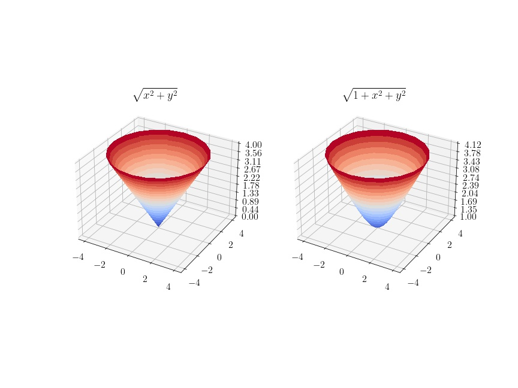
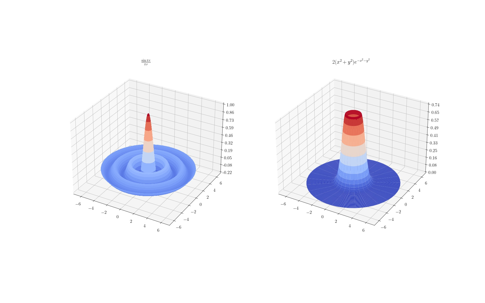

X. 다변수함수 #1
===

## 제 10 장 1 절

<b>2. </b> 다음 함수의 그래프를 종이와 연필을 이용하여 그리라. 또 컴퓨터 프로그램을 이용하여 그리라. 

----

<b>3. </b> 3차원 좌표공간의 $yz$-평면에서
$$
z=f(y),\qquad y\ge 0
$$
의 그래프를 $z$ 축 둘래로 회전시켜 얻은 곡면의 식은 $z=f\left(\sqrt{x^2+y^2}\right) $ 임을 보이라.

---

trivial

<b>4. </b> 다음 함수의 그래프를 그리라.

---

## 제 10 장 2 절

<b>1.</b> 다음 극한값이 존재하면 그 값을 구하라.

---

(1) $\displaystyle \lim_{(x,\,y)\to (0,\,0)}\dfrac{1}{1-\ln (x^2+y^2)}$ 

방향성과 관계 없이 $\infty$ 이다.

(2) $\displaystyle \lim_{(x,\,y) \to (0,\,0)} \dfrac{e^{-1/(x^2+y^2)}}{x^2+y^2} = \lim_{r \to 0^+}  \dfrac{e^{-1/r^2}}{r}=\lim_{s\to \infty} se^{-s^2} =0 $  

<b>2. </b> 다음 함수의 연속성을 조사하라.

---

(1) $\displaystyle f(x,\,y)= \left\{\begin{array}{ll} \dfrac{xy^2}{x^2+y^4}, \quad & (x,\,y) \ne (0,\,0) \\ 0, & (x,\,y )= (0,\, 0) \end{array}\right.$

$(x,\, y)=(t^2, t)$ 방향으로는 $\displaystyle \lim_{t \to 0} f(t^2,\,t) = \lim_{t \to 0} \dfrac{t^4}{2t^4}=\dfrac{1}{2}$ 이므로 연속이 아니다.

(2)  $\displaystyle f(x,\,y)= \left\{\begin{array}{ll} \dfrac{x^2-y^3}{x^2+y^2}, \quad & (x,\,y) \ne (0,\,0) \\ 0, & (x,\,y )= (0,\, 0) \end{array}\right.$

$(x,\,y)= (t,\, 0)$ 방향으로는 $\displaystyle \lim_{t \to 0} f(t,\,0)= 1$ 이므로 불연속

(3) $\displaystyle f(x,\,y)= \left\{\begin{array}{ll} \dfrac{x^2y-xy^2}{x^2+y^2}, \quad & (x,\,y) \ne (0,\,0) \\ 0, & (x,\,y )= (0,\, 0) \end{array}\right.$

$|x^2+y^2|=R>0$ 에 대해, $|xy|\le (x^2+y^2)/2\le R/2$ 이므로 
$$
0\le \left|\dfrac{x^2y-xy^2}{x^2+y^2}\right| =\left|\dfrac{xy(x-y)}{x^2+y^2}\right| \le \dfrac{|x-y|}{2} \le \dfrac{|x|+|y|}{2} \le R
$$
이다. 어떤 뱡항으로든 $\displaystyle \lim_{(x,\,y)\to (0,\,0)} f(x,\,y) =0$ 이다. 

<b>3.  </b> 좌표평면에서 정의된 함수
$$
\displaystyle f(x,\,y)= \left\{\begin{array}{ll} \dfrac{x^2y}{x^4+y^2}, \quad & (x,\,y) \ne (0,\,0) \\ 0, & (x,\,y )= (0,\, 0) \end{array}\right.
$$
는 평면 속의 원점을 지나는 임의의 직선에 제한하면 연속함수가 되지만, 원점을 지나는 포물선 $y=x^2$ 에 제한하면 연속함수가 아님을 보여라.

---

$$
\begin{align}
\lim_{t\to 0} f(t,\, at)&=\lim_{t \to 0} \dfrac{at^3}{t^4+a^2t^2}=\lim_{t \to 0}\dfrac{at}{t^2+a}=0\\
\lim_{t \to 0} f(t,\, t^2) &=\lim_{t \to 0}\dfrac{t^4}{2t^4}=\dfrac{1}{2}

\end{align}
$$

<b>4. </b> 원점을 제외한 좌표평면에서
$$
f(x,\,y) := \dfrac{ax+by}{\sqrt{x^2+y^2}}
$$
로 정의된 함수에 대하여 원점에서의 함수값을 잘 정하면 $f(x,\,y)$ 가 원점에서 연속함수가 되는 실수 $a,\,b$ 의 값을 모두 구하라.

---

우선 $(x,\, y)=(t,\, 0)$ 에서 $t\to 0^+$ 극한은 $a$ 이며 $t\to 0^{-}$ 극한은 $-a$ 이다.  $(x,\, y)=(0,\,t)$ 에서 $t\to 0^{+}$ 극한은 $b$ 이며 $t\to 0^{-}$ 극한은 $-b$ 이다.  $a=b$ 이어야 한다. 또한 $(x,\,y)=(t,\,t)$ 에서 $t \to 0$ 극한은 $\dfrac{a+b}{\sqrt{2}}$ 이므로 $a=b=0$ 이어야 한다. 그렇다면 함수는 $0$ 함수 이므로 연속이다.

<b>5. </b> 좌표공간의 부분집합이 유계라는 것은 무슨 뜻인가.

---

$\exist R\in \mathbb{R}$ s.t. $\max\{|x|: x\in U\}<R$. 

<b>6. </b> 좌표공간의 부분집합에서 정의된 연속함수가 최대값을 가지지 않는 경우는 어떠한 경우인가?

---

1. 함수가 유계가 아닌 경우 $f:\mathbb{R}\to \mathbb{R}$ defined by $f(x)=x^2$ 
2. 함수가 닫힌 집합이 아닌 집합에 대해 정의된 경우. $f:(0,\,1)\to \mathbb{R}$ defined by $f(x)=x$. 

 

## 제 10 장 3 절

- $\operatorname{grad} f$ 를 $\nabla f$ 로 쓰기로 한다.  

<b>1. </b> $f(x,\,y,\,z)=x^2y^3+z$ 에 대하여 $\nabla f(1,\,2,\,3)$ 을 구하라.

---

$$
\nabla f (x,\,y,\, z)=(2xy^3,\ 3x^2y^2,\, 1) \implies \nabla f(1,\,2,\,3)=(16,\, 12,\, 1)
$$

<b>2. </b> 다음 함수의 $\mathbf{v}$ 방향 미분계수를 구하라.

---

(1) $f(x,\, y)=x^2+y^3,\quad P=(-1,\,3),\quad \mathbf{v}=(1,\,2)$
$$
\begin{align}
\nabla f(-1,\,3) &= (-2,\, 27)\\
\nabla f(-1,\,3)\cdot \mathbf{v} &=-2+54=52
\end{align}
$$
(2) $f(x,\,y)=2x^2+xy-y^2,\quad P=(3,\,-2),\quad \mathbf{v}=(1,\,-1)$ 
$$
\begin{align}
\nabla f(x,\,y)&=(4x+y,\, x-2y) \\
\nabla f(3,\,-2) &=(10, 7)\\
\nabla f(3,\, -2) \cdot \mathbf{v} &=3

\end{align}
$$
(3) $f(x,\,y)= e^x \ln y,\quad P=(0,\,e),\quad \mathbf{v}=(2,\,1)$
$$
\begin{align}
\nabla f(x,\,y) &= \left( e^x \ln y,\, \dfrac{e^x}{y}\right)\\
\nabla f(0,\,e) &= (1,\, 1/e) \\
\nabla f(0,\,e) \cdot \mathbf{v} &= 2+ \dfrac{1}{e}
\end{align}
$$
(4) $f(x,\,y)= e^x \sin y,\quad P=(0,\,\pi/4),\quad \mathbf{v}=(2,\,1)$
$$
\begin{align}
\nabla f(x,\,y)&= (e^x \sin y,\, e^x \cos y)\\
\nabla f(0,\,\pi/4)& = (1/\sqrt{2},\, 1/\sqrt{2})\\
\nabla f(0,\, \pi/4)\cdot \mathbf{v} &=3/\sqrt{2}

\end{align}
$$
(5) $f(x,\,y)=\ln \sqrt{x^2+y^2},\quad P=(1,\,1),\quad \mathbf{v}=(2,\,1)$
$$
\begin{align}
\nabla f(x,\,y) &=\left(\dfrac{x}{x^2+y^2},\, \dfrac{y}{x^2+y^2}\right)\\
\nabla f(1,\,1) &=\left(\dfrac{1}{2},\, \dfrac{1}{2}\right) \\
\nabla f(1,\, 1)\cdot \mathbf{v} &=\dfrac{3}{2}

\end{align}
$$

<b>3. </b> $n$ 공간의 열린 집합 $U$ 에서 정의된 편미분가능한 함수 $f,\,g$ 에 대하여
$$
\begin{align}
\nabla (f+g)&=\nabla f + \nabla g\\
\nabla (cf)&=c \nabla f ,\quad c\in \mathbb{R}\\
\nabla (fg) &=f\nabla g+g \nabla f
\end{align}
$$
임을 보이라. 또 $h:\mathbb{R}\to \mathbb{R}$ 가 미분가능함수이면 임의의 $P\in U$ 에 대하여
$$
\nabla(h \circ f)(P)=h'(f(P))\nabla f(P)
$$
임을 보이라.

---

$$
\begin{align}
D_i (f+g)(P) &= D_if(P)+D_i g(P) \quad\forall i=1,\,2,\ldots,\,n  &\implies& \nabla (f+g)=\nabla f +\nabla (g)\\
D_i (cf)(P) &=cD_i (P) \quad\forall i=1,\,2,\ldots,\,n  &\implies& \nabla (cf)=c\nabla f \\
D_i (fg)(P) &= (fD_i g)(P) + (gD_i f)(P) \quad \forall i=1,\ldots,\,n &\implies& \nabla (fg) = f\nabla g + g\nabla f
\end{align}
$$

또한,
$$
D_i (h \circ f)(P)=\left.\dfrac{d}{dt}\right|_0 h(f(p_1,\ldots,\,p_i+t,\ldots,\,p_n))=h'(f(P))D_if(P)
$$
이므로,
$$
\nabla (h \circ f)(P)=h'(f(P)) \nabla f(P)
$$
이다.

<b>4. </b> $n$-공간에서 항등사상 $X= (x_1,\ldots,\,x_n):\mathbb{R}^n \to \mathbb{R}^n$ 과
$$
|X|=\sqrt{x_1^2+\cdots + x_n^2}
$$
​	에 대하여,
$$
\nabla X = \dfrac{X}{|X|}
$$
임을 보이라. 또 $n$ 공간에서 주어진 점 $P$ 에 대하여
$$
\nabla |X-P|=\dfrac{X-P}{|X-P|}
$$
임을 보이라.

---

$$
D_i |X-P|=\dfrac{\partial }{\partial x_k}\sqrt{(x_1-p_1)^2+\cdots +(x_n-p_n)^2}=\dfrac{(x_k-p_k)}{|X|} \implies \nabla|X-P|=\dfrac{X-P}{|X-P|}
$$

이다.

<b>5. </b> $n$-공간에서
$$
\nabla \dfrac{1}{|X|}=-\dfrac{X}{|X|^3}
$$
임을 보이라. 또 임의의 실수 $k$ 에 대하여,
$$
\nabla \dfrac{1}{|X|^k}=-\dfrac{kX}{|X|^{k+2}}
$$
임을 보이라.

---

$$
D_k \dfrac{1}{\left( x_1^2+\cdots+x_n^2 \right)^{k/2}}=\dfrac{-kx_k}{\left( x_1^2+\cdots+x_n^2 \right)^{(k+2)/2}} \implies \nabla\dfrac{1}{|X|^k}= -\dfrac{kX}{|X|^{k+2}}
$$

<b>6. </b> $n$-공간에서 $r=|X|$ 라 할 때 점 $X$ 에서 다음 함수들의 기울기 벡터를 구하라.

---

(1) $f(X)=\ln r$
$$
D_k f(X)= D_k \ln (x_1^2+\cdots +x_n^2)^{1/2}=\dfrac{x_k}{\left(x_1^2+\cdots + x_n^2 \right)} \implies \nabla \ln r = \dfrac{X}{|X|^2}
$$
(2) $f(X)=e^{-r^2}$
$$
D_k e^{-r^2} =D_k e^{-(x_1^2+\cdots+x_n^2)}=-2x_k e^{-r^2}\implies \nabla e^{-r^2}=-2X e^{-r^2}
$$
(3) $f(X)=re^{-r}$ 
$$
D_k re^{-r}= \dfrac{X}{|X|}e^{-r}-Xe^{-r}\implies \nabla re^{-r}=X\left(\dfrac{1}{r}-1\right)e^{-r}
$$

<b>7. </b> 함수 $f(x,\,y)=xy^2$ 에서
$$
\dfrac{\partial f}{\partial x}(1,\,1)=D_1 f(1,\,1)=1
$$
이지만, 함수 $g(y,\,x)=yx^2$ 에서
$$
\dfrac{\partial g}{\partial x}(1,\,1)=D_2g(1,\,1)=2
$$
임을 설명하라. 또 $f=g$ 임을 살펴보라.

---

$f$ 와 $g$ 는 $x,\,y$ 를 서로 exchange 한 함수이므로 $\dfrac{\partial f}{\partial x}(1,\,1)=\dfrac{\partial g}{\partial y}(1,\,1)=2$ 이다. $g(x,\,y)=xy^2=f(x,\,y)$ 이다. 

<b>8. </b> 좌표평면의 극좌표계 $(r,\,\theta)$ 에서 $r=\sqrt{x^2+y^2}$ 이므로,
$$
\dfrac{\partial r}{\partial x}= \dfrac{x}{r}=\cos \theta
$$
이고 또, $x=r \cos \theta$ 에서,
$$
\dfrac{\partial x}{\partial r}=\cos \theta
$$
임을 보이라. 이로부터
$$
\dfrac{\partial r}{\partial x}\cdot \dfrac{\partial x}{\partial r}\ne 1
$$
임을 보이라.

---

$$
\begin{align}
\dfrac{\partial r}{\partial x} &=\dfrac{\partial }{\partial x}\sqrt{x^2+y^2}=\dfrac{x}{r} = \cos \theta\\
\dfrac{\partial x}{\partial r} &= \dfrac{\partial}{\partial r}(r \cos \theta)=\cos \theta \\\
\dfrac{\partial r}{\partial x}\cdot \dfrac{\partial x}{\partial r} &= \cos^2 \theta \ne 1

\end{align}
$$

