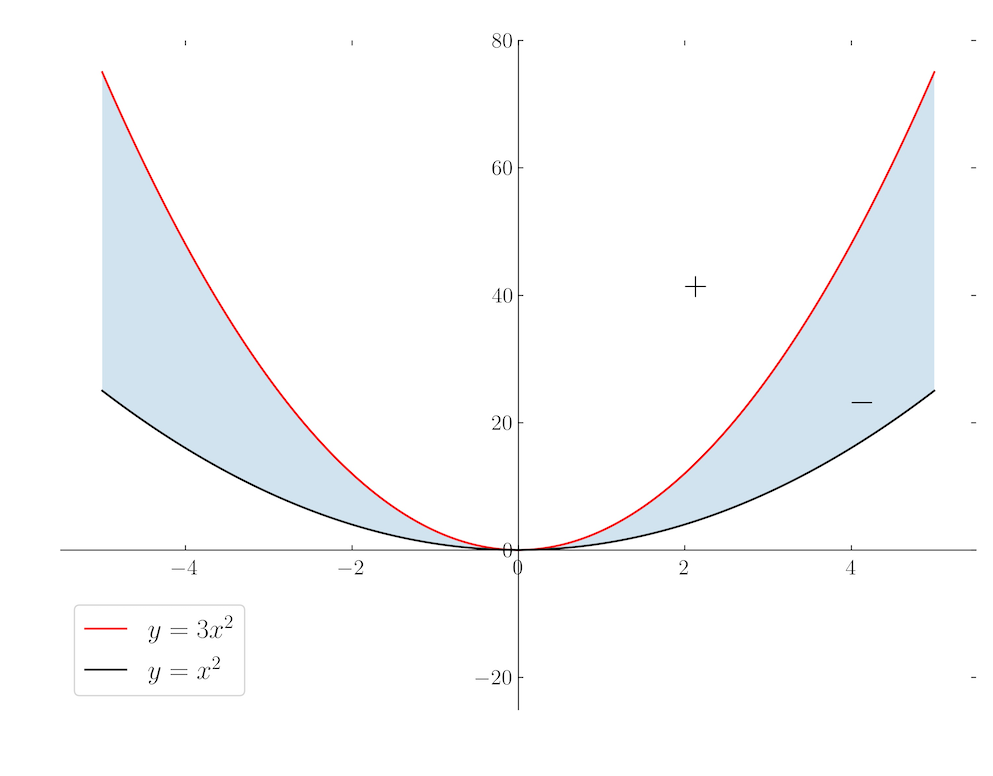

XI. 최대최소값 문제와 고계미분 #3
===

## 

## 연습문제 : 제 11 장 4 절

<b>1. </b> 다음 함수의 임계점을 구하라.

---

(1) $x^2+4xy-y^2-ax-by$
$$
\begin{aligned}
 &\nabla f(x,\,y)=(2x+4y-a,\, 4x-2y-b)=(0,\,0) \\
 \implies& x=\dfrac{a+2b}{10},\, y=\dfrac{2a-b}{10}
 \end{aligned}
$$
\

(2) $x-y\sin x$
$$
\begin{aligned}
&\nabla f(x,\,y)=(1-y\cos x,\, -\sin x)=(0,\,0) \\
\implies & x=n\pi,\, y=(-1)^n \qquad\text{where }n\in \mathbb{Z}

\end{aligned}
$$

(3) $x^2y^2$
$$
\begin{aligned}
& \nabla f(x,\,y)=(2xy^2,\, 2x^2y)=(0,\,0) \\
\implies & (0,\, \mathbb{R}) \;\text{or}\; (\mathbb{R},\,0)
\end{aligned}
$$

(4) $x^4+y^2$
$$
\begin{aligned}
& \nabla f(x,\,y)=(4x^3,\, 2y)=(0,\,0)\\
\implies& (0,\,0)
\end{aligned}
$$

(5) $e^{x^2+y^2+z^2}$
$$
\begin{aligned}
& \nabla f(x,\,y,\,z) = (2x,\, 2y,\, 2z)e^{x^2+y^2+z^2}=0 \\
\implies &(0,\,0,\,0)
\end{aligned}
$$

(6) $e^{-xy/(x^2+y^2+1)}$​
$$
\begin{aligned}
& \nabla f(x,\,y)= \left( \dfrac{x^2y-y^3-y}{(x^2+y^2+1)^2},\, \dfrac{xy^2-x^3-x}{(x^2+y^2+1)^2},\right)e^{xy/(x^2+y^2+1)} \\
\implies & (0,\,0)
\end{aligned}
$$

<b>2. </b> (**최소자승법**) 좌표평면의 점 $(x_1,\,y_1),\ldots,\, (x_n,\,y_n)$ 에 대하여
$$
\sum_{i=1}^n \left( y_i -ax_i-b\right)^2
$$
을 최소로 하는 직선 $y=ax+b$ 를 구하라. (단 $x_1,\ldots,\,x_n$ 이 모두 같은 경우가 아니라고 가정한다.)

---

$$
\begin{aligned}
f(a,\,b) &=\sum_{i=1}^n (y_i-ax_i-b)^2  \\
&=\left(\sum_{i=1}^n {x_i}^2\right) a^2+2\left(\sum_{i=1}^n x_i\right)ab+nb^2-2\left(\sum_{i=1}^n x_i y_i\right) a- 2\left(\sum_{i=1}^n y_i\right)b+\sum_{i=1}^n {y_i}^2\\

\end{aligned}
$$

라 하면, 
$$
\nabla f(a,\,b)=2\left(\left( \sum_{i=1}^n {x_i}^2  \right)a + \left(\sum_{i=1}^n x_i\right)b -\left(\sum_{i=1}^n x_i y_i\right),\, \left(\sum_{i=1}^n x_i \right)a+nb+\left(\sum_{i=1}^n y_i \right)\right) = (0,\,0)
$$
이므로,
$$
a=\dfrac{\left(\sum x_i \right)(\sum y_i)-n\sum x_iy_i}{(\sum x_i)^2-n\sum {x_i}^2},\, b= \dfrac{(\sum x_i y_i)(\sum x_i)-(\sum y_i)(\sum {x_i}^2)}{(\sum x_i)^2-n \sum {x_i}^2}
$$
일 때 $f(a,\,b)$ 는 최소값을 가진다.

<b>3. </b> 함수 $f(x,\,y)=3x^4-4x^2y+y^2=(3x^2-y)(x^2-y)$ 에 대하여,

----

(1) 원점이 $f$ 의 임계점임을 보이라.
$$
\nabla f(x,\,y)= (12x^3-8xy,\, -4x^2+2y)
$$
이므로 $\nabla f(0,\,0)=(0,\,0)$

(2) 임의의 단위벡터 $\mathbf{v}=(h,\,k)$ 에 대하여, 함수 $g(t):=f(t\mathbf{v})=f(th,\,tk)$ 는 $t=0$ 에서 극소임을 보이라.
$$
\begin{aligned}
g(t) = 3h^4t^4-4h^2kt^3+k^2t^2 \implies &g'(t)=12h^4t^3-12h^2kt^2+2k^2t \\
& g''(t) = 36h^4t^2-24h^2kt+2k^2
\end{aligned}
$$
이다. $k\ne 0$ 이면  $g''(0)=2k^2>0$ 이므로 $g(0)$ 은 극소점이며, $k=0$ 이면 $g(t)=3h^4t^4$ 이므로 역시 $t=0$ 이 극소점이다.

(3) 그럼에도 불구하고 원점은 $f$ 의 극소점이 아님을 보이라. 

$f(t,\,2t^2)=(3t^2-2t^2)(t^2-2t^2)=-t^4$ 이므로 $t=0$ 은 $f(t,\,2t^2)$ 의 극대점이다. 따라서 $f(t)$ 의 극소점이 될 수 없다.

(4) $곡선 $f(x,\,y)=0$ 을 도시하라.

$y=3x^2$ or $y=x^2$ 이다.

(5) $f(x,\,y)>0,\, f(x,\,y)<0$ 인 영역을 각각 그리라.

(6) (2) 와 (3) 이 서로 모순되지 않는 이유를 설명하라. 

$- \to 0 \to -$​, $+ \to 0 \to +$​ 를 생각해보라.

<b>4. </b> (**Steiner** 문제) 평면의  $\triangle ABC$ 에서 꼭지각의 크기가 모두 $120^\circ$ 미만이라고 하자. 이때 함수
$$
f(x):=|X-A|+|X-B|+|X-C| \qquad (X\in \mathbb{R}^3-\{A,\,B,\,C\})
$$
의 임계점을 $P$​ 라고 두면, 선분 $AP,\,BP,\,CP$​ 는 서로 $120^\circ$​ 를 이룸을 보이라.

---

$$
\nabla f(X) = \dfrac{X-A}{|X-A|}+\dfrac{X-B}{|X-B|}+\dfrac{X-C}{|X-C|}
$$

이므로,
$$
\dfrac{P-A}{|P-A|}+\dfrac{P-B}{|P-B|}+\dfrac{P-C}{|P-C|}=0
$$
이다. 

**<풀이 1.>**
$$
\begin{align}
\cos (\angle APB) &= \dfrac{(P-A)\cdot (P-B)}{|P-A| \, |P-B|}\\
&= - \left(\dfrac{|P-A|}{|P-B|}(P-B)+ \dfrac{|P-A|}{|P-C|}(P-C)\right) \cdot \dfrac{(P-B)}{|P-A||P-B|} \\
&= -1-\dfrac{(P-C)\cdot (P-B)}{|P-C|\, |{P-B|}}=-1-\cos (\angle BPC)\tag{1}\\
&= -1+ \left(\dfrac{|P-B|}{|P-A|}(P-A)+\dfrac{|P-B|}{|P-C|}(P-C)\right)\cdot \dfrac{ (P-C)}{|P-B||P-C|} \\
&= \dfrac{(P-B)\cdot (P-C)}{|P-B|\,|P{-C|}}=\cos (\angle APC) \tag{2} \\
&= -\left(\dfrac{|P-C|}{|P-A|}(P-A) - \dfrac{|P-C|}{|P-B|}(P-B)\right) \cdot \dfrac{(P-B)}{|P-B||P-C|} \\
&= -1+\cos (\ang APB) \tag{3}
\end{align}
$$
(1), (3) 으로부터  $\cos (\angle APB)=-\dfrac{1}{2}$, (2) 로부터 $\cos (\angle APC)=-\dfrac{1}{2}$, (1) 로부터 $\cos (\angle BPC) = -\dfrac{1}{2}$ 이므로 선분 $AP,\,BP,\,CP$ 는 서로 $120^\circ = \dfrac{2\pi}{3}$ 를 이룬다.

**<풀이 2>**
$$
\dfrac{P-A}{|P-A|}+\dfrac{P-B}{|P-B|}+\dfrac{P-C}{|P-C|}=0
$$
일 때 
$$
\dfrac{P-A}{|P-A|}=\mathbf{e}_A,\quad \dfrac{P-B}{|P-B|}=\mathbf{e}_B,\quad \dfrac{P-C}{|P-C|}=\mathbf{e}_C
$$
라 하면  $|\mathbf{e}_A|=|\mathbf{e}_B|=|\mathbf{e}_C|=1$ 이며 $\mathbf{e}_A+\mathbf{e}_B +\mathbf{e}_C=0$  이다. 
$$
(\mathbf{e}_A+\mathbf{e}_B+\mathbf{e}_C)\cdot \mathbf{e}_A = 0 = 1+\mathbf{e}_A \cdot \mathbf{e}_B + \mathbf{e}_A \cdot \mathbf{e}_C
$$
이며 같은 방법으로 다음을 구할 수 있다.
$$
\begin{aligned}
\mathbf{e}_A \cdot \mathbf{e}_B + \mathbf{e}_A \cdot \mathbf{e}_C &= -1\\
\mathbf{e}_A \cdot \mathbf{e}_B + \mathbf{e}_B \cdot \mathbf{e}_C &= -1\\
\mathbf{e}_A \cdot \mathbf{e}_C + \mathbf{e}_B \cdot \mathbf{e}_C &= -1\\

\end{aligned}
$$
으며 이로부터  $\mathbf{e}_A\cdot \mathbf{e}_B=\mathbf{e}_A\cdot \mathbf{e}_C=\mathbf{e}_B\cdot \mathbf{e}_C=-\frac{1}{2}$ 이다. 따라서, $AP,\,BP,\,CP$ 는 서로 $120^\circ = \dfrac{2\pi}{3}$ 를 이룬다.

<b>5. </b> 생략.

## 연습문제 : 제 11 장 5 절

<b>1. </b> 함수
$$
f(x,\,y) = x^4 + 2x^2y +3xy^2 + 6xy +3x
$$
의 최대값과 최소값이 존재하면 그것을 구하라.

---

일단 $y=0$ 일 때 $f(x,\,0)=x^4+3x$ 이므로 최대값은 존재하지 않는다. 

또한 $x=-1$ 일 때 $f(-1,\,y)=-3y^2-4y-2$ 이므로 최소값은 존재하지 않는다. 

<b>2. </b> 함수 $f(x,\,y)=(x^2+y^2)\cos (x+2y)$ 는 원점이 극소점임을 보이라.

---

$$
\begin{aligned}
\nabla f(x,\,y)&= (2x \cos (x+2y)-(x^2+y^2)\sin (x+2y),\, 2y \cos(x+2y)-2(x^2+y^2)\sin (x+2y)) \\
{\partial_x}^2 f(x,\,y)&=2\cos (x+2y)-2x\sin (x+2y)-2x \sin (x+2y)-(x^2+y^2)\cos (x+2y) \\
&=(2-x^2-y^2)\cos (x+2y)-4x \sin (x+2y) \\
{\partial_x}{\partial_y}f(x,\,y) &=-4x\sin (x+2y)-2y \sin (x+2y)-2(x^2+y^2)\cos (x+2y) \\
{\partial_y}^2 f(x,\,y)&= 2 \cos (x+2y)-4y \sin (x+2y)-4y \sin (x+2y)-4(x^2+y^2)\cos (x+2y) \\
&= 2(1-2x^2-2y^2)\cos (x+2y)-8y \sin (x+2y) \\
\nabla f(0,\,0) &= (0,\,0)\\
{\partial_x}^2f(0,\,0)&= 2\\
{\partial_x}{\partial_y}f(0,\,0)&= 0 \\
{\partial_y}^2 f(0,\,0)&=2

\end{aligned}
$$

이므로 헤세 판정법에 의해 원점은 $f(x,\,y)$ 의 극소점이다.

<b>3. </b> 생략.

<b>4. </b> 다음 함수에서 원점이 안장점 임을 보여라.

---

(1) **원숭이 안장점** $f(x,\,y)=x^3-3xy^2$
$$
\begin{aligned}
\nabla f(x,\,y)&= (3x^2-3y^2,\, -6xy)\\
\nabla f(0,\,0) &= (0,\,0) \\
\end{aligned}
$$
으로 원점은 임계점이다. 헤세 행렬이 영행렬이므로 헤세 행렬로 판정 할 수 엇다.  $f(x,\,1) =x^3-3x$ 는 $x=0$ 근처에서 $+ \to -$ 가 되므로 극점이 아니다. 따라서 원점은 안장점이다.

(2) **개 안장점** $f(x,\,y)=x^3y-xy^3$ 
$$
\begin{aligned}
\nabla f(x,\,y)=(3x^2y-y^3,\, x^3-3xy^2)
\end{aligned}
$$
이므로 $\nabla f(0,\,0)=(0,\,0)$ 이며 따라서 임계점이다. 헤세 행렬이 영행렬이므로 헤세 행렬로 판정 할 수 없다. 마찬가지로 $f(x,\,1)=x^3-x=x(x-1)(x+1)$ 이며 $y=1$​ 을 따라 갔을 때 원점은 극값이 아니므로 원점은 안장점이다.

<b>5. </b> 이차형식 $q(x,\,y)=ax^2+2bxy+cy^2$​ 의 등위선이 원점을 지나지 않을 때 이 등위선은
(1) $ac-b^2>0$​ 이면, 타원
(2) $ac-b^2<0$​ 이면, 쌍곡선
(3) $ac-b^2=0$​ 이면, 직선
임을 보여라.

---

$$
q(x,\,y)=ax^2+2bxy+cy^2=a\left(x+\frac{b}{a}y\right)^2+\frac{ac-b^2}{a}y^2
$$

임을 생각하자. $a=0$ 이면 등위선이 조건을 만족한다는 것을 쉽게 보일 수 있다. 따라서 $a\ne 0$ 일 경우만 보이면 된다. 일차 변환 $f(x,\,y)=\left(x+\frac{b}{a}y,\, y\right)$ 를 생각하자. 이 일차변환은 행렬식이 $0$ 이 아닌 일차변환이며, 이 일차변환에 의해 타원, 쌍곡선, 직선의 형식이 각각에 대해 불변이라는 것을 증명하면 문제를 푸는 것이 된다.  $p(X,\,Y)=aX^2+dY^2$ where $d=(ac-b^2)/a$ 로 놓자. 

<b>6. </b> $n$ 공간의 점 $P$ 근방에서 정의된 이급함수 $f$ 와 벡터 $\mathbf{v}=v_1\mathbf{e}_1 + \cdots + v_n \mathbf{e}_n$ 에 대하여
$$
{D_{\mathbf{v}}}^2 f(P) = \sum_{i,\,j=1}^n v_i v_j D_i D_j f(P) = \mathbf{v} \cdot (f''(P)\mathbf{v})
$$
임을 보이라.

---

$$
\begin{aligned}
\mathbf{v} \cdot (f''(P)\mathbf{v}) &= \sum_{i=1}^n v_i (f''(P)\mathbf{v})_i = \sum_{i=1}^n v_i \left(\sum_{j=1}^n f''(P)_{ij}v_j\right) \\
&= \sum_{i,\,j=1}^n v_i v_j \left(f''(P)\right)_{ij}=\sum_{i,\,j=1}^n v_iv_j D_iD_j f(P)

\end{aligned}
$$

<b>7. </b> 이급함수 $f(x,\,y)$ 의 극대점에서는
$$
\dfrac{\partial^2 f}{\partial x^2}+ \dfrac{\partial^2 f}{\partial y^2} \le 0
$$
이고, 극소점에서는
$$
\dfrac{\partial^2 f}{\partial x^2}+ \dfrac{\partial^2 f}{\partial y^2} \ge 0
$$
임을 보이라.

---

$(a,\,b)$ 가 $f(x,\,y)$ 의 극대점이라 하자. $g (t)=f(a+t,\,b)$ 라 하면 $0$ 이 $g$ 의 극대점이므로 $g'(0) = \dfrac{\partial f}{\partial x}(a,\,b)=0$ , $g''(0) = \dfrac{\partial^2 f}{\partial x^2}(a,\,b) \le 0$ 이다. $h(s) = f(a,\,b+s)$ 라 하면 같은 이유로 $h''(0) = \dfrac{\partial^2 f}{\partial y^2}(a,\,b)\le 0$ 임을 안다. 따라서 
$$
\dfrac{\partial^2 f}{\partial x^2}(a,\,b)+ \dfrac{\partial^2 f}{\partial y^2}(a,\,b)\le 0
$$
이다. 극소점에 대해서는 이계미분의 부호가 바뀌므로 쉽게 보일 수 있다.

