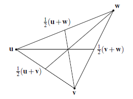

IV. Vectors and Euclidean Spaces
===

## 4.1. Vectors

#### Exercises

<b>4.1.3.</b> $\R^2$의 모든 vector에 $-1$ 곱하는 것의 기하학적 의미는 무엇인가? 이것은 회전인가?

---

원점 중심 대칭. 원점을 중심으로 $\pi$ 만큼의 회전변환.

<b>4.1.4 </b> $\R^3$ 의 모든 벡터에 $-1$ 을 곱하는 것은 회전인가?

---

No. 예를 들어 $(1,\,0,\,0)\to (-1,\,0,\,0) $ and $(0,\,1,\,0)\to (0,\,-1,\,0)$ 은 $z$ 축을 중심으로 $\pi$ 만큼 회전한 것이다. 그러나 $(0,\,1,\,0)\to (0,\,-1,\,0)$ and $(0,\,0,\,1)\to (0,\,0,\,-1)$ 은 $x$ 축을 중심으로 $\pi $ 만큼 회전한 것으로 하나의  rotation 으로 표현 할 수 없다.

## 4.2. Direction and Linear dependence

#### Vector Thales theorem

$\mathbf{s}$ 와 $\mathbf{v}$ 가 $0$ 을 지나는 어떤 line 상에 위치하고, $\mathbf{t}$, $\mathbf{w}$ 도 다른 lines 상에 위치하며, $\mathbf{w}-\mathbf{v}$ 가 $\mathbf{t}-\mathbf{s}$ 에 평행하다면 $\mathbf{v}=a\mathbf{s}$ 이고 $\mathbf{w}=a\mathbf{t}$ 이다.

---

*(proof)* (1) $\mathbf{w}-\mathbf{v}$ 가 $\mathbf{t}-\mathbf{s}$ 에 평행하면 $\mathbf{w}-\mathbf{v}=a(\mathbf{t}-\mathbf{s})$ for some $a\in \R$ 이다.

(2) $\mathbf{v}$와 $\mathbf{s}$ 가 $0$ 을 지나는 어떤 line 상에 위치하므로 $\mathbf{v}=b\mathbf{s}$ for some $b\in \R$  이며 같은 이유로 $\mathbf{w}=c\mathbf{t}$ for some $c\in \R$ 이다.

(3) $\mathbf{w}-\mathbf{v} = b\mathbf{t}-c\mathbf{s}=a(\mathbf{t}-\mathbf{s})$ 이므로 $b=c=a$ 이다.$\square$

#### Vector Pappus Theorem

만약 $\mathbf{r},\,\mathbf{t},\, \mathbf{v}$ 가 $0$을 지나는 어떤 line 상에 존재하며 $\mathbf{s},\,\mathbf{u},\, \mathbf{w}$ 가 $0$ 을 지나는 다른 line 상에 존재한다고 하자. 또한 $\mathbf{u}-\mathbf{v}$ 가 $\mathbf{s}-\mathbf{r}$ 에 평행하며 $\mathbf{t}-\mathbf{s}$ 가 $\mathbf{v}-\mathbf{w}$ 에 평행하다면 $\mathbf{u}-\mathbf{t}$ 는 $\mathbf{w}-\mathbf{r}$ 에 평행하다.

---

*(proof)* (1) 어떤 $a,\,b,\,c,\,d \in \R$ 에 대해 $\mathbf{t}=a\mathbf{r}$, $\mathbf{v}=b\mathbf{r}$ 이며 $\mathbf{u}=c\mathbf{s}$, $\mathbf{w}=d\mathbf{s}$ 이다.

(2) 어떤 $h,\, k\in \R$ 에 대해 $\mathbf{u}-\mathbf{v}=h(\mathbf{s}-\mathbf{r})$ 이며 $\mathbf{t}-\mathbf{s}=k(\mathbf{v}-\mathbf{w})$ 이다.

(3) $\mathbf{u}-\mathbf{v}=c\mathbf{s}-b\mathbf{r}$ 이고 $h(\mathbf{s}-\mathbf{r})=h\mathbf{s}-h\mathbf{r}$ 이므로 $c=b=h$ 이다. 따라서 $\mathbf{u}=b\mathbf{s}$.

(4) $\mathbf{u}-\mathbf{t}=b\mathbf{s}-a\mathbf{r}$, $k(\mathbf{v}-\mathbf{w})=bk\mathbf{r}-dk\mathbf{s}$ 이다. 따라서 $a=-bk, b=-dk$ 이므로  $ad=b^2$ 이다.
$$
\mathbf{w}-\mathbf{r}=d\mathbf{s}-\mathbf{r}=\dfrac{d}{b}\mathbf{u}-\dfrac{1}{a}\mathbf{t}=\dfrac{ad}{ab}\mathbf{u}-\dfrac{1}{a}\mathbf{t}=\dfrac{1}{a}(\mathbf{u}-\mathbf{t})\;.
$$

## 4.3 Midpoints and Centroids

#### median

삼각형의 한 꼭지점에서 맞은편 변의 중점까지 이은 선을 **median** 이라 한다.

#### Concurrence of medians

삼각형의 세 median은 한 점에서 만나며 이를 **centroid of the triangle** 이라 한다.

---

*(proof)* 삼각형의 세 꼭지점을 $\mathbf{u},\,\mathbf{v},\,\mathbf{w}$ 라 하자. 

$\mathbf{v}$와 연결되는 median $\mathscr{L}_v$ 는 $t\mathbf{v}+(1-t)\dfrac{1}{2}(\mathbf{u}+\mathbf{w})$ 로 기술된다. $\mathbf{w}$와 연결되는 median $\mathscr{L}_w$ 는 $s\mathbf{w}+(1-s)\dfrac{1}{2} (\mathbf{u}+\mathbf{v})$ 로 기술된다. $\mathbf{u}$ 와 연결되는 median $\mathscr{L}_u$ 는 $p\mathbf{u} + (1-p)\dfrac{1}{2}(\mathbf{v}+\mathbf{w})$ 로 기술된다.

 $\mathscr{L}_v$ 와 $\mathscr{L}_w$ 의 교점은 $t=(1-s)/2,\, s=(1-t)/2$ 를 만족하므로 $t=s=1/3$ 이며 $p=1/3$ 일 때 $\mathscr{L}_u$ 와 일치함을 알 수 있다. 즉 삼각형의 세 median은 한 점에서 만나며 그 점은 $\dfrac{1}{3} (\mathbf{u}+\mathbf{v}+\mathbf{w})$ 이다. $\quad\square$

#### Exercise

<b>4.3.1.</b> 꼭지점이 $\mathbf{t},\, \mathbf{u},\, \mathbf{v},\,\mathbf{w}$ 인 사각형은 중심 $\dfrac{1}{4} (\mathbf{t}+\mathbf{u}+\mathbf{v}+\mathbf{w})$ 를 가짐을 보이시오.

---

(1) $\mathbf{w}-\mathbf{t} =a(\mathbf{u}-\mathbf{t})+b(\mathbf{v}-\mathbf{t})$ for some $a,\,b\in \R$ 이면 $\mathbf{t},\,\mathbf{u},\,\mathbf{v},\,\mathbf{w}$ 는 사각형을 이룬다. 

(2) $\mathbf{c}=\dfrac{1}{4} (\mathbf{t}+\mathbf{u}+\mathbf{v}+\mathbf{w})$ 라 할 때 $\mathbf{c}-\mathbf{t}$ 가 역시 $\mathbf{u}-\mathbf{t}$ 와 $\mathbf{v}-\mathbf{t}$ 의 linear combination 임을 보이자.
$$
\begin{align*}
\mathbf{c}-\mathbf{t}&=\dfrac{1}{4}(\mathbf{t}+\mathbf{u}+\mathbf{v}+\mathbf{w})-\mathbf{t} \\
&=\dfrac{1}{4} (\mathbf{t}+\mathbf{u}+\mathbf{v}+\mathbf{t}+a(\mathbf{u}-\mathbf{t})+b(\mathbf{v}-\mathbf{t})-4\mathbf{t})\\
&=\dfrac{1}{4} ((a+1)(\mathbf{u}-\mathbf{t})+(b+1)(\mathbf{v}-\mathbf{t}) )

\end{align*}
$$

<b>4.3.2.</b> 사면체의 꼭지점이 $\mathbf{t},\,\mathbf{u},\,\mathbf{v},\,\mathbf{w}$ 라 하자. $\mathbf{t}$의 맞은편의 면의 centroid는 $\dfrac{1}{3}(\mathbf{u}+\mathbf{v}+\mathbf{w})$ 임을 보이고 다른 세 면의 centroids를 쓰시오.

----

trivial

<b>4.3.3.</b> 꼭지점과 그 맞은편 삼각형의 centroid를 연결하는 직선을 생각하자. 특해 $\mathbf{t}$ 로부터 맞은편 삼각형의 centroid 까지 잇는 선분의 $3/4$ 지점이 $\dfrac{1}{4}(\mathbf{t}+\mathbf{u}+\mathbf{u}+\mathbf{w})$ 임을 보여라.

---

$$
\dfrac{1}{4}\mathbf{t}+\dfrac{3}{4}\cdot \left\{ \dfrac{1}{3}(\mathbf{u}+\mathbf{v}+\mathbf{w})\right\}=\dfrac{1}{4}(\mathbf{t}+\mathbf{u}+\mathbf{v}+\mathbf{w})
$$

<b>4.3.4.</b> 왜 $\dfrac{1}{4}(\mathbf{t}+\mathbf{u}+\mathbf{u}+\mathbf{w})$ 이 사면체의 한 꼭지점에서 맞은편의 삼각형의 centroid 까지 잇는 직선상의 점인지 설명하라.

---

$\mathbf{u}$ 로 부터 맞은편의 삼각형의 centroid $\dfrac{1}{3}(\mathbf{t}+\mathbf{v}+\mathbf{w})$ 까지 있는 직선은 실수 $s\in \R$ 에 대해,
$$
s\mathbf{u}+(1-s)\cdot \dfrac{1}{3}(\mathbf{t}+\mathbf{v}+\mathbf{w})
$$
이다. $s=1/4$ 일 때 이므로 주어진 점은 $\mathbf{u}$와 맞은편 삼각형의 centroid 사이에 위치한다. 다른 꼭지점에 대해서도 똑같이 보일 수 있다.

<b>4.3.5.</b> 사면체의 한 꼭지점에서 맞은편 삼각형의 centroid를 잇는 네 직선은 한 점에서 만남을 보이시오.

---

그 점이 4.3.4의 그 점이다.

## 4.4 Inner Product

#### Exercise

<b>4.4.1.</b> 꼭지점이 $\mathbf{0},\,\mathbf{u},\,\mathbf{v},\, \mathbf{u}+\mathbf{v}$ 인 평행사변형을 생각한다. 이 대각선은 $\mathbf{u}-\mathbf{v}$ 와 $\mathbf{u}+\mathbf{v}$ 임을 설명하시오.

---

trivial

<b>4.4.2.</b> Exercise 4.4.1로부터 이 두 대각선의 내적은 $|\mathbf{u}|^2-|\mathbf{v}|^2$ 임을 유도하고 이것이 왜 마름모에서 $0$ 인지 설명하시오.

---

(1) $(\mathbf{u}-\mathbf{v})\cdot (\mathbf{u}+\mathbf{v})=\mathbf{u} \cdot(\mathbf{u}+\mathbf{v})-\mathbf{v}\cdot (\mathbf{u}+\mathbf{v})=|\mathbf{u}|^2+|\mathbf{v}|^2+\mathbf{u}\cdot \mathbf{v}-\mathbf{u}\cdot \mathbf{v}=|\mathbf{u}|^2+|\mathbf{v}|^2$ 

(2) 마름모에서는 두 대각선이 직교하므로 그 내적이 $0$ 이다.

<b>4.4.3.</b> $\mathbf{w}$ 가 $\mathbf{u}$ 와 $\mathbf{v}$ 로부터 각각 같은 거리만큼 떨어져 있을 때의 조건은
$$
(\mathbf{w}-\mathbf{u})\cdot(\mathbf{w}-\mathbf{u})=(\mathbf{w}-\mathbf{v})\cdot (\mathbf{w}-\mathbf{v})
$$
이다. 이유를 설명하고 이 조건이 아래와 동등함을 보이시오.
$$
|\mathbf{u}|^2-2\mathbf{w}\cdot \mathbf{u}=|\mathbf{v}|^2-2\mathbf{w}\cdot \mathbf{v}\;.
$$

---

(1) $|\mathbf{w}-\mathbf{u}|=|\mathbf{w}-\mathbf{v}|\iff |\mathbf{w}-\mathbf{u}|^2=|\mathbf{w}-\mathbf{v}|^2 \iff (\mathbf{w}-\mathbf{u})\cdot(\mathbf{w}-\mathbf{u})=(\mathbf{w}-\mathbf{v})\cdot (\mathbf{w}-\mathbf{v})$ 

(2) 주어진 벡터식을 풀고 양 변에 공통인 $|\mathbf{u}|^2$ 를 제거하면 된다.

<b>4.4.4. </b> Exercise 4.4.3에 나온 조건이 아래와 동등함을 보이시오.
$$
\left(\mathbf{w}-\dfrac{\mathbf{u}+\mathbf{v}}{2}\right)\cdot (\mathbf{u}-\mathbf{v})=0\,.
$$
또한 왜 이 식이 $\mathbf{w}$가 $\mathbf{u}$ 와 $\mathbf{v}$ 를 잇는 선분의 수직이등분선상에 존재하는지를 설명하시오.

---

$$
\begin{align*}
|\mathbf{u}|^2-2\mathbf{w}\cdot \mathbf{u}=|\mathbf{v}|^2-2\mathbf{w}\cdot \mathbf{v} &\iff 2\mathbf{w} \cdot (\mathbf{u}-\mathbf{v})=|\mathbf{u}|^2-|\mathbf{v}|^2=(\mathbf u-\mathbf{v})\cdot (\mathbf{u}+\mathbf{v}) \\

&\iff (2\mathbf{w}-(\mathbf{u}+\mathbf{v}))\cdot (\mathbf{u}-\mathbf{v})=0\\
&\iff \left( \mathbf{w}-\dfrac{\mathbf{u}+\mathbf{v}}{2} \right)\cdot (\mathbf{u}-\mathbf{v})=0\;.

\end{align*}
$$

$\dfrac{\mathbf{u}+\mathbf{v}}{2}$ 는 $\mathbf{u}$와 $\mathbf{v}$ 의 중점이며 $\mathbf{w}-\dfrac{\mathbf{u}+\mathbf{v}}{2}$는 이 중점과 $\mathbf{w}$ 를 잇는 벡터이다. 이것이 $(\mathbf{u}-\mathbf{v})$ 와 수직하므로  $\mathbf{w}$가 $\mathbf{u}$ 와 $\mathbf{v}$ 를 잇는 선분의 수직이등분선상에 존재한다.

## 4.5 Inner Product and Cosine

#### Exercises

피타고라스정리는 원점 $\mathbf{0}$ 에 직각을, 다른 두 꼭지점을 $\mathbf{u},\,\mathbf{v}$ 로 놓고 직접적으로 증명 할 수 있다.

<b>4.5.1.</b> 위의 조건에서 $|\mathbf{v}-\mathbf{u}|^2=|\mathbf{u}|^2+|\mathbf{v}|^2$ 임을 보이고 이것이 왜 피타고라스정리의 증명인지 설명하라.

---

 $\mathbf{v}\cdot \mathbf{u}=0$ 이므로,
$$
|\mathbf{v}-\mathbf{u}|^2=|\mathbf{u}|^2+|\mathbf{v}|^2-2\mathbf{u\cdot \mathbf{v}}\cos \theta =|\mathbf{u}|^2+|\mathbf{v}|^2.
$$

<b>4.5.2.</b> $(\mathbf{v}+\mathbf{u})\cdot (\mathbf{v}-\mathbf{u})=|\mathbf{v}|^2-|\mathbf{u}|^2$ 임을 보여라.

---

trivial

<b>4.5.3.</b> 원점 $\mathbf{0}$ 를 중심으로 지름의 양 끝을 $\mathbf{u}$ 와 $-\mathbf{u}$ 로 하는 반원을 생각하자. 원주상의 임의의 점을 $\mathbf{v}$ 라 하자. 이 때 $\mathbf{v}+\mathbf{u}$ 와 $\mathbf{v}-\mathbf{u}$ 는 직각을 이룸을 보여라.

---

$\mathbf{v}+\mathbf{u}$, $\mathbf{v}-\mathbf{u}$ 그리고 $2\mathbf{u}$ 는 삼각형을 이룬다. 그리고 $\mathbf{v}$ 와 $\mathbf{u}$ 가 원에 위치하므로 원의 반지름을 $R$ 이라 할 때, $|\mathbf{v}|=|\mathbf{u}|=R$ 이다.
$$
|\mathbf{v}-\mathbf{u}|^2+|\mathbf{v}+\mathbf{u}|^2=2|\mathbf{v}|^2+2|\mathbf{u}|^2=|2\mathbf{u}|^2
$$

## 4.6 The Triangle Inequality

#### Exercises

벡터 내적의 일반적인 성질만을 이용한 Cauchy-Schwartz 부등식의 증명은 2차방정식에서의 대수적 트릭을 이용하여 얻어질 수 있다. 그 성질은 임의의 벡터 $\mathbf{w}$ 에 대해 $\mathbf{w} \cdot \mathbf{w}=|\mathbf{w}|^2\ge 0$ 인 것이다. 이러한 성질을 *positive definite* 라 한다. 

<b>4.6.1.</b> Euclidean inner product for $\R^n$ 에서 이렇게 정이한 내적은 항상 positive definite 이다. 왜인가?

---

$\mathbf{w}=(w_1,\ldots,\,w_n)$ 에 대해 $\mathbf{w\cdot w}=\sum_{i=1}^n w_i^2$ 이며 각각의 $w_i^2\ge0$ 이므로.

<b>4.6.2. </b> 임의의 실수 $x$ 와 임의의 벡터 $\mathbf{u},\, \mathbf{v}$ 에 대해 다음
$$
(\mathbf{u}+x\mathbf{v})\cdot (\mathbf{u}+x\mathbf{v})=|\mathbf{u}|^2+2x(\mathbf{u}\cdot \mathbf{v})+x^2|\mathbf{v}|^2\;
$$
을 보이고 따라서 $|\mathbf{u}|^2+2x(\mathbf{u\cdot v})+x^2|\mathbf{v}|^2 \ge 0$ for any $x\in \R$ 임을 보이시오.

---

$$
(\mathbf{u}+x\mathbf{v})\cdot(\mathbf{u}+x\mathbf{v})=|\mathbf{u}+x\mathbf{v}|^2 \ge 0
$$

<b>4.6.3. </b> $A,\,B,\,C$ 가 실수이며 모든 실수 $x$ 에 대해 $A+Bx+Cx^2\ge 0$ 이면 $B^2-4AC\le0$ 임을 설명하시오.

---

우선 $C\ge 0$ 이어야 하며 $f(x)=A+Bx+Cx^2$ 라 할 때 $f(x)=0$ 을 만족하지 않는 해를 갖지 않으야 하므로.

<b>4.6.4.</b> Exercise 4.6.3 을 $|\mathbf{u}|^2+2x(\mathbf{u\cdot v})+x^2|\mathbf{v}|^2 \ge 0$ 에 적용하여 다음을 보이시오.
$$
(\mathbf{u}\cdot \mathbf{v})^2 \le |\mathbf{u}|^2|\mathbf{v}|^2, \quad \text{and hence}\quad |\mathbf{u\cdot \mathbf{v}}| \le|\mathbf{u}||\mathbf{v}|
$$

---

$$
(2\mathbf{u\cdot\mathbf{v}})^2-4|\mathbf{u}|^2|\mathbf{v}|^2\le 0 \implies (\mathbf{u \cdot v})^2\le|\mathbf{u}|^2|\mathbf{v}|^2 \implies |\mathbf{u\cdot v}|\le |\mathbf{u}||\mathbf{v}|.
$$

## 4.7 Rotations, Matrices, and Complex Numbers

#### Exercises

